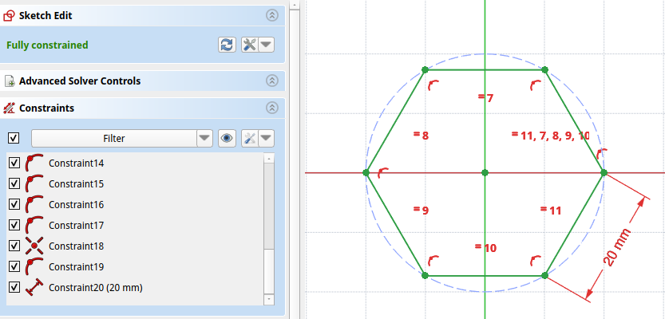
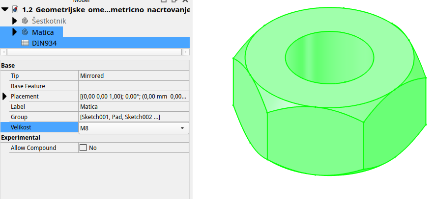
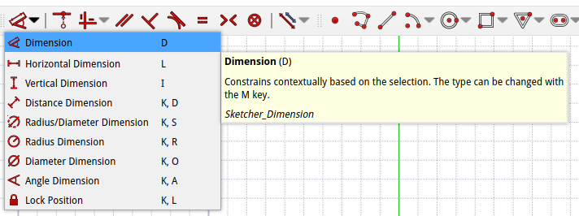
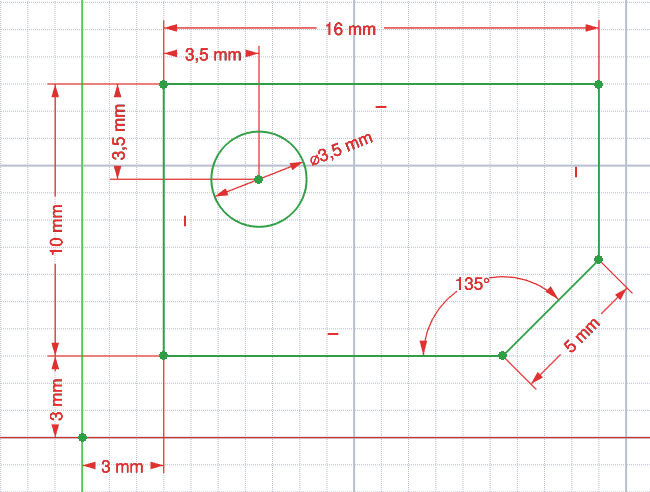
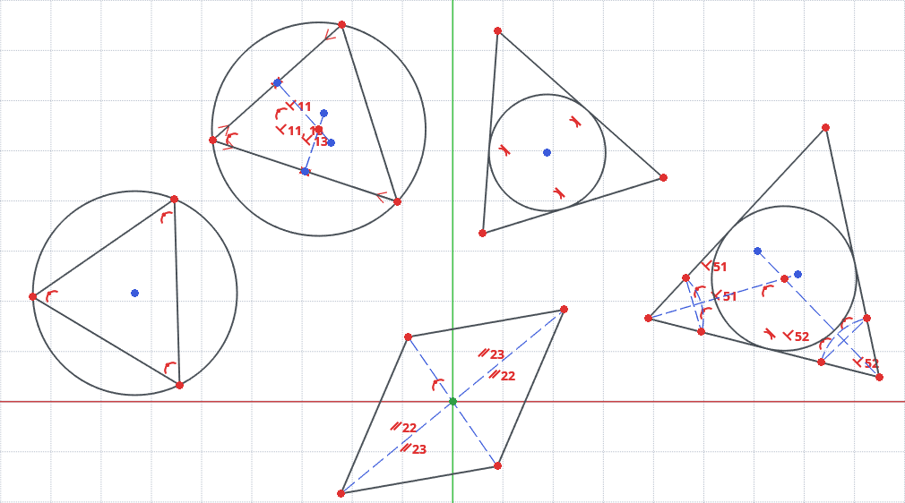
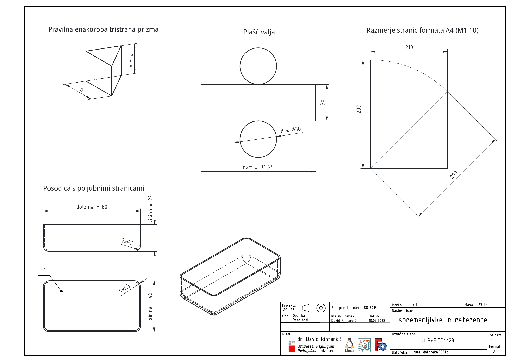
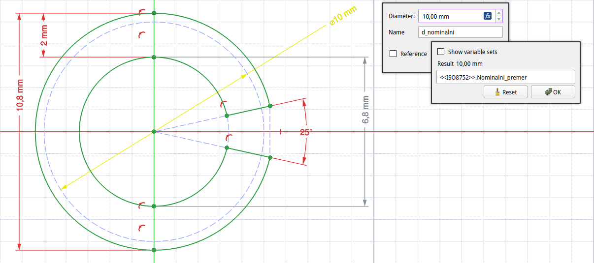
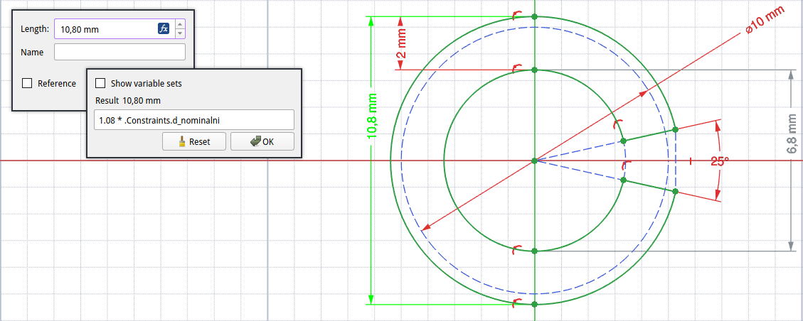

## Parametrično modeliranje, omejitve, referenčne mere in spremenljivke

Parametrično načrtovanje omogoča, da so vsi elementi modela definirani z dimenzijami, vezavami in odvisnostmi, ki jih lahko kadarkoli spremenimo. S tem postane model prilagodljiv in enostaven za posodabljanje. Vsaka sprememba parametra se samodejno odrazi v celotnem modelu.

V okolju **FreeCAD** to pomeni, da so skice, telesa in funkcije povezane prek parametrov, ki jih lahko določimo numerično ali s formulami. Praktični primeri so dosegljivi v datoteki [Geometrijske_omejitve_in_parametricno_nacrtovanje.FCStd](./slike/1.2_Geometrijske_omejitve_in_parametricno_nacrtovanje.FCStd).

**Ključne prednosti:**

* prilagodljivost in ponovna uporabnost modelov,
* možnost ustvarjanja različic modelov z različnimi dimenzijami,
* lažje posodabljanje projektov.

> Primer 1: pri šestkotniku na [@fig:sestkotnik], kjer je dolžina stranice podana kot osnovna dimenzija, so vsi robovi enako dolgi in ogljišča enako oddaljena od središča. Če spremenimo dolžino stranice `a`, se samodejno spremeni celoten obris in velikost šestkotnika.

{#fig:sestkotnik}

> Primer 2: šesterokotna matica na [@fig:matica], kjer so ključne mere izpeljane iz ene vhodne spremenljivke — **nazivnega premera navoja ** (npr. M8, M10, M12). Širina med dvema ploskvama `s` in višina `m` sledita standardnim razmerjem glede na `D` (glej tabelo standardov DIN 934), notranja odprtina pa je vezana na `D` (ustrezna izvrtina, ki je potrebna za vrezovanje navoja). Tako lahko z eno vrednostjo `D` avtomatsko določiš celotno geometrijo matice.

{#fig:matica}

---

### Dimenzijske omejitve

Dimenzijske omejitve določajo **numerične vrednosti**, ki opisujejo dolžine, kote, polmere in oddaljenosti. V FreeCAD Sketcher-ju se te omejitve dodajajo z orodji za **dimenzije** in so prikazane na [@fig:dimenzijskaomejitev] v spustnem menu-ju.


{#fig:dimenzijskaomejitev}

**Vrste dimenzijskih omejitev**

| Vrsta                                                  | Opis                                          |
| ------------------------------------------------------ | --------------------------------------------- |
| **Dolžina (Distance Constraint)**                      | Določi dolžino črte ali razdaljo med točkama. |
| **Kot (Angle Constraint)**                             | Določi kot med dvema črtama.                  |
| **Polmer/Premer (Radius/Diameter Constraint)**         | Določi velikost kroga ali loka.               |

> Nasvet: kombinacija geometrijskih in dimenzijskih omejitev omogoča popolno definicijo skice.

**Primer uporabe**

Na [@fig:dimenzijkeomejitveprimer] so prikazane naslednje **dimenzijske omejitve (constraints)** – to so tiste, ki določajo velikosti in kote skiciranih elementov:

1. Dolžina pravokotnika (vodoravno):
   `16 mm` – razdalja med levim in desnim vogalom pravokotnika.

2. Višina pravokotnika (navpično):
   `10 mm` – razdalja med zgornjim in spodnjim robom.

3. Razmak luknje od levega roba (vodoravno):
   `3,5 mm` – razdalja med središčem kroga in levim robom.

4. Razmak luknje od zgornjega roba (navpično):
   `3,5 mm` – razdalja med središčem kroga in zgornjim robom.

5. Razmak spodnjega roba od vodoravne osi (navpično):
   `3 mm` – razdalja med spodnjim robom pravokotnika in neko referenčno črto spodaj.

6. Razmak levega roba od vertikalne osi (vodoravno):
   `3 mm` – razdalja med levim robom pravokotnika in referenčno črto levo.

7. Kot med poševno črto in spodnjim robom:
   `135°` – verjetno med diagonalno linijo in vodoravno.

8. Premer kroga:
   ` 3,5 mm`

9. Dolžina poševne črte:
   `5 mm` – dolžina linije, ki tvori kot 135°.

{#fig:dimenzijkeomejitveprimer width=9cm}

---

### Geometrijske omejitve

Geometrijske omejitve določajo **relacije med geometrijskimi elementi** (točke, črte, krogi, loke). Namen omejitev je, da določimo, kako so elementi med seboj poravnani, vzporedni, pravokotni, koncentrični ipd.

**Vrste geometrijskih omejitev**

| Vrsta omejitve                              | Opis                                                           |
| ------------------------------------------- | -------------------------------------------------------------- |
| **Vodoravnost (Horizontal Constraint)**     | Poravna element v vodoravni smeri glede na koordinatni sistem. |
| **Navpičnost (Vertical Constraint)**        | Poravna element v navpični smeri.                              |
| **Vzporednost (Parallel Constraint)**       | Dve črti imata enako smer.                                     |
| **Pravokotnost (Perpendicular Constraint)** | Črti sta pod kotom 90°.                                        |
| **Tangencialnost (Tangent Constraint)**     | Krožnica se dotika črte ali loka.                              |
| **Simetričnost (Symmetry Constraint)**      | Elementi so simetrični glede na os.                            |
| **Kolinearnost (Coincident Constraint)**    | Dve točki ali točka in črta se stikata.                        |

> **Opomba:** Priporočljivo je, da uporabimo čim manj omejitev, vendar dovolj, da je skica popolnoma definirana.

**Geometrijski primeri**

{#fig:geometrijskeomejitve width=9cm}

> NALOGA: Paralelogram s središčem v izhodišču (0,0)  
> Nariši paralelogram tako, da je presečišče diagonal v izhodišču, nasprotna oglišča pa so simetrično oddaljena od izhodišča.
>
> 1. Postavi štiri daljice $\overline{AB}, \overline{BC}, \overline{CD} in \overline{DA}$ približno v obliki paralelograma.
> 2. Uporabi **simetričnost** (Symmetry): izberi točki A in C ter kot referenco **izhodišče (0, 0)** → A in C naj bosta simetrična glede na točko (0,0). Ponovi za B in D.
> 3. Dodaj **paralelnost**: $\overline{AB} \parallel \overline{CD}$ in $\overline{AD} \parallel \overline{BC}$.
> 4. (Neobvezno) Poudari lastnost **središča**: dodaj diagonali $\overline{AC}$ in $\overline{BD}$ (konstrukcijsko) ter uveljavi **kolinearnost** njunega presečišča z izhodiščem.
> 
> **Uporabljene omejitve:** simetričnost, paralelnost, kolinearnost, (vodoravnost/navpičnost kot pomožne).

---

> NALOGA: Poljubnemu trikotniku očrtaj krožnico  
> Za poljuben trikotnik ABC skonstruiraj krožnico, ki gre skozi vsa tri oglišča.
> 
> **a) S točkami na krožnici ("kolinearnimi" točkami)**
> 
> 1. Nariši poljuben trikotnik ABC.
> 2. Nariši **krog** s poljubnim središčem O in polmerom.
> 3. Za vsako oglišče (A, B, C) dodaj omejitev **kolinearnosti** na krog.
> 
> **b) S simetralami stranic (pravokotne simetrale)**
> 
> 1. Za stranico $\overline{AB}$ postavi pomožno točko M_AB in uveljavi **simetričnost** točk A in B glede na M_AB (M_AB postane **sredina**).
> 2. Skozi M_AB nariši pomožno črto in ji dodaj **pravokotnost** na $\overline{AB}$ (to je pravokotna simetrala AB).
> 3. Ponovi 1–2 za stranico AC (dobiš M_AC in ustrezno pravokotno simetralo).
> 4. Presečišče obeh pravokotnih simetral označi z O (dodaj **kolinearnost**).
> 5. Nariši **krog** s središčem O skozi enega od vrhov (A, B ali C).
> 
> **Uporabljene omejitve:** koincidenca, točka-na-objektu, simetričnost, pravokotnost.

---

> NALOGA: Poljubnemu trikotniku včrtaj krožnico  
> Za poljuben trikotnik ABC skonstruiraj krožnico, ki se dotika vseh treh stranic.
> 
> **a) S tangentami na stranice**
> 
> 1. Nariši trikotnik ABC.
> 2. Nariši **krog** s poljubnim središčem O.
> 3. Za vsako stranico trikotnika dodaj omejitev **tangentnost** med krogom in stranico.
> 
> **b) S simetralami kotov (incenter)**
> 
> 1. Nariši trikotnik ABC.
> 2. Iz ogljišča A nariši lok ADE.
> 3. Dodaj daljico $\overline{DE}$.
> 4. Dodaj daljico $\overline{AF}$ tako, da bo pravokotna z daljico $\overline{DE}$.
> 5. Ponovi korake 2 - 4, le da simetralo kota narediš v oglišču B.
> 6. Kjer se simetrali kotov sekata dodaj točko `O` in jo uporabi kot središče včrtane krožnice. Krožnica se mora dotikate stranice trikotnika tangentno.
> 
> **Uporabljene omejitve:** tangentnost, pravokotnost (radij $\perp$ tangenta), enakost (razdalj), koincidenca.

---

### Projekcijia robov in ogljišč

V postopkih tehničnega risanja in modeliranja pogosto potrebujemo, da se elementi obstoječih 3D modelov (robovi, oglišča, obrobe) prikažejo v ploskvi skice, da jih uporabimo kot referenco za nove geometrije ali omejitve. Orodje `External Projection` ustvari pravokotno projekcijo izbranih zunanjih robov/ogljišč na trenutno ravnino skice. Projekcija ostane parametrično povezana z originalnimi objekti—če se izvor spremeni, se ustrezno posodobi tudi projekcija.

Pri modeliranju ojnice APN4 je orodje External Projection uporabljeno za dodajanje dveh prstanov, ob upoštevanju naslednjih dimenzij: globina telesa ojnice 6 mm, globina vsakega prstana 12 mm, kar pomeni, da prstana izstopata iz telesa ojnice 3 mm na vsaki strani. Na [@fig:external_projection] je prikazano telo ojnice. Rumeno obarvan rob moramo projecirati v skico prstanov. Tak potek uporabe External Projection omogoči natančno dodajanje prstanov, ki se popolnoma prilegajo obstoječi geometriji ojnice. Podrobnejša dokumentacija ojnice za APN4 je dosegljiva v dokumentu [Ojnica APN4.pdf](./slike/1.2_Geometrijske_omejitve_in_parametricno_nacrtovanje_Ojnica APN4.pdf).

{#fig:external_projection width=10cm}

> ### NALOGA: Uporabi orodje External Projection za prileganje prstanov zunanji konturi telesa ojnice.
>
> 1. Na XY ravnini ustvarite skico telesa ojnice iz večpogledne projekcije (razčlenite projekcijo v obris telesa in položaj lukenj).
>    - Poskrbite, da so glavni konturi in luknje parametrično omejene z dimenzijami, prevzetimi iz projekcije.
>    - Ekstrudirajte obliko telesa (telo ojnice) simetrično glede na ravnino skice z globino 3 mm, tako da je po skupna globina telesa 6 mm.
> 
> 2. Ustvarite novo skico na XY ravnini za prstane. Skica naj bo aktivna in nameščena natanko na XY ravnini, ki jo uporabljate kot referenco.
>    - Preden začnete risati krožnice prstanov, pripravite External Projection za prenosenje kontur iz telesa.
> 
> 3. Projecirajte notranjo črto vsake luknje (rob notranjosti) na skico prstanov. Projekcija vsake luknje biti definicijska (defining) — to pomeni, da izberete projekcijo kot dejansko geometrijo (ne konstrukcijsko ali pomožno črto). To zagotovi, da bo notranji rob prstana točno vezan na položaj luknje.
>    - Projecirajte zunanjo konturo telesa ojnice, vendar to nastavite kot konstrukcijsko črto (construction). Ta pomožna (construction) črta služi kot referenca, ne kot dejanski rob prstana.
> 
> 4. Po konstrukcijski projekciji zunanje konture narišite dve krožnici:
>      - veliki prstan: krožnica s premerom 32 mm
>      - manjši prstan: krožnica z zunanjim premerom 24 mm
>    - Pri postavitvi središč krožnic upoštevajte projekcijo: center kroga naj leži na ustrezni središčni liniji oziroma v skladu z geometrijo iz projekcije, tako da sta krožnici pravilno poravnani s projekcijo zunanje konture.
> 
> 8. Izberite profil vsakega prstana in ekstrudirajte simetrično glede na ravnino skice v obe strani za 6 mm (torej skupni debelinski vložek prstana je 12 mm.
> 

---

### Parametričnost in uporaba spremenljivk

Parametrično modeliranje je pristop, ki temelji na definiranju geometrije preko vnaprej določenih parametrov. Namesto ročnega vnašanja mer se oblikuje mreža odnosov med dimenzijami, kar omogoča hitro prilagajanje in ponovljivo proizvodnjo. V FreeCAD-u so ključni elementi prav spremenljivke (variables) in referenčne mere, ki povezujejo različne dele modela: sprememba enega parametra samodejno posodobi sorodne dele, zaračunajo pa se tudi vzporedne dimenzije ali geometrijske povezave.

Pri snovanju lastnih delov je koristno vključiti merilne točke in reference (npr. robovi, središča ali obsege) kot referenčne mere, ki zagotavljajo doslednost pri večkratnem ponavljanju izdelkov. S tem pristopom lahko vnaprej določimo obliko izdelka in njegovo uporabnost v daljšem časovnem okviru, saj je vsaka sprememba enega parametra pragmatično povezana z ostalimi lastnostmi modela.

**Primeri uporabe referenčnih mer in spremenljivk**:

V priloženem dokumentu [o uporabi spremenljivk in referenčnih mer](./slike/1.2_Geometrijske_omejitve_in_parametricno_nacrtovanje_Spremenljivke_in_reference.pdf) na [@fig:spremenljivke_reference] so zbrani štirje primeri: pravilna tristranska enakostrana prizma z eno spremenljivko za dolžino stranice osnovne ploskve; izris plašča valja, kjer je dolžina plašča določena iz obsega ($L = \phi d$); načrtovanje formata A4, kjer je višina povezana z diagonalo kvadrata širine papirja; ter uporaba orodja VARIABLE SET, s katerim ustvarimo poljubne spremenljivke (višina, širina, dolžina) za določitev osnovnih mer sortirne posodice v predalu.

{#fig:spremenljivke_reference}

1. Pravilna tristranska enakostrana prizma: določimo dolžino stranice osnovne ploskve kot spremenljivko a; ta spremenljivka nato določa tudi višino/prerez ali dolžino izračuna, kar omogoča prilagoditev vzorca ali dolžine orodja po potrebi.
2. Izris plašča valja: dolžino plašča izračunamo iz obsega definiranega premera valja ($L = \phi d$); spremenljivke omogočajo dinamično prilagoditev premera in posledično tudi dolžine plašča.
3. Načrtovanje formata A4: višina formata je povezana z diagonalo kvadrata širine papirja (npr. širina 210 mm $\rightarrow$  višina $\approx$ 297 mm), kar ponazarja razmerja med dimenzijami.
5. Orodje VARIABLE SET: s pripravljenim setom treh spremenljivk – visina, širina in dolžina – določimo osnovne mere sortirne posodice v predalu, pri čemer se spremembe enakovredno razširijo na vse relevantne dimenzije.

#### Primer vzmetnega zatiča

Omenili smo že, da parametrično modeliranje pomeni, da je model določen z **omejitvami in parametri, ki jih je mogoče spreminjati.** V **FreeCAD** to omogoča *Expression Engine*, ki se sklicuje na **imenovane mere** iz skice ali preglednice (*Spreadsheet*). Tak primer je prikazan na [@fig:spremenljivka]. Pri tem modelu smo generirali nabor spremenljivk in jim vrednosti določili iz standarda ISO8752. V prikazanem primeru je nazivni premer vzmetnega zatiča določen na `10 mm`. Vse ostale mere pa so odvisne od tega nazivnega premera. [Dokumentacija vzmetnega zatiča](./slike/1.2_Geometrijske_omejitve_in_parametricno_nacrtovanje_Vzmetni_zatic.pdf) je dosegljiva na spletni strani.

{#fig:spremenljivka}

Omejitve je mogoče tudi poimenovati in tako te uporabiti v računskih izrazih v istih ali drugih skicah modela. Naslednja [@fig:izracun] prikazuje izračun, ki smo ga uporabili za zunanjo mero vzmetnega zatiča.

{#fig:izracun}

Siva mera na [@fig:izracun] je raferenčna mera. Le ta ne določa geometrije samega modela, pač pa je lahko koristna za nadaljnjo uporabo.

**Ključni pojmi:**

* **Določena omejitev** – določa geometrijo (črna/zelena) in je *vhodna* mera.
* **Referenčna omejitev** – izračunana (modra); geometrije modela ne spreminja, a jo lahko **beremo** in uporabimo v formulah.
* **Alias (ime mere, spremenljivke)** – poljubno ime dimenzije, npr. `d_nominalni`, ki ga nato kličeš v izrazih.

**Poimenovanje mere in uporaba kot spremenljivke**

1. V **Sketcherju** dodaj dimenzijo (npr. premer kroga) in ji v seznamu omejitev nastavi **Name**: `d_nominalni`.
2. To ime lahko uporabiš v drugih omejitvah ali lastnostih kot izraz: `Sketch.Constraints.d_nominalni` (v isti skici lahko pogosto tudi krajše `Constraints.d_nominalni`).
3. Po potrebi katerokoli mero spremeni v **Reference** (Toggle reference → siva), če želiš, da je samo **izpis/izračun** in ne vpliva na geometrijo.

> Primer: vzmetni zatič (spiralni/roll pin) – en vhodni parameter `d_nominalni`
> vse ostale mere naj sledijo iz `d_nominalni`.
> 
> **V skici (prerez):**
> 
> * Glavni krog: premer z **Name** `d_nominalni`.
> * Zunanji krog (maks. premer): omejitev z **Name** `d_max` in izrazom `1.08 * Sketch.Constraints.d_nominalni`.
> * Debelina stene: omejitev v skici z izrazom `0.2 * Sketch.Constraints.d_nominalni`.
> 
> **V 3D (Part Design):**
> 
> * *Pad.Length* (dolžina zatiča): `5 * Sketch.Constraints.d_nominalni`.
> * *Chamfer.Size* (posnetje na koncu): `0.2 * Sketch.Constraints.d_nominalni`.
> 
> **Povzetek izrazov:**
> 
> ```
> L         = 5    * Sketch.Constraints.d_nominalni
> d_max     = 1.08 * Sketch.Constraints.d_nominalni
> a (posnet)= 0.2  * Sketch.Constraints.d_nominalni
> s (stena) = 0.2  * Sketch.Constraints.d_nominalni
> ```
> 
> S spremembo **edine vhodne** mere `d_nominalni` se samodejno posodobijo vse odvisne mere (`L`, `d_max`, `a`, `s`).

Kdaj uporabiti **referenčne** mere?

Referenčne mere so uporabne, ko želimo **kaj izmeriti, izpisati ali preveriti**, ne da bi to vplivalo na geometrijo. Na primer v našem primeru smo pri vzmetnem zatiču označili notranjo mero premera zatiča kot referenčno mero. Ta mera je že definirana in ne more spreminjati geometrije zatiča, lahko pa nam pride prav, če bi morali oblikovati trn za raztezanje vzmetnega zatiča na prvotne dimenzije ob morebitni ponovni uporabi vzmetnega zatiča.

## Diagnostika in vizualni prikaz

FreeCAD uporablja barvno kodo za prikaz stanja skice:

| Barva      | Pomen                                         |
| ---------- | --------------------------------------------- |
| **Zelena** | Skica je popolnoma definirana.                |
| **Modra**  | Skica je delno definirana.                    |
| **Rdeča**  | Skica ima preveč omejitev (over-constrained). |

> Pri pojavu rdeče barve je treba odstraniti odvečne omejitve ali preveriti podvojene relacije.

<!--
TD-2: V nadaljevanju lahko bolj podrobno predelamo še: kako uporabljamo varset (za variable), kako uporabimo tabelo kot nabor definicijskh dimenzin in kako tabelo preuredimo v izbrini menu.
-->

