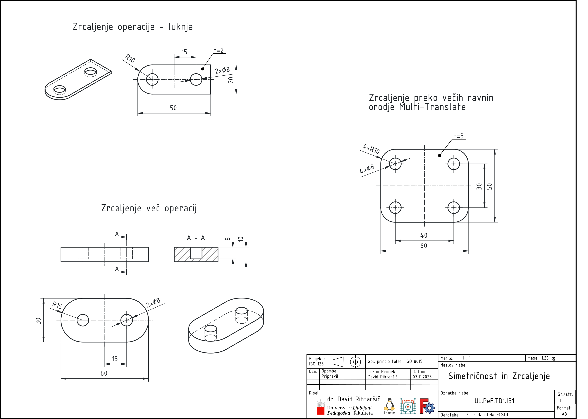
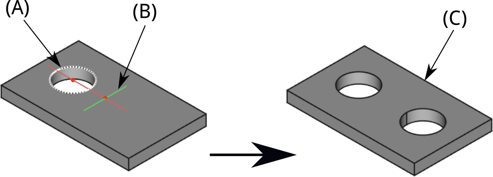
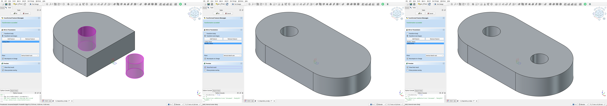
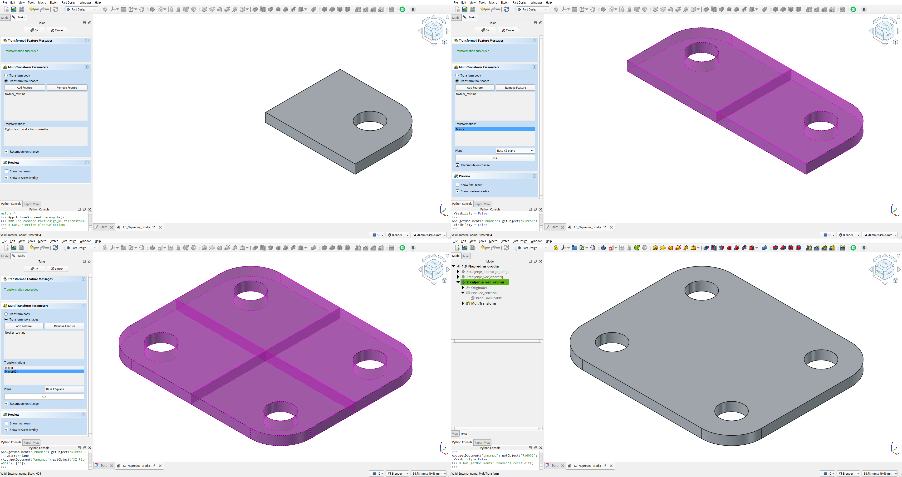
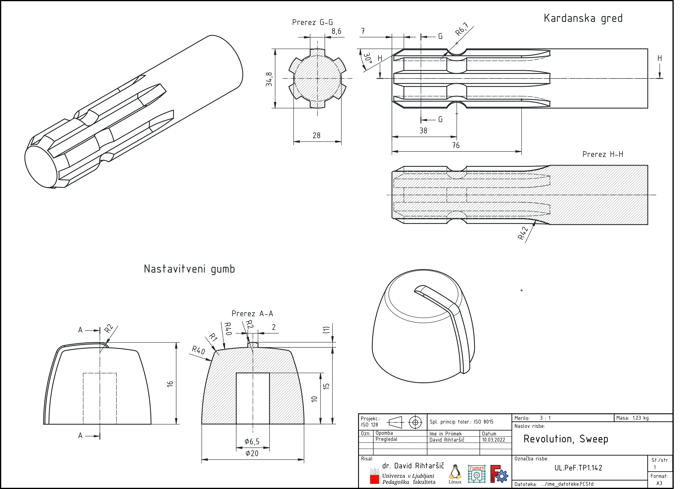

## Modeliranje: Mirror, Revolve in Sweep

V tem podpoglavju nadaljujemo z raziskovanjem osnovnih načinov ustvarjanja kompleksnejših oblik. Osredotočili se bomo na vlogo **simetrije** pri modeliranju, ki omogoča racionalno gradnjo in uravnoteženost izdelkov. Ob tem bomo spoznali tri temeljne principe oblikovanja v 3D prostoru – **zrcaljenje (Mirror)**, **vrtenje (Revolve)** in **povezovanje profilov (Loft)**. Ti postopki skupaj tvorijo osnovni nabor orodij za ustvarjanje funkcionalnih in estetsko uravnoteženih geometrijskih modelov.

### Zrcaljenje (Mirror)

V tehnični dokumentaciji so linije simetrije pogosto ključne reference pri opisovanju geometrije telesa (glej [@fig:simetricnost_in_zrcaljenje], ali dokument [Simetričnost in Zrcaljenje](./slike/1.3.1_Napredna_orodja_Zrcaljenje.pdf)). S tem se jasno nakaže simetrija izdelka ali sestavnih delov, olajša razumevanje konstrukcije ter omogoči dosledno reproduciranje modelov. 

{#fig:simetricnost_in_zrcaljenje}

V programu FreeCAD je orodje zrcaljenja (Mirror), ki omogoča hitro ustvarjanje simetričnih elementov glede na izbrano ravnino simetrije, pri čemer se ohrani povezava med originalom in njegovim zrcaljeno preslikavo. Ta pristop pripomore, da je dokumentacija bolj pregledna in omogoča jasno komunicijo [@FreeCAD2023_parametric; @FreeCAD2023_mirror].

**Zrcaljenje (Mirror)** je orodje, ki omogoča kopiranje oblike ali funkcije modela glede na določeno ravnino simetrije. V inženirskem modeliranju se uporablja za hitro ustvarjanje **simetričnih elementov**, brez potrebe po ponovnem risanju skic.

Zrcaljenje temelji na **geometrijskem pojmu simetrije**, pri katerem so vsi točkovni elementi kopirani na nasprotno stran izbrane ravnine, pri čemer ostane razdalja od ravnine enaka.

V delovnem okolju **Part Design** se orodje Mirror uporablja za:

- **zrcaljenje modelirne operacije (features)** (npr. luknja, posnetje, rebro),
- zrcaljenje **celotnega telesa (body)**.

#### Ključni pojmi

- Ravnina zrcaljenja: referenčna ravnina, na podlagi katere se izvede simetrična preslikava. Lahko je osnovna ravnina (XY, YZ, XZ) ali je v uporabi *Datum Plane* kot izhodišče zrcaljenja.
- Modelirna operacija (Feature): funkcionalni element telesa (npr. Pocket, Pad, Fillet), ki ga je mogoče zrcaliti v okviru parametričnega modeliranja.
- Simetrija: geometrijska lastnost, pri kateri sta dve polovici objekta enaki glede na določeno os ali ravnino.
- Parametričnost: zrcaljeni del ostane v povezavi z izvirnim delom; spremembe v originalu se avtomatsko odražajo na zrcaljeni kopiji.
-
**Ključne prednosti zrcaljenja:**

- enostavno ustvarjanje simetričnih oblik,
- manjše število skic in funkcij,
- samodejno posodabljanje ob spremembah izvirnega dela,
- hitrejša gradnja kompleksnih modelov.

#### Uporaba orodja Mirror v FreeCAD

Orodje **Mirror** se nahaja v delovnem okolju **Part Design** in je uporabno za ustvarjanje zrcaljenih kopij značilnosti glede na izbrano ravnino. Primer takega preprostega zrcaljenja je prikazan na [@fig:PartDesign_Mirrored_example], podrobnejši opis uporabe tega orodja je objavljen na spletnih straneh FreeCAD [@freecad_documentation_2025].

{#fig:PartDesign_Mirrored_example}

**Postopek:**

1. Izberi operacijo (npr. *Pocket*, *Pad*, *Fillet* …), ki jo želiš zrcaliti.
2. Klikni ikono **Mirror**.
3. V pogovornem oknu izberi **Mirror Plane** – lahko je osnovna ravnina (*XY, YZ, XZ*) ali *Datum Plane*.
4. Potrdi. FreeCAD ustvari zrcalno kopijo izbranega elementa.

> **Nasvet:** Zrcaljenje je najbolj učinkovito, če je os simetrije že predvidena v zasnovi telesa – npr. če je telo centrirano v izhodišču koordinatnega sistema.

#### Primer 1: Zrcaljenje luknje na plošči

Na [@fig:PartDesign_Mirrored_example] je prikazan primer uporabe orodja Mirror za luknjo, ki je bila prvotno definirana le na eni strani plošče. Z izbiro ravnine simetrije (v tem primeru **YZ-ravnina**) dobimo zrcalno kopijo luknje na nasprotni strani, brez potrebe po novi skici.

> **Postopek:**
>
> 1. V 3D pogledu izberi funkcijo, ki jo želiš zrcaliti (npr. *Pocket* za luknjo).
> 2. Klikni **Mirror**.
> 3. Določi **Mirror Plane** – standardna ravnina (XY, YZ, XZ) ali *Datum Plane*.
> 4. Potrdi.
>
> **Rezultat:** Zrcaljena značilnost je parametrično povezana z izvirno. Sprememba v originalni luknji se samodejno prenese tudi na zrcalno stran.

#### Primer 2: Zrcaljenje več operacij

Na [@fig:Mirror_Pad_Pocket_all] je prikazan nosilec ohišja, ki je bil modeliran le na eni strani osnovnega telesa. V tokratni nalogi bomo prikazali primer **zrcaljenja več operacij hkrati**. Pogosto so nosilci zasnovani simetrično, zato lahko modeliramo le polovico nosilca in vanj dodamo luknjo (če luknja ne prebada celotnega telesa). Nato uporabimo funkcijo **Mirror**, da hkrati zrcalimo dve operaciji – *Pad* (osnovno telo nosilca) in *Pocket* (luknjo).

> **Pomembno opozorilo:** Če bi v tem primeru zrcalili le operacijo *Pocket*, ali da je vrstni red zrcaljenih operacij napačen, model ne bo prikazan pravilno, saj luknja nima obstoječega telesa, v katero bi bila vrezana. Zato je potrebno v zrcaljenje vedno vključiti prave operacije in jih logično urediti.

{#fig:Mirror_Pad_Pocket_all}

> **Opomba:** Če v modelu še ni ravnine simetrije, jo lahko ustvariš z orodjem **Datum Plane** – postavi jo točno v sredino med dvema točkama ali obrazoma in jo uporabi kot referenco za Mirror.

#### Primer 3: Zrcaljenje preko več ravnin

Na [@fig:Multi_Transform] je prikazan primer, kjer uporabimo orodje **Multi-Transform**, ki omogoča hkratno izvedbo več transformacij, med njimi tudi zaporedno zrcaljenje preko različnih ravnin. V praksi to pomeni, da lahko izberemo četrtino nosilca (1/4 modela) in ga v enem koraku zrcalimo dvakrat – najprej glede na YZ-ravnino, nato še glede na XZ-ravnino. Na ta način lahko ustvarimo popolnoma simetričen nosilec brez dodatnega risanja skic.

{#fig:Multi_Transform}

> **Opomba:** V FreeCAD-u zaporedje dveh operacij zrcaljenja ni mogoče izvesti neposredno z več ločenimi ukazi Mirror. V ta namen uporabimo **Multi-Transform**, kjer so zrcaljenja združena v eno operacijo, kar zagotavlja stabilnost in pravilno posodabljanje modela.

#### Tipične uporabe

Spodaj je jedrnat opis, ki povzema navedene primere zrcalne ravnine ter njihove namembnosti v posameznih elementih.

- Luknje na plošči
  – Ravnina zrcaljenja: YZ
  – Opis uporabe: Luknje simetrično razporejene levo in desno.
- Ojačitve (rebra)
  – Ravnina zrcaljenja: XZ
  – Opis uporabe: Strukturna simetrija ohišij, nosilcev.
- Pokrovi in držala
  – Ravnina zrcaljenja: XY
  – Opis uporabe: Zrcalno oblikovanje v simetričnih izdelkih.
- Utori ali rezi
  – Ravnina zrcaljenja: YZ ali XZ
  – Opis uporabe: Simetrična razbremenilna zareza.

#### Razlika med Mirror in Pattern

- **Mirror** ustvari **eno zrcaljeno kopijo** elementa glede na ravnino.
- **Pattern (Linear/Polar)** ustvari **več kopij** iste značilnosti v izbrani smeri ali okoli osi.

> **Primer:** Če imaš eno luknjo in jo želiš še enkrat na nasprotni strani → *Mirror*.\
> Če pa želiš 5 enakih lukenj v vrsti → *Linear Pattern*.

#### Diagnostika in nasveti

V spodnjem besedilu so povzete ključne napake, ki jih lahko povzročijo, da se zrcaljenje ne izvede pravilno. Posledica takih napak so pogosto topoloških napak. 

- Zrcaljenje ne ustvari dodatnega telesa: Ker ravnina zrcaljenja ne seka prvotnega telesa, zrcaljenje ne generira zrcalne kopije. Rešitev: uporabiti Midplane ali premakniti Datum Plane, da ravnino primerno uvedemo v geometrijo.
- Zrcaljeni del ni povezan s telesom: Napaka nastane, kadar zrcaljena značilnost ne tvori kontakta osnovnega telesa. Rešitev: dodati Union (Fuse) ali preveriti, ali je operacija Additive/Subtractive pravilno nastavljena.
- Napaka pri spremembi originala: Vzrok je topološki problem v strukturi. Rešitev: izvesti zrcaljenje na osnovni strukturi telesa (ne na kombiniranih telesih), da ostane povezanost in ažurnost sprememb.

### Revolve

Revolve je CAD operacija za ustvarjanje tridimenzionalnih teles s preprosto rotacijo 2D profila okoli izbrane osi. Ker je veliko predmetov osno-simetričnih, je priročno zasnovo modelov zasnovati z revolve, saj s tem dobimo popolnoma simetrične geometrije brez ponovnega risanja.

Ključni koncepti:
- os rotacije: izberemo linijo ali rob profila, okoli katere se profil zavrti.
- kot vrtenja: lahko je 360° (polni objem) ali manjši kot 360°, kar omogoča delne oblike (npr. valji, stožci, polovične skulpture).
- uporabo v praksi: profil se najprej definira v skici, nato se ta skica obrot okoli osi s funkcijo Revolution in tako nastane končni model [@FreeCAD2023_parametric].

{#fig:PartDesign_Revolution_example}

Opomba: pri načrtovanju je smiselno upoštevati osno simetrijo že v začetni fazi modeliranja, saj to olajša kasnejše spremembe in zagotavlja konzistentnost geometrije.

> to-do ...

Poglejmo si primer osnosimetričnih elemntov. Podrobnejša dokumentacija je dosegljiva v dokumentu z imenom [1.4.2_ Napredna_orodja_Revolution.pdf](./slike/1.3.2_Napredna_orodja_Revolution.pdf)

{#fig:1}

> **NALOGA (za vaje):**\
> Ustvari osnovno ploščo (80 × 40 × 10 mm) z eno izvrtino na desni strani (Ø 8 mm, odmiki od robov 10 mm).\
> Nato s funkcijo **Mirror** zrcali luknjo na levo stran plošče.\
> Preveri, ali se sprememba položaja luknje v originalu pravilno prenese na zrcalno stran.

<!--
## Napredna orodja modeliranja

Ko obvladamo osnovne funkcije skiciranja in osnovnega modeliranja, lahko začnemo uporabljati naprednejša orodja za kompleksnejše 3D-oblike. Ta orodja omogočajo večjo fleksibilnost in širše možnosti oblikovanja.

### Loft (prelivanje oblik)

Funkcija *Loft* omogoča povezovanje dveh ali več skic v različnih ravninah v zvezno 3D obliko.

- Zahteva najmanj dve skici,
- Skici morata biti odprti ali zaprti profili,
- Uporabno za ustvarjanje kompleksnih prehodov med oblikami.

### Mirror (zrcaljenje)

- Uporablja se za simetrične modele,
- Zrcali izbrane elemente okoli določene ravnine,
- Uporabno za zmanjšanje števila operacij v modelu.

### Pattern (ponavljanje elementov)

- Linearni in krožni vzorec (*Linear Pattern*, *Polar Pattern*),
- Uporablja se za ustvarjanje ponovitev (npr. luknje na krogu),
- Možnost spreminjanja števila ponovitev, razmika, kota.

### Boolean operacije

- Združevanje (Union), odvzemanje (Cut), presek (Intersection),
- Uporabne pri kombiniranju več teles v *Part* okolju,
- Manj priporočljivo za *Part Design*, kjer naj bodo modeli parametrični.

### Primeri uporabe

- *Loft* za ustvarjanje ročaja ali držala z organsko obliko,
- *Mirror* za zrcalno simetrična ohišja,
- *Pattern* za ponavljajoče se izvrtine,
- *Shape Binder* za prenos osnov iz drugega modula.

**Pravilno:** uporaba referenc (Shape Binder), delovanje znotraj enega telesa, smiselna uporaba simetrije.

**Nepravilno:** ročno podvajanje skic, manjkajoča vezava na osnovne skice, nepregleden model.

-->
