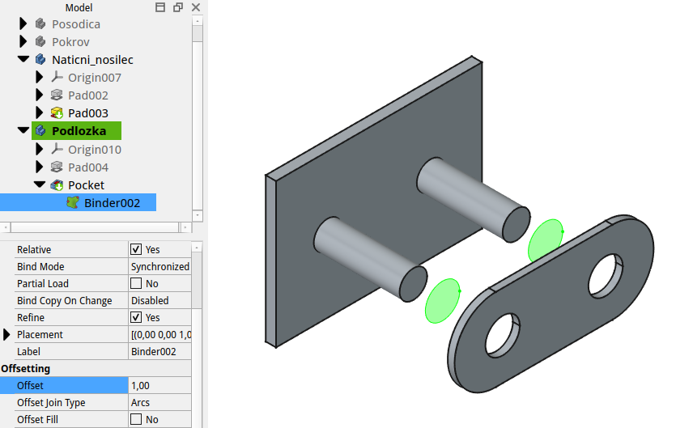
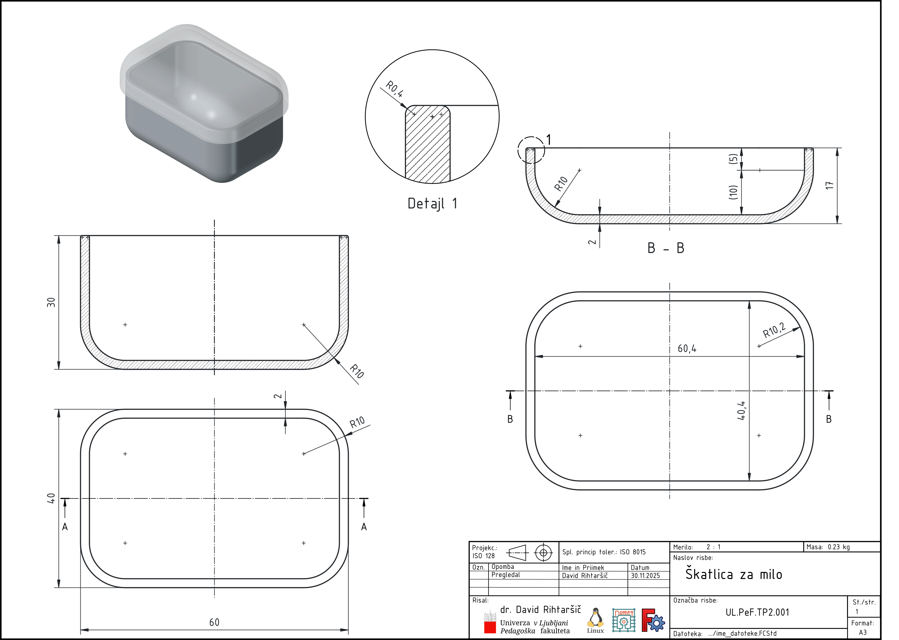

## Soodvisne oblike sestavnih delov

Modeli v realnem svetu pogosto niso sestavljeni iz enega samega kosa, temveč iz več komponent, ki jih je treba združiti v logično celoto. Sestavljanje modelov v FreeCAD-u poteka s pomočjo t.i. *Assembly* okolja, vendar o tem nekoliko kasneje. Najprej bomo spoznali kako lahko načrtujemo posamezne soodvisne elemente, ki se lahko združijo v funkcionalno celoto. V ta namen nam bo v veliko pomoč orodje "Sub-Shape Binder". To orodje nam omogoča parametrično prenašanje definicijskih točk, robov ali ploskev tudi med različnimi telesi.

### Sub-Shape Binder

`Sub-Shape Binder` je ključno orodje v FreeCAD-u, ki omogoča prenos geometrije med telesi in njeno ponovno uporabo kot referenco pri nadaljnjem modeliranju. Namenjen je ohranjanje povezav med deli oziroma oblikami sestavnih delov, kar zagotavlja soodvisnost oblik in doslednost modelov v sklopih, kjer so potrebna ujemanja sestavih sklopov (prikazano na [@fig:sub-shape-binder_podlozka]). Orodje deluje kot posrednik, ki omogoča referenciranje robov, ploskev ali skic iz enega telesa v drugo, pri čemer ohranja parameterčno povezanost: spremembe v izvirniku se samodejno odražajo v zrcaljeni ali povezanem telesu. Ta način dela je še posebej uporaben pri ustvarjanju sestavljenih teles, kjer so dimenzije in postavitve med deli odvisne drug od drugega, zato se izogne napakam, ki nastanejo pri neposredni uporabi zunanje geometrije [@FreeCAD2023_binder; @FreeCAD2023_parametric].

{#fig:sub-shape-binder_podlozka height=7cm}

Pri uporabi `Sub-Shape Binderja` je mogoče referencirati različne geometrijske elemente: objekte ali celo celotna telesa, njihove podobjekte (npr. skice ali funkcije) ter tudi njihove pod-elemente (robove, ploskve ali točke). Izbor prenesene geometrije je odvisen od namena modeliranja: za ustvarjanje teles z orodjem Pad je primarna ravnina ali skica, za določanje položaja izreza sta pogosto dovolj robova, medtem ko je za Booleove operacije smiselno referencirati celotno telo. Ker `Sub-Shape Binder` deluje na podlagi referenc iz različnih teles ali dokumentov, je skrbno načrtovanje referenčne geometrije ključno za trajno skladnost sestavnih delov modela [@FreeCAD2023_binder].

Ena ključnih prednosti `Sub-Shape Binderja` je ohranjanje parametrične povezave. Če se osnovno telo spremeni (npr. sprememba dimenzije, radija ali debeline), se prenesena geometrija in vse od nje odvisne operacije v drugem telesu samodejno posodobijo. S tem se izognemo ročnemu popravljanju modela in omogočimo zanesljiv razvoj sestava.

Orodje je posebej uporabno v naslednjih primerih:

- izdelava pokrovov, ohišij in nosilcev, ki se morajo natančno prilagajati osnovnemu elementu,
- modeliranje notranjih dodatkov, ki sledijo obliki zunanjega ohišja,
- uporaba pristopa »skeletnega modeliranja« (master sketch),
- gradnja elementov, ki morajo slediti robovom ali ploskvam drugega telesa,
- prenos referenčnih linij ali ploskev za nadaljnjo konstrukcijo funkcij.

#### Primer: Škatlica s pokrovom

V naslednjem primeru uporabimo Sub-Shape Binder za modeliranje pokrova, ki se popolnoma ujema z osnovnim telesom škatlice. Primer prikazuje prednosti parametričnega prenosa geometrije med telesi. Podrobnejša dokumnetacijo škatlice je dosegljiva v datoteki [1.5_Soodvisnost_sestavnih_delov_Skatlica.pdf](./slike/1.5_Soodvisnost_sestavnih_delov_Skatlica.pdf).

{#fig:Soodvisnost_sestavnih_delov_Skatlica}

1. Osnovno telo (škatlica)

Osnovno telo naj bo modelirano z naslednjimi značilnostmi:
- tloris: 60 × 40 mm,
- radij vogalov: R10 mm,
- skupna višina: 30 mm,
- debelina sten: 2 mm,
- zaobljen spodnji rob: R10 mm.

To telo predstavlja osnovo, glede na katero bo konstruiran pokrov.

2. Novo telo za pokrov
Ustvari se novo telo, ki bo predstavljalo pokrov škatlice. Pokrov mora ustrezati obliki temeljnika, zato je potrebna uporaba Sub-Shape Binderja za prenos geometrije.

3. Ustvarjanje Sub-Shape Binderja
Izberemo zgornjo ploskev osnovnega telesa ali njegove robove.

Uporabimo ukaz Create Sub-Shape Binder.

Binder se ustvari v telesu pokrova in vsebuje kopijo izbrane geometrije.

Preneseni elementi služijo kot referenca za natančno določanje dimenzij in položaja pokrova.

4. Upoštevanje zračnosti
Pokrov mora biti nekoliko večji od osnovnega telesa, da se lahko prilega.
Pri tem uporabimo odmik:

zračnost: 0,2 mm.

Zračnost lahko določimo:

z odmikom skice,

z odmikom robov (3D Offset),

ali s samostojno skico, ki sledi preneseni geometriji.

5. Konstruiranje pokrova
Na podlagi geometrije iz Sub-Shape Binderja je pokrov izdelan na naslednji način:

skupna višina pokrova: 15 mm,

10 mm kot del, ki sega v notranjost škatlice,

5 mm kot zgornji vidni del;

debelina sten: 2 mm,

zaobljen zgornji rob: R10 mm.

Zaključeno telo pokrova se parametrično prilagodi spremembam osnovnega telesa, ker Sub-Shape Binder sproti posodablja referenčno geometrijo.

#### Tips and Tricks:

Sub-Shape Binder je izredno vsestransko orodje v FreeCAD-u, ki omogoča prenos geometrije iz enega modela na drugega. Omogoča, da vsak binder nosi svojo referenčno geometrijo (robovi, ploskve ali skice), kar omogoča ustvarjanje več oblik iz enega glavnega modela z ohranjeno parametrično povezanostjo. Tak pristop olajša prilagajanje in vzdrževanje skladnosti geometrije pri spremembah osnovnega telesa, kar je posebej uporabno pri razširjenih ali variabilnih sestavnih elementov. Zato je primerno omeniti še nekaj praktičnih primerov uporabe.

**Uporaba robov namesto celotne ploskve:**  
Namesto popolne ploskve je v nekaterih primerih smiselno označiti le robove ali izbrane robne geometrije (npr. robovi, skice ali posamezne ploskve) in jih uporabiti kot referenco pri drugih telesih. Na primer, pri načrtovanju dveh sestavnih delov, ki ju povežemo z vijakom, pogosto načrtujemo dve različni luknji: skozi prvo telo načrtujemo odprtino z določeno zračnostjo okoli vijaka, medtem ko je na drugem telesu luknja nekoliko ožja, kar zagotavlja zadosten oprijem in togost spoja.

**Spreminjanje referenčnih sestavnih elementov Sub-Shape Binderja**:  
V kolikor smo pri kreiranju Sub-Shape Binderja naredili napako in vanj pozabili vključiti nekatere druge referenčne elemente,jih lahko dodamo tako da:

1. na izbrani funkciji telesa (npr.: Pad003) označimo želene robove ali ploskve (npr.: Pad003.Edge002, Pad003.Edge003...), ki jih želimo dodati v Sub-Shape Binder,
2. na to v oknu z zgodovino operacij (Model), primemo dotično operacijo Pad003 in jo prenesemo v Sub-Shape Binder.

**Ponovno definiraje sestavnih geomerijskih elementov Sub-Shape Binderja**:  
Če želimo sestavne elemente Sub-Shape Binderja ponovno definirati, to storimo tako, da:

1. na izbrani funkciji telesa (npr.: Pad003) označimo želene robove ali ploskve (npr.: Pad003.Edge002, Pad003.Edge003...), ki bodo na novo definirali Sub-Shape Binder,
2. na to v oknu z zgodovino operacij (Model), primemo dotično operacijo Pad003 in jo prenesemo v Sub-Shape Binder **in preden operacijo spustimo moramo držati še tipko CONTROL**.

**Uporaba Sub-Shape Binderja z Master Sketch**:  

Sub-Shape Binder omogoča, da iz Master Sketch, torej iz ene glavne skice, načrtujemo več teles ali sestavnih del ter jih vzdržujemo s pomočjo ločenih referenčnih elementov, kot so robovi ali ploskve, ki se dodelijo posameznim binderjem. Tako lahko vsak binder nosi drugačen sklop referenc (npr. različne robove ali skice), kar omogoča, da iz ene glavne skice ustvarimo več različnih oblik ali delov. Ko spremenimo primarno skico, se spremembe samodejno posodobijo v različnih binderjih, s čimer se vzdržuje parametrična povezanost med deli in se olajšajo iteracije pri zasnovi sestavnih delov.

### Osnovni pojmi sestavljanja

- **Komponenta**: posamezni del (kos), ki ga sestavimo v večjo celoto.
- **Sestav (Assembly)**: združba več komponent, ki so med seboj povezane s funkcionalnimi relacijami (prileganje, poravnava).
- **Povezave (Constraints)**: določajo prostorski odnos med posameznimi komponentami (npr. poravnava osi, stik ploskev).

### Pristopi k sestavljanju

- **Znotraj enega dokumenta** (več Body elementov): preprosto modeliranje brez uporabe specializiranega okolja.
- **Z ločenimi dokumenti in Assembly Workbenches**: bolj napredno sestavljanje s komponentami, uvoženimi iz različnih datotek.

### Assembly Workbenches

V FreeCAD-u obstaja več dodatkov za sestavljanje:

- **A2+** – enostaven in zelo razširjen dodatek za sestavljanje modelov.
- **Assembly 4** – naprednejši modul s parametrično vezavo in referencami.

### Primer uporabe povezav

- Poravnava dveh osi,
- Stik med dvema ploskvama,
- Fiksacija ene komponente in usklajevanje ostalih.

### Priporočila za delo

- Komponente naj bodo modelirane posamezno in shranjene kot ločene datoteke,
- Uporabljaj skupne referenčne točke za lažje poravnavanje,
- Pred sestavljanjem preveri, da so posamezne komponente popolnoma definirane.

**Pravilno:** uporaba vezav (constraints) za sestavljanje, orientacija na referenčne točke.

**Nepravilno:** ročno premikanje komponent brez povezav, manjkajoče relacije med deli, slaba organizacija datotek.

