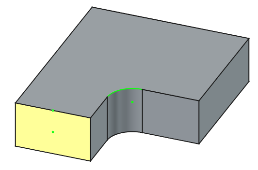
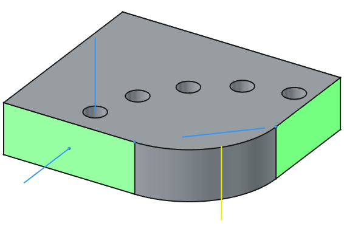
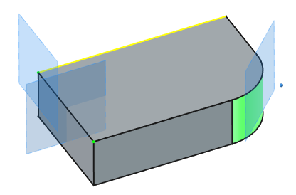
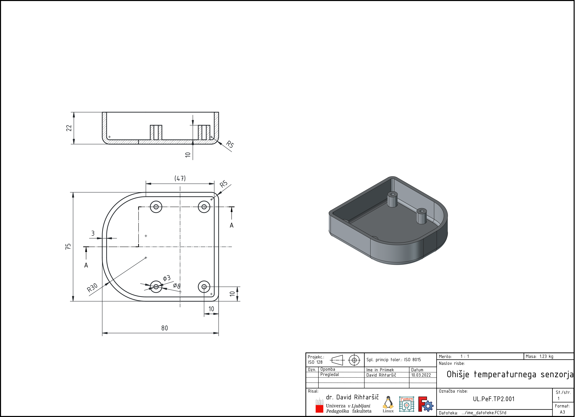
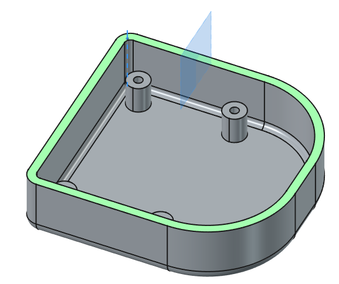

## Referenčne ravnine, premice in točke

Pri kompleksnejših modelih osnovne ravnine XY, YZ in XZ pogosto ne zadostujejo. V takih primerih uporabimo pomožne ravnine (Datum Planes), premice in točke, ki jih lahko postavimo poljubno glede na geometrijo modela ali v soodvisnosti z drugimi geometrijskimi elementi modela. Delo v prostoru vključuje tudi uporabo lokalnih koordinatnih sistemov in orientacijo skic v različnih smereh.

Ko v Freecad-u izberemo orodje za kreiranje referenčne geometrije, se v oknu z `Nalogami` (Tasks) prikažejo tri pomembna področja:
1. Določitev izbranih elementov (Attachment):
    - izberemo geometrijske elemente s katerimi bo določena referenčna geometrija.
2. Definicijske omejitve izbranih elementov izbranih (Attachment mode):
    - določimo soodvisnosti izbranih elementov (normala, tangentnost, središče , ...).
3. Dodatni premiki in rotacije (Attachment offset):
    - dodatni premik referenčne geometrije v smereh x, y in z.

{#fig:Datum_Plane_menu}

V teh primerih ne bomo posebej izpostavljali, da vse te elemente lahko premikamo in rotiramo okoli njihovega koordinatnega izhodišča. Ta funkcionalnost je na voljo tudi skici in se v tem skica ne razlikuje od referenčne ravnine. Posebnost referenčnih elementov je prav v tem, da jih lahko definiramo glede na ostale geometrijske elemente telesa.

### Referenčna točka

Referenčno točko največkrat uporabimo takrat, ko si želimo pridobiti neko središče. V takih primerih izberemo `Attachment mode = center of mass`. Na [@fig:DatumPointExample] je prikazan primer, kjer smo referenčne točke določili v središču ploskve, daljice in loka.

{#fig:DatumPointExample}

### Referenčna premica

Referenčna premica (Datum Line) ima pomembno vlogo, še posebej pri naprednejšem modeliranju, saj omogoča natančno kontrolo orientacije, simetrije, osi rotacije, zlasti tam, kjer ne moremo uporabiti izhodiščnih koordinatnih osi ali obstoječih robov določenega modela. Pogosto jo kombiniramo z orodji kot so: Revolve, Groove in Polar pattern. Tak primer je prikazan na [@fig:DatumLineExample], kjer so izvrtine razporejene okoli osi, ki je presečišče označenih ploskev.

{#fig:DatumLineExample}

Uporabne možnosti določitve referenčne daljico so:
- normala ploskve skozi točko,
- presečišče dveh ploskev,
- premica skozi dve točki,
- os krožnice ali loka,

### Referenčna ravnina

Od vseh referenčnih geometrijskih elementov se najbolj pogosto uporablja prav referenčna ravnina. Z njo si največkrat pomagamo pri določitvi mesta za skico. Pogosto naletimo na situacijo, ko skice ne moremo pripeti na nek obstoječ geometrijski element. Poleg te situacije, je tudi pogosta uporaba referenčne ravnine v primerih, ko ne moremo zrcaliti preko koordinatnih ravnin.

Ker ravnino določa več geometrijskih omejitev kot na primer točko ali premico, imamo zato v `Attachment mode` polju zelo veliko možnosti. A najpogosteje uporabljamo tiste možnosti, ki jih pri pritrjevanju skice ni možno izbrati:
- ravnina tangentna na izbrano ploskev in normalo proti izbrani točki,
- ravnina z normalo izbrane premice ali roba in izbrano točko,
- ravnina, ki gre skozi "težišče" (središče vztrajnostnih momentov) izbranega elementa (ali več njih).

{#fig:DatumPlaneExample}

#### Primer: Zrcaljenje lokalne geometrije telesa
je priličen primer uporabe referenčne ravnine. Na primer če imamo nek izdelek, na katerem se pojavi neka simetrija funkcionalnih elementov le lokalno, takrat si lahko pomagamo z referenčno ravnino.

Naslednja risba [ohišja temperaturnega senzorja](./slike/1.6_Referencne_ravnine.pdf) predstavlja tak primer ([@fig:ohisje_temp_sen]). Ohišje vsebuje štiri pritrdilna mesta za tiskano vezje temperaturnega senzorja, ki so simetrično postavljene glede na notranje polje (pravokotnik).

{#fig:ohisje_temp_sen}

V tem primeru si lahko pomagamo z referenčno ravnino, ki jo določimo glede na sredino notranje daljice. Ker je notranji rob zaokrožen z radijem 2 mm, moramo najprej:
- narediti referenčno premico, ki jo dobimo s presečiščem notranjih ploskev ohišja.
- Nato definiramo še referenčno točko, kot presečišče referenčne premice in zgornje ploskve ohišja, ter
- definiramo referenčno ravnino na sredini (Inertia) med končno točko robu in definirano referenčno točko.

{#fig:middle_plane_example}

<!--
### Orientacija v prostoru

- Pomembna za modeliranje z več smermi (npr. vrtanje pod kotom),
- Uporaba orodij za rotacijo in premik objektov,
- Določanje referenc glede na obstoječe geometrijske elemente.

### Lokalni koordinatni sistemi

- Določeni s pomočjo *Datum Coordinate System*,
- Uporabni pri sestavljenih modelih in povezovanju različnih komponent,
- Omogočajo neodvisno orientacijo posameznih delov.

### Projekcije skic na ploskve

- Možno je projicirati 2D-skico na ukrivljeno ali rotirano ploskev,
- Uporabno pri naprednih oblikah (npr. gravure, utori),
- Orodje: *Map Sketch to Face*.

### Primeri uporabe

- Skica na 45° ravnini za poševno izvrtino,
- Konstrukcija lukenj na zakrivljenih površinah,
- Ločeno modeliranje podsklopov z lastnimi koordinatnimi sistemi.

**Pravilno:** uporaba Datum Plane za logično ločevanje funkcionalnih sklopov,
orientacija glede na obstoječe elemente.

**Nepravilno:** prekrivanje geometrije, nenatančna pozicija skic, uporaba napačnih referenc.

-->
