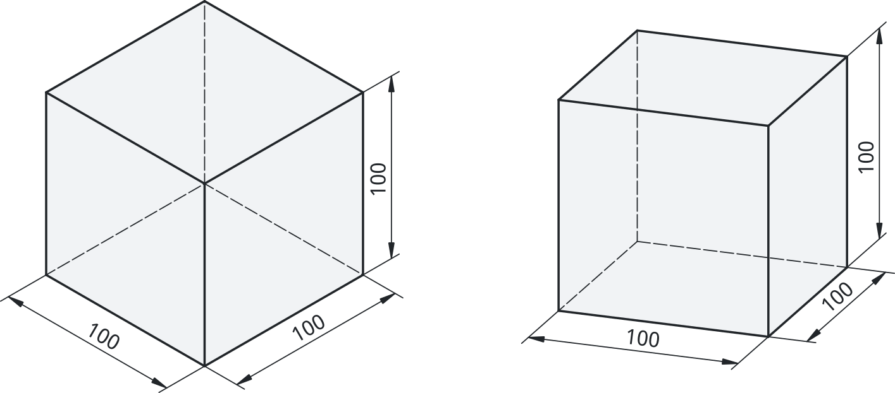
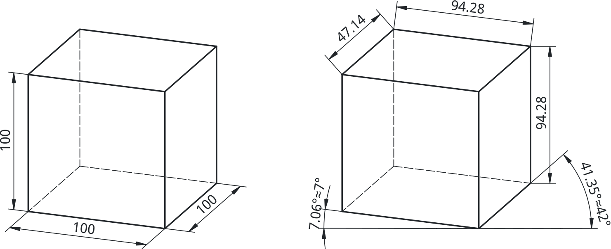

## Aksonometrične projekcije

Aksonometrična projekcija je metoda tehnične risbe, ki omogoča prikaz tridimenzionalnih objektov na dvodimenzionalni ravni, pri čemer se ohrani razmerje med dimenzijami v vseh treh prostornih oseh (x, y in z). Ta projekcija se uporablja v tehnični dokumentaciji in inženiringu bolj redko. Pogosteje je uporabljena za širšo javnost, ki niso vešči večpoglednih projekcij. Aksonometrična projekcija omogoča jasen in natančen vpogled v obliko in strukturo objekta. Aksonometrične risbe so še posebej uporabne pri predstavi kompleksnih elementov, saj omogočajo hkrati prikaz prednje, stranske in zgornje perspektive, kar olajša predsavo objekta.

Med najbolj pogosto uporabljenimi oblikami aksonometrične projekcije sta izometrična in dimetrična projekcija. V nadaljevanju bomo podrobneje raziskali izometrično projekcijo, ki je specifična vrsta aksonometrične risbe, ter njene značilnosti in prednosti pri tehničnem risanju.

Izometrična projekcija je posebna oblika aksonometrične projekcije, kjer so tri glavne osi objekta prikazane pod enakimi koti (120° med seboj) in brez perspektive. Uporablja se za bolj intuitiven prikaz 3D oblik. Od vseh aksonomitričnih projekcij se le-ta največkrat uporablja. Pri predmetih, katerih se prednji in zadnji robovi prekrivajo (npr. pri kocki, 4-strana piramida) lahko uporabimo dimetrično projekcijo, kot na [@fig:izo_vs_di]. Čeprav se le-ta praviloma uporablja ko želimo večji poudarek dati eni ploskvi predmeta.

{#fig:izo_vs_di}

### Izometrična projekcija

- Vse tri osi (X, Y, Z) so enako nagnjene (30° od vodoravnice),
- Razmerja dolžin ostanejo nespremenjena (ni perspektivnega skrajševanja),
- Krogi postanejo elipse, kvadri ostanejo pravokotni.

#### Definicija izometrične projekcije

Posebnost izometrične projekcije je v tem, da so vse tri glavne osi - dolžinska, širinska in višinska - merjene v enakem merilu, kar omogoča, da so vse dolžine proporcionalne. Torej rešiti moramo problem kako zarotirati telo kocke tako, da bodo projekcije vseh njenih robov enako dolge. Problem najlažje rešimo z rotacijskimi matrikami, vendar ga na tem mestu ne bomo podrobneje obravnavali. Le tega si lahko pogledate v mnogih literaturah (na primer [@Sterk_rot_proj_matrike]). Povzeli bomo le pot reševanja tega problema:

- Rotacija točke


```python
import numpy as np
import Part
from FreeCAD import Vector

kot_deg = 45
kot_rad = np.radians(kot_deg)

Rz = np.array([
    [np.cos(kot_rad), -np.sin(kot_rad), 0],
    [np.sin(kot_rad),  np.cos(kot_rad), 0],
    [0,                0,               1]
])

print("Rotacijska matrika Rz:")
print(Rz)

v = Vector(10, 0, 0)
izvorna_tocka = Part.show(Part.Vertex(v))
izvorna_tocka.ViewObject.PointColor = (0.0, 0.0, 1.0)
izvorna_tocka.ViewObject.PointSize = 8
izvorna_tocka.Label = "IzvornaTočka"

# pretvorba v numpy objekt
p = np.array([v.x, v.y, v.z])
# ROTACIJA = množenje matrike in točke
p_rot = Rz @ p

v_rot = Vector(*p_rot)
rotirana_tocka = Part.show(Part.Vertex(v_rot))
rotirana_tocka.ViewObject.PointColor = (1.0, 0.0, 0.0)
rotirana_tocka.ViewObject.PointSize = 8
rotirana_tocka.Label = "RotiranaTočka"

# Črta med točkama – SIVA
crta = Part.makeLine(v, v_rot)
crta_obj = Part.show(crta)
crta_obj.ViewObject.LineColor = (0.5, 0.5, 0.5)
crta_obj.Label = "Povezava"
```
: Rotacija tocke v programu FreeCAD s python kodo. {#lst:rotacija_tocke_FreeCAD}


- Rotacijska matrika
- Rotacija po $z$ osi za kot $\alpha$ in rotacija po $y$ osi za kot $\beta$.
- Rešitev problema za $|a_x| = |a_y| = |a_z|$.

$$ \begin{pmatrix}
0 & 0 & 0 \\
\frac{\sqrt2}{2} & \frac{\sqrt2}{2} & 0 \\
-\frac{\sqrt6}{6} & -\frac{\sqrt6}{6} & \sqrt\frac{2}{3}
\end{pmatrix} $${#eq:iso_solution}

Od koder lahko izračunamo oba kota: $\alpha = sin^{-1}(\frac{\sqrt2}{2}) = 45^\circ$ in
$\beta = cos^{-1}(\sqrt\frac{2}{3}) \approx 35.26^\circ$.

#### Prikaz izometričnih projekcij

- Osnovni sistem osi: X (30° desno), Y (30° levo), Z (navpično),
- Izometrična mreža olajša ročno risanje,
- V CAD programih se uporablja izometrični pogled kamere.

### Dimetrična projekcija

Dimetrična projekcija je vrsta axonometrične projekcije, kjer sta dve izmed treh glavnih osi objekta prikazani z enakim merilom, tretja os pa ima drugačno merilo. To vodi do neenakomernega prikaza dimenzij, vendar lahko ohrani določene geometrijske in prostorske značilnosti objekta.

Na primer, rob kocke, ki je v resnici dolg 100 mm (kot je prikazano na [@fig:dimetricna_projekcija]), je v projekciji prikazan kot 94.28 mm. Podobno je projekcija roba v smeri x, ki bi moral meriti 50 mm, prikazana z dolžino 47.14 mm. Kljub tej deformaciji, v dimetrični projekciji pogosto ohranjamo razmerje 1:2:2 med osmi. To omogoča, da ohranjamo enakomeren in proporcionalen vtis prikaza objekta, kljub temu da nekatere meritve kažejo manjše kot so v resnici.

{#fig:dimetricna_projekcija}

Z upoštevanjem razmerja 1:2:2 se zagotovi, da so dimenzije še vedno pravilne in usklajene, kar omogoča lažje razumevanje objekta v prostoru, hkrati pa omogoča enostavno merjenje in reprodukcijo elementov na tehničnih risbah.


### Uporaba

- Hiter vizualni prikaz kompleksne oblike,
- Primeren za predstavitev funkcionalnih sklopov,
- Ni primeren za natančne meritve.

### Primeri

- Tehnični priročniki,
- Priročni prikazi naprav,
- Uvodne predstavitve modelov pred izdelavo.

**Pravilno:** pravilni koti osi, ohranjena razmerja.

**Nepravilno:** mešanje perspektive, nepravilna orientacija osi.

