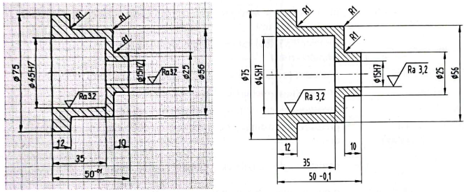
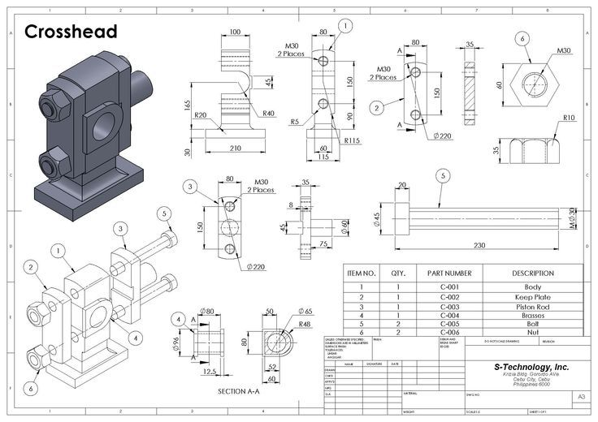
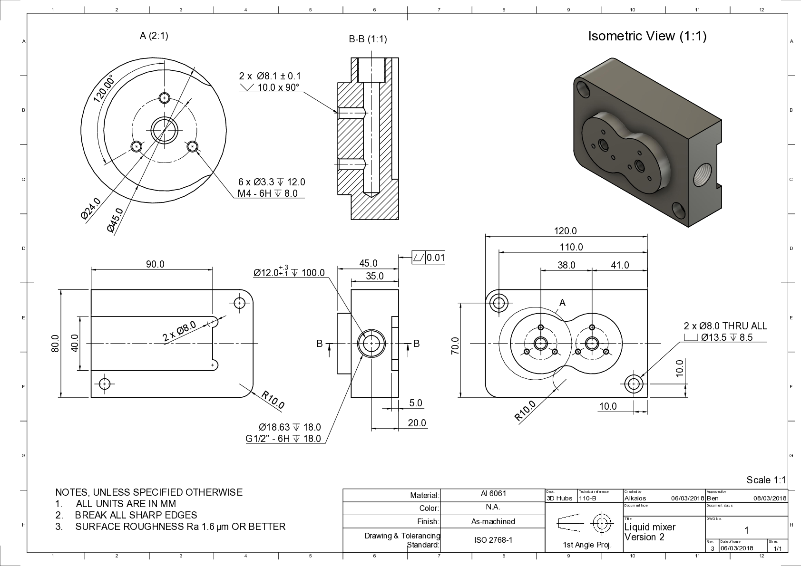
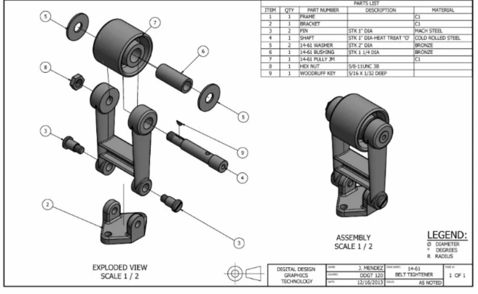
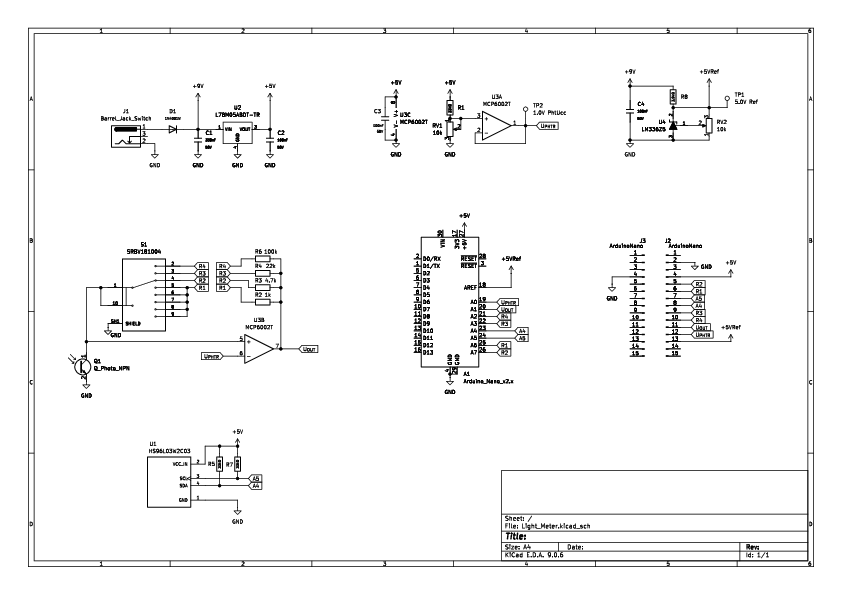

## Vrste tehniških risb

Tehniške risbe obstajajo v številnih oblikah, saj vsaka opravlja specifično funkcijo v procesu načrtovanja, izdelave, nadzora ali dokumentiranja tehničnih sistemov. Različne vrste risb omogočajo prenos informacij na različnih stopnjah razvoja izdelka – od prvotne idejne zasnove do natančne delavniške risbe ter končne montažne dokumentacije.

Vsaka vrsta risbe ima svoj namen, raven podrobnosti, stopnjo standardizacije in tipične uporabnike. Razumevanje razlik med njimi je ključno za učinkovito komunikacijo v tehničnih poklicih ter za zagotavljanje, da izdelki nastanejo skladno s pričakovanim delovanjem, kakovostjo in varnostnimi zahtevami.

V nadaljevanju predstavljamo pregled najpogosteje uporabljenih vrst risb v skladu s standardom **SIST ISO 10209 (DIN 199-1)** in dodatnimi klasifikacijami iz literature (Prebil & Zupan). Preglednica združuje splošno sprejete vrste risb ter njihove definicije, kot jih najdemo na str. 17 vira Tehniška dokumentacija (Prebil et al.).

V [@tbl:vrste_risb] so povzete ključne vrste risb ter njihov namen. Terminologija in opisi sledijo mednarodnim standardom ter domači strokovni literaturi.

| Vrsta risbe                             | Opis                                                                                                                  |
| --------------------------------------- | --------------------------------------------------------------------------------------------------------------------- |
| **Razporeditvena risba**                | Prikazuje prostorsko postavitev in lego posameznih delov v sklopu ali napravi.                                        |
| **Diagram**                             | Predstavlja medsebojne številčne ali funkcijske odvisnosti v koordinatnem ali sistemskem prikazu.                     |
| **Risba posameznega dela**              | Tehnična risba, narisana za del, ki ga ni mogoče nadalje razstavljati.                                                |
| **Risba osnutka**                       | Prikazuje razvojno fazo izdelka, ko še ni sprejeta končna konstrukcijska odločitev.                                   |
| **Dodatna risba**                       | Samostojna risba, katere vsebina ni vezana na drugo tehnično dokumentacijo.                                           |
| **Delavniška risba**                    | Popoln tehnični dokument, potreben za izdelavo posameznega dela. Vključuje mere, tolerance, material, hrapavosti itd. |
| **Fotografija**                         | Uporablja se kot vizualni dodatek za prikaz videza, površin ali sestavov.                                             |
| **Prospekt**                            | Predstavlja idejne rešitve ali komercialne predstavitve izdelkov.                                                     |
| **Skupinska risba (podsestav, sestav)** | Prikazuje prostorsko razporeditev delov in njihovo medsebojno povezavo.                                               |
| **Glavna risba (sestavna risba)**       | Predstavlja celoten izdelek v njegovi končni obliki, vključuje standardizirano kosovnico.                             |
| **Konstrukcijska risba**                | Prikazuje konstrukcijsko rešitev izdelka ali naprave v različni fazi razvoja.                                         |
| **Namenska risba**                      | Prikazuje risbo za določen namen uporabe (npr. servisne risbe).                                                       |
| **Patentna risba**                      | Služi uradnim postopkom prijave patenta in mora slediti formalnim pravilom patentnih organizacij.                     |
| **Eksperimentalna risba**               | Uporablja se pri raziskovalnih in eksperimentalnih postopkih; prikazuje postavitev sistema ali meritev.               |
| **Zbirna risba**                        | Prikazuje prostorsko ureditev delov, ki niso sestavljeni.                                                             |
| **Shema**                               | Abstraktna ali simbolična predstavitev sistema (električna, hidravlična, pnevmatska shema).                           |
| **Skica**                               | Ročno izdelana tehnična risba, ki pogosto ni v merilu in se uporablja v začetnih fazah načrtovanja.                   |
| **Originalna podloga**                  | Podlaga, namenjena razmnoževanju risb.                                                                                |
| **Standardna risba**                    | Risba, ki kljub spremembam ohranja določene mere zaradi standardizirane uporabe.                                      |
| **Tehnična skica**                      | Pojasnjuje tehnični namen in način delovanja.                                                                         |
| **Tehnična podloga**                    | Podlaga, katere informacije služijo tehničnemu namenu.                                                                |
| **Tehnična risba**                      | Splošni pojem za risbo, ki pojasnjuje tehnični namen in način delovanja izdelka ali sklopa.                           |
| **Risba dela**                          | Prikazuje del brez prostorske postavitve, osredotočena na geometrijo.                                                 |
| **Podloga**                             | Nosilec informacij, ki omogoča arhiviranje, branje in označevanje risb.                                               |
| **Tiskani obrazec – podloga**           | Oblika predpripravljene risarske podlage.                                                                             |
| **Risarska podloga**                    | Tehnični papir, na katerem je narisana risba.                                                                         |
| **Montažna risba**                      | Risba, ki prikazuje postopek sestavljanja, vrstni red montaže ter lego delov.                                         |

Table: Vrste risb. {#tbl:vrste_risb}

(vir: Prebil & Zupan, *Tehniška dokumentacija*)

### Skica

Skica je prva in najosnovnejša oblika tehniške risbe. Gre za hitro, ročno izdelano predstavitev oblike, razmerij in osnovnih dimenzij dela ali sklopa. Skiciranje predstavlja začetno fazo razvoja tehnične dokumentacije, saj omogoča zgodnje razumevanje oblike izdelka in pripravo na natančnejše tehniške risbe.

Skica določa potrebne poglede in prereze za nadaljnjo izdelavo natančnega modela. Vedno jo rišemo prostoročno, brez ravnil, šestil in drugih pripomočkov. Pogosto se uporablja mrežni papir, ki pomaga pri določanju simetričnih elementov in razmerij. Na skici so prikazane tudi ključne mere, ki jih kasneje prenesemo v delavniško risbo.

Skica se uporablja:

- v idejni fazi razvoja,
- pri pogovorih med konstrukterjem in tehnologom,
- kot pomoč pri razumevanju poteka delovnega procesa,
- pri določanju osnovnih oblik in proporcev.

Značilnosti skice:

- ni nujno izdelana v merilu,
- vsebuje osnovne mere in oblike,
- pogosto prikazuje srednice, pomožne črte in preproste geometrijske konstrukcije,
- omogoča hitro popravljanje in dopolnjevanje.

{#fig:vrste_risb_skica}

Na [@fig:vrste_risb_skica] so prikazani tipični primeri prehoda od skice prirobnice do delavniške risbe ter konstrukcija osnovnih geometrijskih oblik.

### Sestavna risba

Sestavna risba na [@fig:vrste_risb_sestavna] [@bible_2020_sestavna] prikazuje, kako so posamezni deli sestavljeni v mehanski sklop. Sestavne risbe prikazujejo neko celoto, lahko je tudi podsestav ali pa celotno napravo. Namenjena je razumevanju povezav med deli, medsebojnega delovanja in pravilnega vrstnega reda sestavljanja.

{#fig:vrste_risb_sestavna}

Sestavna risba pogosto vsebuje:

- mere, ki določajo gabarite sklopa,
- pozicijske številke delov,
- kosovnico (seznam delov),
- ključne mere za prileganje (ujem),
- razrede toleranc med sestavnimi deli,
- posamezne poglede in prereze,
- smeri in načine sestavljanja.

Sestavna risba je izhodišče za montažne risbe, delavniške risbe posameznih delov in končno tehnično dokumentacijo.

### Delavniška risba

Delavniška risba (primer na [@fig:vrste_risb_delavniska] [@network_2024_delavniska] ) je ena najpomembnejših tehničnih risb, saj predstavlja popoln nabor informacij, potrebnih za izdelavo posameznega dela. Gre za risbo, izdelano v standardnem merilu, s pripadajočo glavo risbe, kosovnicami ter tabelami za tolerance.

{#fig:vrste_risb_delavniska}

Delavnška risba vključuje:

- natančne mere (dimenzije),
- tolerance dimenzij in oblik,
- obdelovalne oznake (hrapavost, toplotna obdelava),
- material,
- oznake leg in orientacij,
- opombe, pomembne za proizvodnjo.

Standardni deli (kot so vijaki, matice, podložke, ležaji …) ne zahtevajo delavniške risbe; zadostuje sklic na standard.
Delavniška risba je torej temeljni dokument v proizvodnji, iz katerega delavec, tehnolog ali kontrolor kakovosti neposredno razume, kako izvesti izdelek.

### Montažna risba

Montažna risba [@fig:vrste_risb_montazna] [@anderson_2024_montazna] prikazuje **postopek sestavljanja** izdelka, zaporedje vključevanja posameznih delov ter končno lego sestava. Osredotoča se na **montažni proces**, zato se razlikuje od sestavne risbe, ki prikazuje predvsem strukturo in medsebojne odnose delov.

Montažna risba vključuje:

- prikaz sestavljanja po korakih (fazno),
- zaporedje in smeri vstavljanja delov,
- potrebna orodja ali posebna navodila,
- ključne montažne mere in ujemne površine,
- pogosto tudi eksplozijski prikaz sestava.

Montažna risba je pomembna za:

- monterje in servisne tehnike,
- sestavo izdelkov v proizvodnji,
- pregled pravilnega vrstnega reda postopkov,
- pripravo učnih gradiv in servisnih dokumentov.

{#fig:vrste_risb_montazna}

V praksi montažna risba pogosto dopolnjuje sestavno risbo, saj poda informacije, ki niso razvidne iz klasičnega projektantskega prikaza.

### Shematska risba

Shematska risba je **abstrakten** ali **simboličen** prikaz sistema (primer na [@fig:vrste_risb_shematska]), pri katerem prostorska razporeditev ne nujno odraža razporeditvi realnih sestavnih delov. Njen namen je prikazati logično soodvisnost sestavnih delov, ki delujejo kot celota. Namesto realne geometrije so uporabljeni dogovorjeni simboli, ki opisujejo funkcionalne povezave, tokove energij, signalne linije ali zaporedja delovanja.

{#fig:vrste_risb_shematska}

Shematske risbe so ključnega pomena povsod, kjer je za uporabnika pomembno **delovanje sistema**, ne pa njegova oblika. Zaradi tega so močno standardizirane – vsak simbol ima določen pomen, pravila branja shem pa so usklajena med panogami.

Ključne značilnosti shematskih risb:

- niso v merilu,
- uporabljajo standardizirane simbole,
- prikazujejo **delovanje**, ne **geometrije**,
- omogočajo hitro razumevanje kompleksnih sistemov,
- so nujne za načrtovanje, diagnostiko in izobraževanje.

V strojništvu sheme najpogosteje prikazujejo:

- **hidravlične sisteme** (ventili, črpalke, valji, rezervoarji, tlaki),
- **pnevmatske sisteme** (regulatorji, aktuatorji, ventili, filtri),
- **krmilne in varnostne mehanizme**,
- **energijske tokove** (pretok zraka, olja, vode itd.).

V teh shemah prostorska razporeditev elementov ni pomembna; pomembni so **tokovni diagrami**, **povezave**, **usmerjenost tokov** in **funkcionalne odvisnosti**. Sheme omogočajo hitro razumevanje delovanja stroja, identifikacijo napak in načrtovanje servisnih postopkov.

V elektroniki so shematske risbe (angl. **schematics**) temelj celotnega inženirskega procesa. Predstavljajo električne in elektronske komponente ter njihove medsebojne povezave.

Shematska risba v elektroniki vključuje:

- **simbolične predstavitve komponent** (upori, kondenzatorji, diode, tranzistorji, integrirana vezja),
- **vrednosti komponent** (upori v ohmih, kondenzatorji v faradih, tolerančni razredi),
- **logične povezave med elementi** (signali, napajalne linije, mase),
- **oznako netov** (poimenovane povezave, ki jih računalniško orodje sledi po vezju),
- **referenčne oznake** (R1, C3, U5 …), ki se uporabljajo pri montaži in izdelavi PCB.

Elektronske sheme so osnova za:

- **načrtovanje tiskanih vezij (PCB)**,
- **simulacije delovanja vezij**,
- **debugging in iskanje napak**,
- **proizvodnjo in sestavo vezij**,
- **servisne priročnike**.

Skupna značilnost vseh shem (strojnih in elektronskih) je, da prikazujejo **funkcionalno logiko**, ne pa fizične dimenzije ali oblike. Zato se uporabljajo abstraktni standardizirani simboli:

- ISO 1219 za hidravlično in pnevmatsko tehniko,
- IEC 60617 za elektronske komponente,
- IEEE standardi za digitalne diagrame.

---

###  Povzetek

V tem poglavju smo predstavili najpogostejše vrste tehniških risb ter njihove namene v celotnem konstrukcijskem procesu. Razumevanje razlik med njimi je ključno za pravilno branje tehniške dokumentacije, učinkovito komunikacijo v inženirskih timih in pravilno pripravo dokumentov za proizvodnjo, montažo ali servis.

Tehniške risbe se med seboj razlikujejo glede na stopnjo natančnosti, vsebino informacij, namen uporabe in uporabnika, ki jih potrebuje. Pri tem štiri vrste izstopajo ([@tbl:pogoste_risbe]) kot temeljne za razumevanje in delo v strojništvu ter sorodnih tehničnih področjih:

| Vrsta risbe                 | Namen                         | Kaj prikazuje                                                       | Značilnosti                                                              | Tipičen uporabnik                                                   |
| --------------------------- | ----------------------------- | ------------------------------------------------------------------- | ------------------------------------------------------------------------ | ------------------------------------------------------------------- |
| **Sestavna (glavna) risba** | Razumevanje zgradbe sklopa    | Medsebojno lego delov, gabarite, ujemne mere, povezave              | Vključuje kosovnico, pozicijske številke, poglede in prereze             | Konstrukter, tehnolog, načrtovalec montaže                          |
| **Delavniška risba**        | Izdelava posameznega dela     | Natančno geometrijo dela, vse mere, tolerance, material, hrapavosti | Vedno v merilu, najvišja raven podrobnosti, strogo standardizirana       | Izdelovalec, tehnolog, kontrolor kakovosti                          |
| **Montažna risba**          | Prikaz postopka sestavljanja  | Zaporedje montažnih korakov, smeri vstavljanja, faze sestave        | Pogosto fazna ali eksplozijska, vsebuje navodila za montažo              | Monterji, servisni tehniki, proizvodnja                             |
| **Shematska risba**         | Razumevanje delovanja sistema | Simbolni prikaz komponent in njihovih funkcionalnih povezav         | Ni v merilu, uporablja standardizirane simbole, prikazuje logiko sistema | Elektroniki, strojni inženirji (pnevmatika, hidravlika), serviserji |

Table: Povzetek najpogosteje uporabljenih vrst tehniških risb. {#tbl:pogoste_risbe}

**Povzetna spoznanja**

- Delavniška risba se osredotoča na **natančno izdelavo posameznega dela**.
- Sestavna risba prikazuje **zgradbo sklopa in povezave med deli**, skupaj s kosovnico.
- Montažna risba razloži **kako** dele pravilno sestavimo – z navodili in vrstnim redom.
- Shematska risba namesto oblike prikazuje **delovanje**, tok signalov ali energij, in je zato ključna v elektroniki, pnevmatiki, hidravliki in drugih tehničnih sistemih.

Razumevanje teh razlik je temeljno pri pripravi tehniške dokumentacije, saj vsak tip risbe opravlja drugačen del naloge: od prvotnega razumevanja oblike, preko natančnega definiranja delov, do sestave in razumevanja delovanja celotnega sistema.

