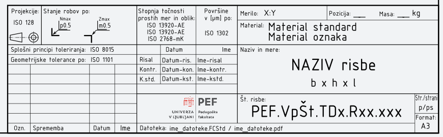
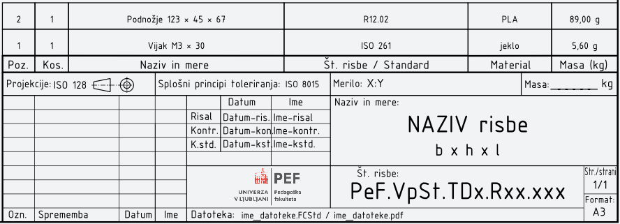
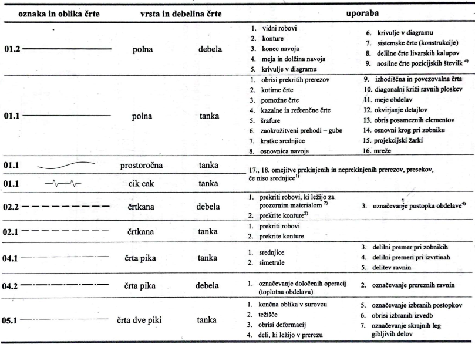
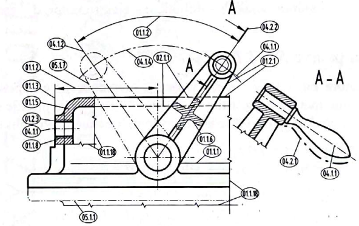

## Značilnosti risbe

Tehniška risba je natančno strukturiran dokument, ki s pomočjo standardiziranih grafičnih elementov posreduje vse ključne informacije o izdelku, njegovi obliki, dimenzijah, materialu, ter načinu izdelave in sestavljanja. Njena jasnost temelji na dosledni uporabi glave risbe, kosovnice, meril, vrst in debelin črt ter tehniške pisave. Vsak od teh elementov skrbi za to, da bralec risbe razume geometrijo, skrite in vidne robove, razmerja, strukturo sestava in pomembne tehnološke zahteve brez dodatnih razlag. Tehniška risba je zato univerzalni jezik tehničnih strok, ki omogoča nedvoumno komunikacijo med konstrukterji, tehnologi, proizvajalci in kontrolorji kakovosti.

### Glava risbe in kosovnica

Glava risbe (angl. *title block*) je obvezni del vsake tehniške risbe. Namenjena je identifikaciji dokumenta, omogoča sledljivost in nadzor nad različicami risbe ter vsebuje ključne informacije za uporabo risbe v konstrukcijskem, proizvodnem in kontrolnem procesu. Kosovnica pa je sestavni del sestavnih risb in predstavlja strukturiran seznam vseh delov, ki pripadajo danemu sklopu ali sestavu.

V glavi risbe morajo biti zapisani vsi podatki, ki omogočajo:

- identifikacijo dokumenta (številka risbe, naziv izdelka),
- sledljivost (datum, izdelek kontroliral, odgovorna oseba),
- razumevanje uporabe risbe (merilo, projekcija, standard toleranc),
- upravljanje dokumentacije (revizije, spremembe, datoteka).

Glava risbe mora biti  vedno umeščena v **spodnji desni kot** risalnega formata. Razlog je enoten način branja dokumentacije in kompatibilnost pri arhiviranju.

Glava risbe mora slediti standardu **SIST EN ISO 7200**, ki določa obvezna identifikacijska polja, vendar pri tem ostaja precej prilagodljiv. Medtem ko je bil starejši standard **DIN 6771-1** zelo strog pri natančnem določanju dimenzij in razporeditve polj, **SIST EN ISO 7200 dopušča bistveno več svobode**. Priporočena je zgolj dolžina glave **180 mm**, medtem ko so ostale mere in razpored polj **poljubni**, če sta ohranjeni preglednost in skladnost podatkov.

V glavi risbe se zato nahajajo ključne skupine podatkov, ki morajo biti jasno predstavljene, njihova natančna grafična izvedba pa je stvar organizacijskih praks. Ta polja se v nadaljevanju podrobneje predstavijo v preglednici, ki povzema njihov pomen:

| Polje v glavi risbe          | Pomen                                          |
| ---------------------------- | ---------------------------------------------- |
| stopnja točnosti prostih mer | navaja tolerančno območje za netolerirane mere |
| kakovost obdelave            | standard za hrapavost ali obdelavo             |
| merilo                       | merilo risanja in lokalna merila               |
| pozicija                     | pozicijska številka (pri sestavnih risbah)     |
| masa                         | masa dela ali sklopa                           |
| naziv in mere                | naziv izdelka; značilne mere                   |
| št. risbe / standard         | identifikacijska številka dokumenta            |
| stran                        | številka strani dokumentacije                  |
| oznaka spremembe             | sledljivost revizij                            |
| izdelal / kontroliral        | osebe odgovorne za izdelavo in kontrolo        |
Table: Ključna polja v glavi risbe. {#tbl:glava_kljucna_polja}

Delavniška risba je namenjena izključno enemu samemu delu, zato mora glava risbe na zelo jasen in nedvoumen način podati vse ključne podatke, ki omogočajo njegovo pravilno izdelavo, kontrolo in morebitno poznejšo sledljivost. V proizvodnem procesu delavec ali tehnolog praviloma ne bere dodatnih dokumentov, zato mora biti delavniška glava dovolj informativna, da zagotavlja razumevanje izdelka brez potrebe po drugih razlagah. Delavniška glava zato vsebuje niz podatkov, ki so specifični za posamezen del in se neposredno uporabljajo pri obdelavi. Najpomembnejši med njimi so:

- **Stanje robov** – omogoča določitev, kako naj bodo obdelani robovi (npr. ostali ostri, zaobljeni, odsevani). Nekatere industrije zahtevajo stroge omejitve ostrih robov zaradi varnosti ali funkcionalnih zahtev. V delavniški glavi je zato stanje robov posebej izpostavljeno, da delavec ne dela po lastni presoji.
- **Tolerance in stopnje točnosti** – delavniška risba mora natančno določiti, kako natančno mora biti posamezna mera izvedena. Ker se tolerance med različnimi deli močno razlikujejo, je zapis stopnje točnosti v glavi risbe nujen za zagotavljanje pravilnega ujemanja v kasnejšem sestavu. Globalne tolerance (za vse neoznačene mere) omogočajo lažje branje risbe in preprečujejo nepotrebno preobremenitev s podvojenimi podatki.
- **Hrapavost površin (kakovost obdelave)** – kakovost površin določa končno funkcionalnost dela, npr. trenje, tesnjenje, natančnost prileganja ali vizualno kakovost. V delavniški glavi risbe mora biti zapisano, ali veljajo posebne hrapavosti za izbrane površine, ali pa za celoten del velja enotna privzeta hrapavost. To je ključni podatek za tehnologe in obdelovalne stroje.
- **Masa elementa** – masa posameznega dela je pomembna tako v konstrukcijskem smislu (preračuni, obremenitve), kot pri logistiki, skladiščenju in kakovostni kontroli. V delavniški risbi masa izhaja iz natančne geometrije dela in izbranega materiala, zato mora biti jasno navedena v glavi. Posebej je pomembna pri delih, ki se proizvaja serijsko, saj odstopanja v masi pogosto nakazujejo proizvodne napake. 

Zaradi vsega naštetega je delavniška glava risbe bistveno bolj tehnično obremenjena kot glava sestavne risbe. Sestavna risba opisuje strukturo sklopa, delavniška pa zagotavlja podatke, potrebne za dejansko izdelavo. Gre za dokument, ki mora biti neposredno uporaben na delavniškem nivoju in mora vključevati vse podatke, ki vplivajo na funkcionalnost, varnost in kakovost izdelka.

{#fig:Znacilnosti_Glava_Delavniska}

Glava sestavne risbe je po zasnovi manj obremenjena z informacijami kot glava delavniške risbe, saj je njen primarni namen predstaviti strukturo sklopa in odnose med posameznimi deli, ne pa podrobnosti o obdelavi ali tehnoloških postopkih. To pomeni, da sestavna glava vsebuje manj tehnoloških podatkov, saj se ti podatki nanašajo le na posamezne dele, ne pa na sklop kot celoto.

{#fig:Znacilnosti_Glava_Sestavna}

#### Kosovnica

Kosovnica je strukturiran seznam delov, ki sestavljajo sklop ali napravo. V njej so zbrani podatki, ki omogočajo:

- organizacijo delov po pozicijah,
- razumevanje hierarhije sestavov,
- identifikacijo standardnih in nestandardnih delov,
- izračun mase in pripravo materialnih zahtev.

Kot navaja @Prebil2011-TehDoc, obstaja več oblik kosovnic, ki se razlikujejo glede na področje uporabe, kompleksnost sestava in potrebe konstrukcijske dokumentacije. Vendar bomo v tem učbeniku uporabljali **poenostavljeno kosovnico**, ki združuje najpomembnejša polja iz oblike A in B ter je primerna za večino izobraževalnih in projektnih situacij.

V nadaljevanju je predstavljena enotna, didaktično prilagojena struktura kosovnice, ki vključuje **osnovna obvezna polja**, obenem pa omogoča tudi **nekaj razširjenih polj**, kadar so ta potrebna.

Kosovnico lahko tudi nekoliko priredimo glede na naše potrebe. Pri tem pazimo, da vsebuje vse potrebne podatke, da kos sestava nedvoumno določa. Na primer za potrebe pouka bi lahko vkljičili polja, ki jih prikazuje [@tbl:kosovnica_polja].

| Polje v kosovnici                 | Pomen / uporaba                                                                  |
| --------------------------------- | -------------------------------------------------------------------------------- |
| **Pozicija**                      | Zaporedna številka dela v sestavni risbi.                                        |
| **Kos**                           | Število kosov posamezne komponente v sklopu.                                     |
| **Naziv**                         | Ime dela ali sklopov, standardni naziv pri normiranih elementih.                 |
| **Mere**                          | Ključne značilne mere (npr. 150 × 80 × 12); pri standardnih delih ni obvezno.    |
| **Št. risbe / standard**          | Povezava z delavniško risbo ali oznaka standarda (npr. DIN, ISO).                |
| **Material** *(razširjeno polje)* | Vrsta materiala (jeklo, aluminij, plastika …).                                   |
| **Masa** *(razširjeno polje)*     | Masa posameznega kosa, pomembna pri preračunih ali konstrukcijah večjih sklopov. |
| **Opombe**                        | Posebnosti, zahteve, smer montaže, površinske obdelave ipd.                      |
Table: Pomembnejša polja kosovnice. {#tbl:kosovnica_polja}

Ta enotna oblika je pregledna, primerna za risanje v FreeCAD-u in skladna s tipično rabo v šolskem in projektno usmerjenem okolju. Poleg tega se dobro navezuje na vsebino glave risbe, kjer se nahajajo ključni podatki o celotnem dokumentu.

#### Nastavitve v FreeCAD – TechDraw: Glava in kosovnica

FreeCAD omogoča enostavno upravljanje glave risbe in kosovnic v okolju **TechDraw**. Pri delu v tem učbeniku bomo uporabljali **že pripravljene predloge**, ki vključujejo glavo risbe za delavniško ali sestavno risbo.

Pri vseh novih risbah bomo FreeCAD nastavili tako, da se bo **privzeto naložila predloga za delavniško risbo**. Na [spletnem odlagališču](https://davidrihtarsic.github.io/TechDoc/Presnemi/) si lahko presnamete dve predlogi: A3_Land_PeF_TD_DR.svg in A3_Land_PeF_TD_SR.svg . Ter na to lahko nastavimo privzeto predlogo tako, da:

> **Edit → Preferences → TechDraw → General → Files**\
> Pot do predloge:\
> `.../A3_Land_PeF_DWD_DR.svg`

S tem zagotovimo, da se ob ustvarjanju nove risalne strani samodejno uporabi enotna institucionalna predloga, ki vsebuje vse potrebne elemente glave risbe.

**Vključevanje kosovnice v TechDraw**

V FreeCADu je možno vključiti kosovnico s pomočjo okolja Spreadsheet, kjer najprej ustvarimo tabelo in vanjo vnesemo vsa potrebna polja za vsak sestavni element (npr. oznako dela, naziv, količino, material, masa ...), nato pa preidemo na tehnično risbo in v delovnem okolju TechDraw vstavimo tabelo, ki služi kot referenca za izdelavo sestava ter vzdrževanje skladnosti podatkov med deli. Za usklajevanje širine tabele z glavo na sestavni risbi nam je lahko v pomoč [Makro za poravnavo širine kosovnice](https://davidrihtarsic.github.io/TechDoc/Presnemi/). 

**Pridobivanje fizikalnih lastnosti modela**

Za izračun mase 3D-modela v FreeCAD-u je najprej potrebno modelu dodeliti material, saj program maso izračuna iz volumna telesa in gostote izbranega materiala. Material telesu dodelimo tako, da v drevesu modela označimo objekt, kliknemo z desnim klikom in izberemo možnost *Material*, kjer nato izberemo ustrezen material iz knjižnice ter potrdimo izbiro. S tem FreeCAD pridobi informacijo o gostoti, ki je nujna za nadaljnje izračune.

Če želimo do volumna modela dostopati ročno, lahko uporabimo orodje *Part → Check Geometry*, kjer po izvedenem preverjanju dobimo geometrijske podatke, med njimi tudi volumen. Masa bi bila v tem primeru prepuščena ročnemu izračunu, vendar je tak pristop zamuden in manj pregleden, zato je za izobraževalne in praktične namene bistveno primernejša uporaba makra *PhysicalInfo*.

Makro *PhysicalInfo* prenesemo s spletne strani [https://davidrihtarsic.github.io/TechDoc/Presnemi/](https://davidrihtarsic.github.io/TechDoc/Presnemi/), ga shranimo in v FreeCAD-u dodamo prek menija *Macro → Macros*, kjer ga vključimo med obstoječe makre. Ko je makro nameščen, izberemo objekt z dodeljenim materialom in makro zaženemo. V oknu *Report View* se nato izpišejo podatki o objektu, vključno z njegovim volumnom, gostoto uporabljenega materiala in izračunano maso. Podatek o masi je tako dostopen neposredno, brez dodatnih korakov ali ročnih izračunov, kar bistveno poenostavi delo pri tehniški dokumentaciji in analizah modelov.

```
PODATKI O OBJEKTU  
------------------------------
Objekt      : kvader
Material    : PLA-Generic
Volumen     : 55126.55 mm³
Gostota     : 1240.00 kg/m³
Masa        : 68.36 g (0.068 kg)  
------------------------------
```


### Merilo

Merilo je razmerje med narisano in dejansko velikostjo predmeta. V tehničnem risanju mora biti merilo izbrano tako, da omogoča **preglednost, berljivost in jasnost** risbe, pri čemer se merila **ne prilagajajo formatu risbe**, temveč **vodoravnim ali navpičnim meram obravnavanega izdelka**.

V skladu s standardom **SIST EN ISO 5455** (nadomešča zastareli DIN EN ISO 5455) se merila delijo na:

- **naravna merila**,
- **pomanjšana merila**,
- **povečana merila**.

Če so mere na risbi enake dejanskim meram izdelka, uporabljamo merilo **1 : 1**. Takšna risba se uporablja pri manjših predmetih, kadar je mogoče vse elemente prikazati v realni velikosti. Uporablja se, kadar je predmet prevelik, da bi ga lahko prikazali v naravni velikosti. Standard dovoljuje naslednja pomanjšana merila: **1 : 2, 1 : 5, 1 : 10, 1 : 20, 1 : 50, 1 : 100**. Druga merila so dovoljena le izjemoma. Primer: merilo **1 : 5** pomeni, da je narisana dolžina petkrat manjša od dejanske.

Povečana merila uporabljamo pri majhnih predmetih ali **detajlih**, ki zahtevajo podrobnejši prikaz. Standardna povečana merila so: **2 : 1, 5 : 1, 10 : 1, 20 : 1, 50 : 1, 100 : 1**. Primer: merilo **5 : 1** pomeni, da je narisana vrednost petkrat večja od dejanske.

V tehnični dokumentaciji je ključna doslednost v uporabi pisave in meril, saj to prispeva k jasnosti, berljivosti ter profesionalni predstavitvi risb; @Prebil2011-TehDoc izpostavlja, da se osnovno merilo zapisuje z večjo pisavo (na primer pri pogledu), medtem ko merila posameznih detajlov ali prerezov zapisujemo z manjšo pisavo, v oklepaju, kot na primer A–A 5:1; prav tako mora biti merilo prereza ali detajla vedno zapisano ob oznaki prereznega pogleda, kar omogoča dosledno interpretacijo zrcaljenih ali detajlnih pogledov ter olajša primerjave med različnimi risbami in koncepti modeliranja.

<!--

Slikovni primer primerjave meril (slika 3.9, str. 53) prikazuje skale meril 1:1, 1:2 in 1:5, kar študentom omogoča jasno predstavo o razlikah v interpretaciji mer.

-->

#### Nastavitve merila v FreeCAD – TechDraw

V tehnični dokumentaciji je ključna doslednost pri uporabi meril, saj različna merila omogočajo jasno predstavitev velikosti v več pogledih istega predmeta, hkrati pa uporaba enotnega merila za celotno risbo zagotavlja splošno skladnost in preglednost. V FreeCAD-u se pri načrtovanju risb pogosto uporablja več meril za različne poglede, pri čemer lahko glavno merilo ostane enotno, medtem ko se pri detajlih ali prerezih uporabljajo manjša merila ali specifične razlage v oklepaju, kar omogoča primerjavo in jasen prikaz odnosov med različnimi elementi. Vendar pa vizualizacije v glavi risbe ne pomenijo samodejnega zapisovanja merila ob vsakem pogledu, zato je priporočljivo, da se merilo pri posameznem pogledu izrecno navede v risbi, še posebej pri prikazih detajlov ali povečav. To prispeva k pravilni interpretaciji dimenzij, toleranc ter možnosti primerjalne analize med različnimi pogledi in interpretacijami modelov [@Prebil2011-TehDoc].

Praviloma nastavimo **privzeto merilo**, s tem zagotovimo, da ima vsaka nova risba že ob začetku pravilno določeno osnovno merilo:

> **Edit → Preferences → TechDraw → Scale → Page Scale : 1.00**

seveda pa lahko **merilo kadarkoli kasneje določimo ali spremenimo za vsak posamezen pogled posebej**.

> Izberemo pogled → *Property Editor → Data → Scale*

Primeri nastavitev:

- **Scale = 1.00** → merilo 1 : 1,
- **Scale = 0.5** → merilo 1 : 2,
- **Scale = 2** → merilo 2 : 1.

### Vrste in debeline črt

Črte so eden najpomembnejših grafičnih elementov tehniške risbe, saj z njihovo pomočjo posredujemo informacije o obliki, legi, skritih elementih, prerezih, osi in pomožnih konstrukcijskih odnosih. Standard **SIST EN ISO 128** natančno določa vrste črt, njihovo debelino, pomen ter tipične uporabe.

V tehničnem risanju uporabljamo le toliko različnih vrst črt, kot je nujno potrebno za jasno interpretacijo risbe. Preobilica vrst ali napačna uporaba zmede bralca in zmanjša tehnično vrednost dokumenta.

{#fig:Znacilnosti_vrste_crt_rotated}

Skupni poudarki:

- Vidne robove vedno rišemo **polno debelo črto** (01.2).
- Skrite robove prikazujemo s **prekinjeno tanko** (02.1).
- Osi in simetrije vedno s **črtkano-pikčasto** (04.1 ali 04.2).
- Pomožne konstrukcijske črte vedno s **polno tanko** (01.1).

Standard predpisuje, da so črte različnih debelin razdeljene v **skupine**, pri čemer se prehod med skupinami izvede s faktorjem √2. Naslednja [@tbl:skupina_crt] prikazuje najbolj pogosto izbrane skupine črt z določenimi debelinami črt.

| Skupina črt | Debela črta (mm) | Tanka črta (mm) | Teksti in grafični simboli (mm) |
| ----------- | ---------------- | --------------- | ------------------------------- |
| **0,35**    | 0,35             | 0,18            | 0,25                            |
| **0,5**     | 0,50             | 0,25            | 0,35                            |
| **0,7**     | 0,70             | 0,35            | 0,5                             |
| **1,0**     | 1,00             | 0,50            | 0,7                             |
Table: Skupine črt z določenimi debelinami črt. {#tbl:skupina_crt}

V splošni praksi uporabljamo **le dve skupini črt: 0,5 ali 0,7.** Razmerje med debelo in tanko črto je vedno **2 : 1**, kar zagotavlja jasno ločitev med vidnimi in manj izrazitimi informacijami.

Pri uporabi črt v tehniški risbi je izjemno pomembno, da konstrukter razume ne le posamezne tipe črt, temveč tudi njihovo medsebojno hierarhijo. Vidni robovi in konture imajo najvišjo prednost, saj predstavljajo dejanske, neposredno opazne meje predmeta. Za njimi sledijo skriti robovi, ki omogočajo razumevanje notranje geometrije. Ravnine prerezov in osne črte so kljub svoji funkcionalni pomembnosti grafično podrejene vidnim in skritim robovom, medtem ko težiščnice, poti gibanja in pomožne konstrukcijske črte zasedajo zadnja mesta v hierarhiji vizualne izraznosti.

Naslednji praktični primer uporabe črt na [@fig:Znacilnosti_crte_primer] prikazuje, kako se različne vrste črt združujejo v kompleksnem mehanskem sklopu. Prikaz razkriva več ključnih načel: črte različnih debelin se prekrivajo tako, da so pomembnejše informacije vedno grafično poudarjene (01.2); osi izvrtin so jasno označene s črta-pika črto (04.1); skrite geometrije so prikazane s tanko prekinjeno črto (02.1); osne črte (04.1) se ustrezno nadaljujejo čez rob elementa, kar omogoča pravilno umestitev elementov v prostoru.

{#fig:Znacilnosti_crte_primer}

Takšna analiza jasno pokaže, da izbira in uporaba črt ni zgolj grafično pravilo, temveč ključen element tehniške komunikacije. Pravilna raba črt neposredno vpliva na berljivost risbe, razumevanje geometrije in možnost pravilne interpretacije pri proizvodnji, montaži ali kontroli. Obvladovanje črt je zato temeljna veščina tehniškega risanja, tako pri ročnem kot pri računalniškem načrtovanju.

#### Nastavitve vrst in debelin črt v FreeCAD – TechDraw

FreeCAD omogoča nadzor nad vrstami in debelinami črt, kar mora biti skladno s pravili iz standardov. V okolju **TechDraw** so najpomembnejše nastavitve dostopne prek:
> **Edit → Preferences → TechDraw → Annotation**

V tem meniju lahko določimo privzete standarde in stile črt. Za potrebe pouka in skladno s SIST EN ISO 128 priporočamo naslednje nastavitve:

- **Line Standard:** `ISO.128.20.1996`  
  (skladno s standardom SIST EN ISO 128)
- **Line Width Group:** `0.5 mm`  
  (skupina črt, ki najbolje ustreza formatom A3–A4)
- **Hidden Line Style:** `Dashed`  
  (za skrite robove – ustreza črti 02.1)
- **Section Line Style:** `LongDashDot`  
  (za ravnine prerezov – ustreza črti 04.2)
- **Detail Highlight Style:** `Continuous`  
  (za poudarjanje detajlov brez prekinitev)
- **Center Line Style:** `DashedDotted`  
  (za srednice – ustreza črti 04.1)
- **Break Line Style:** `Continuous`  
  (ker slog 01.1.18 ni na voljo, uporabimo klasično tanko polno črto)

Nastavitev črt po posameznem pogledu
Izberemo pogled → *Property Editor → View → Line Width* in *Line Style*.

#### Priporočene debeline
- **tanke črte: 0.25 mm**
- **debele črte: 0.5 mm**

Ti vrednosti sta skladni s skupino črt 0,5 iz preglednice ter omogočata dobro berljivost tehničnih risb na najpogosteje uporabljenih formatih A4 in A3.

Vrste in debeline črt tvorijo temelj jasne tehniške dokumentacije. Napačna uporaba črt vodi do napačne interpretacije risbe, izgube informacij ali zmede pri montaži. Standard SIST EN ISO 128 jasno določa:

- katera črta je primerna za katero informacijo,
- kakšno debelino mora imeti,
- kako se črte uporabljajo v prerezih, pogledih in sestavih.

Obvladovanje črt je zato temeljna veščina tehničnega risanja, tako pri ročnem kot pri računalniškem načrtovanju.

### Tehniška pisava

Tehniška pisava je standardizirana pisava, ki se uporablja pri vseh tehničnih risbah. Njena naloga je zagotoviti **čistost, berljivost in enotnost** vseh napisov, kot so mere, oznake prerezov, oznake osi, besedilne opombe, nazivi in podatki v glavi risbe. Standard SIST EN ISO 3098 določa obliko, višine, debeline in razmike posameznih znakov:

- **Pisava oblike A:** debelina črte je *1/14* višine velikih črk  
  (pri h = 7 mm je debelina d = 0,5 mm)
- **Pisava oblike B:** debelina črte je *1/10* višine velikih črk  
  (pri h = 7 mm je debelina d = 0,7 mm).

V tehnični praksi se skoraj izključno uporablja **pisava B**, ker je bolj berljiva pri kopiranju, tiskanju in digitalni obdelavi. Pri tehniški dokumentaciji, ki jo pripravljamo v tem učbeniku, bomo enako uporabljali **pisavo B**.

Preglednica ([@tbl:dimenzija_pisave_B]) določa ključna razmerja pisave:

| Parameter                                          | Razmerje | Primer pri h = 3,5 mm |
|----------------------------------------------------|----------|-----------------------|
| Višina velikih črk h                               | (10/10)h | 3,5 mm                |
| Višina malih črk c                                 | (7/10)h  | 2,5 mm                |
| Najmanjši razmik med črkami a                      | (2/10)h  | 0,7 mm                |
| Najmanjša razdalja med vrsticami (brez podaljšanj) | (10/10)h | 3,5 mm                |
| Debelina črte d (pisava B)                         | (1/10)h  | 0,35 mm               |
Table: Dimenzije črk tehniške pisave oblike B. {#tbl:dimenzija_pisave_B}

Pri tem je pomembno:
- da je **razmerje med višino in debelino črte vedno ohranjeno**,
- da se pri majhnih napisih (npr. pri merilih ali oznakah prereza) ne sme uporabljati premajhnih višin črk,
- da so vsi napisi izvedeni z enotno pisavo.

Razložimo še, zakaj smo izbrali pisavo B z višino 3,5 mm. Ker smo v poglavju o črtah izbrali **skupino črt 0,5 mm**, je s tem skladno tudi:
- **debelina pisave B = 0,35 mm**,
- **višina pisave = 3,5 mm**.

To razmerje izhaja neposredno iz standarda SIST EN ISO 3098, kjer je debelina črte določena kot 1/10 višine.

Prednosti take izbire so:
- odlična berljivost pri tiskanju na A4 in A3,
- skladnost z debelinami črt,
- dovolj velika pisava za pregledne tehniške risbe,
- idealna za študijsko in projektno delo.

#### Nastavitve tehniške pisave v FreeCAD – TechDraw
FreeCAD omogoča nastavitev privzete pisave in velikosti besedila prek dveh ločenih nastavitev, ki ju moramo pravilno konfigurirati. Vendar preden se nastavitve se prepričajte, da je pisava `ISOCPEUR` res nameščena na vašem računalniku. Če jo še nimate, lahko pisavo [ISOCPEUR.ttf](https://davidrihtarsic.github.io/TechDoc/Presnemi/) presnamete s spletnega mesta.

Ko imate pisavo preneseno na vaš računalniko jo lahko namestite tako, da z desnim miškino tipko kliknete na datoteko `ISOCPEUR.ttf` in izberete `Install`.

Sedaj lahko v FreeCAD-u nastavite privzeto vrsto pisave tako da v nastavitvah izberete:
> **Edit → Preferences → TechDraw → General → Label font**

Za potrebe tega učbenika priporočamo:
- **Label font:** `ISOCPEUR`

Pisava *ISOCPEUR* je vizualno zelo podobna standardizirani tehniški pisavi po ISO 3098 in je zato najprimernejša za tehniško dokumentacijo.

Velikost pisave nastavimo ločeno v:
> **Edit → Preferences → TechDraw → Dimensions → Font size**

Priporočena vrednost je:
- **Font size:** `3.5 mm`

Ta velikost ustreza pisavi B s črtnim razmerjem, pri katerem je debelina črte **0.35 mm**, kar je popolnoma skladno z izbrano skupino črt **0.5 mm**.

Pisava **ISOCPEUR** je ena najpogosteje uporabljenih CAD pisav, ker je:
- vizualno zelo podobna standardizirani tehniški pisavi iz ISO 3098,
- enostavna in čista,
- dobro berljiva pri majhnih velikostih,
- enotna na različnih operacijskih sistemih.

V tehnični dokumentaciji je ključno, da so uporaba pisave in njena velikost dosledni, saj to zagotavlja berljivost, jasnost in profesionalen videz risb; standard SIST EN ISO 3098 opredeljuje obliko črk, debelino pisave, višino črk, razdalje med vrsticami in razdalje med znaki, zato v naših načrtih uporabljamo pisavo B s konkretno višino 3,5 mm ter izbiramo obliko pisave ISOCPEUR, ki je prilagojena ISO smernicam in nudi dobro čitljivost v tehničnih dokumentih, kar prispeva k doslednosti, berljivosti in profesionalni predstavitvi tehničnih informacij ter olajša pravilno interpretacijo dimenzij in toleranc na risbah.

