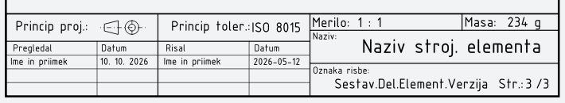
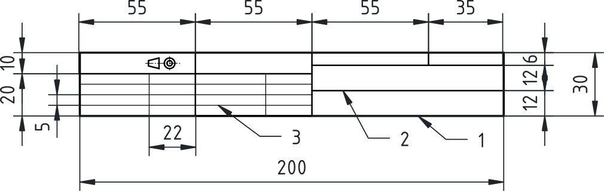
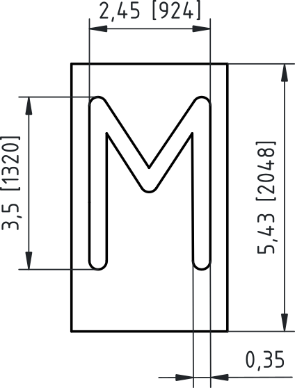
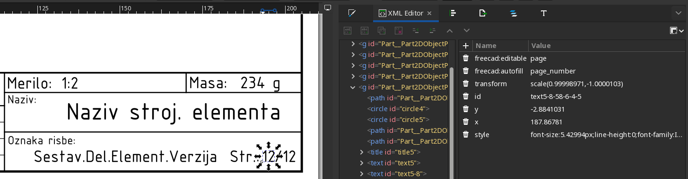

## Priprava predloge

Pri pripravi tehniške risbe v FreeCAD-u je smiselno predlogo zasnovati modularno. Vsak sestavni del risbe oblikujemo na **ločeni skici**, kar bistveno olajša kasnejše urejanje, selekcijo elementov ter nadzor nad grafičnimi lastnostmi (predvsem debelino črt in slogom). V praksi to pomeni, da bomo v ločenih skicah pripravili **okvir**, **glavo**, **razdelke glave** ter **tabelo (polja) v glavi**. Takšna razdelitev omogoča boljši nadzor nad posameznimi plastmi risbe in enostavnejši izvoz v vektorski format.

### Okvir

Okvir predstavlja rob risbe in določa uporabno risalno površino. Ker bo dokument shranjen in distribuiran v digitalni obliki, rob **enakomerno odmaknemo 5 mm od vseh robov lista** (glej {@fig:okvir_5mm}). Okvir narišemo na **ločeni skici**, da ga lahko kasneje neodvisno urejamo. Priporočena debelina črte za rob je **0,7 mm**, vendar se z dejansko debelino v tej fazi še ne ukvarjamo, saj bomo grafično obdelavo izvedli v programu Inkscape.

> Slika 1: Okvir risbe z odmikom 5 mm od roba lista {#fig:okvir_5mm}

### Glava

Glava risbe vsebuje identifikacijske in tehnične podatke. Pred začetkom risanja določimo, katera polja bomo uporabljali (glej [@tbl:tabela_polj_v_glavi]). Za potrebe učnega procesa izberemo naslednja polja:

| Polje                 | Namen                             |
|-----------------------|-----------------------------------|
| Naslov risbe          | Ime izdelka ali sklopa            |
| Oznaka risbe          | Enolična identifikacija dokumenta |
| Merilo                | Razmerje prikaza                  |
| Masa                  | Skupna masa izdelka ali dela      |
| Princip projekcije    | Način projekcije (npr. evropska)  |
| Princip toleranc      | Globalne tolerance                |
| Ime in datum priprave | Avtor in datum izdelave           |
| Ime in datum pregleda | Kontrola in odobritev             |

Table: Pomembnejša polja v glavi risbe in njihov namen. {#tbl:tabela_polj_v_glavi}

Nato načrtujemo primerno razporeditev polj v glavi ter izberemo primerno velikost pisave. Na primer preprosta glava bi lahko bila urejena tako kot jo prikazuje [@fig:PripravaPredloge_nacrtovanje_polj].

{#fig:PripravaPredloge_nacrtovanje_polj}

Velikost pisave določimo glede na pomembnost informacij, kar neposredno vpliva tudi na višino polj.

|    Tip besedila | Višina pisave | Priporočena višina polja |
|----------------:|:-------------:|:------------------------:|
| Ključni podatki |      5 mm     |           ~7 mm          |
|   Splošni tekst |     3,5 mm    |           ~5 mm          |
|    Manjši tekst |     2,5 mm    |          ~3,5 mm         |


Table: Priporočljiva višina polja glede na višino pisave. {#tbl:visina_polja}

Na podlagi teh vrednosti ustvarimo **novo skico za glavo** in določimo osnovne dimenzije celotnega bloka.

### Razdelki glave

Za razmejitev posameznih informacijskih polj ustvarimo **ločeno skico razdelkov glave**. Razdelke prilagodimo dimenzijam besedila, pri čemer zagotovimo dovolj prostora za čitljivo postavitev vsebine. Višine in širine polj izhajajo iz izbranih velikosti pisav, zato je smiselno najprej določiti tipografijo, nato pa geometrijo razdelkov (glej [@fig:PripravaPredloge_Glava]).

{#fig:PripravaPredloge_Glava}

Na primeru glave risbe na [@fig:PripravaPredloge_Glava] smo izhajali iz priporočene dolžine glave 180 mm, a ker se bo ta glava uporabljala za format A4 v pokončni obliki in je uporabna širina tega 200 mm smo širino glave podredili tej dimenziji. Višino glave smo določili glede na potrebna polja. Rob glave smo narisali z debelino 0,5mm ([@fig:PripravaPredloge_Glava], črta 1).Na to smo glavo razdelili s črtami debeline 0,35 mm ([@fig:PripravaPredloge_Glava], črta 3) na manjša polja, ki bodo vsebovala ključne podatke risbe. V teh poljih bo višina pisave 3,5 mm ali celo 5 mm. Višino polj v tabeli smo določili glede na višino najmanjše pisave (2,5 mm) in da za tako pisavo potrebujemo 3,5 mm za višino vrstice. Tako smo tej pisavi namenili 5 mm za višino vrstice v tabeli. Črte tabele pa smo narisali z debelino 0,18 mm ([@fig:PripravaPredloge_Glava], črta 3).

### Tabela (polja v glavi)
Podatke o avtorju in pregledu organiziramo v tabelo. Tabelo narišemo na **ločeni skici**, kjer definiramo strukturo vrstic in stolpcev. Posebej določimo polja za ime, priimek in datum priprave ter pregleda dokumenta. Tabela mora biti prilagojena velikosti pisave in omogočati enostavno izpolnjevanje.

Po zaključku vseh skic preverimo poravnavo elementov in **izvozimo celotno geometrijo kot SVG datoteko**.

### Dodajanje besedila
Pri delu z besedilom uporabljamo pisavo **ISOCPEUR**, ki je vizualno najbližja standardizirani tehniški pisavi po ISO 3098. Ključno je razumeti, da nastavljena velikost pisave v digitalnih okoljih ne predstavlja dejanske višine črk, temveč velikost t. i. **em-polja** (tipografski okvir pisave, še iz časa tipkarskih strojev). Dejanska višina velikih črk (npr. črke *M*) je od tega manjša.

Analiza pisave ISOCPEUR.ttf pokaže

```
FONT: ISOCPEUR.ttf

unitsPerEm: 2048
hhea:
  ascent: 1320
  descent: -396
  lineGap: 0
OS/2:
  sTypoAscender: 1320
  sTypoDescender: -396
  sTypoLineGap: 0

  usWinAscent: 1980
  usWinDescent: 528

Glyph: "M"
  xMin: 132
  yMin: 0
  xMax: 1056
  yMax: 1320
```
kar pomeni:

- velikost em-polja **2048 enot**,
- višina črke **M = 1320 enot**,
- razmerje višine črke **k = 1320 / 2048 = 0,64453125**.

To pomeni, da črke zavzemajo približno **64,45 % višine em-polja** (glej [@fig:em_polje]). Zato moramo za dosego želene dejanske višine črk uporabiti korekcijo.

{#fig:em_polje}

#### Izračun velikosti pisave

Želeno višino črk označimo z *h*. Velikost pisave, ki jo moramo nastaviti, izračunamo po formuli:

$$ \text{font size} = \frac{h}{0{,}64453125} $${#eq:izracun}

Na tej osnovi dobimo:

| Željena višina črk | Debelina črte | Višina pisave | Višina pisave | Razmik vrstic |
|-------------------:|:-------------:|:-------------:|:-------------:|--------------:|
|               5 mm |     0,5 mm    |    7,75 mm    |    22,0 pt    |          7 mm |
|             3,5 mm |    0,35 mm    |    5,43 mm    |    15,4 pt    |          5 mm |
|             2,5 mm |    0,25 mm    |    3,88 mm    |    11,0 pt    |        3,5 mm |

Table: Tabela nastavitev velikosti pisave za željeno višino črk. {#tbl:visina_pisave}

Če programsko orodje velikost pisave zahteva v pt enotah, moramo najprej izračunano vrednost v milimetrih pretvoriti v tipografske točke. Pri tem uporabimo pretvorbo:

$$ 1 \text{palec} = 72 pt \text{; zato velja: } 1 pt = 0,3528 mm.
$${#eq:preracum_pt_v_mm}

Za neposredni izračun pa lahko uporabimo [@eq:preracum_mm_v_pt]:

$$ \text{font size [pt]} = \frac{h}{(0,64453125 × 0,3528mm)}. $${#eq:preracum_mm_v_pt}

Ta korekcija zagotavlja, da bo dejanska višina črk (npr. *M*) skladna z zahtevami tehniške dokumentacije. Pri tem pristopu ne uporabljamo nominalnih vrednosti iz uporabniškega vmesnika, temveč izhajamo iz dejanske geometrije pisave.

Besedilo vnašamo kot ločene elemente, ki jih kasneje v FreeCAD-u označimo kot urejevalna polja. Ko smo z razporeditvijo zadovoljni, vse elemente označimo v drevesni strukturi in jih ponovno izvozimo kot **.svg datoteko**.

### Oblikovanje v programu Inkscape

SVG datoteko odpremo v programu Inkscape, kjer izvedemo končno grafično obdelavo. Najprej preverimo ali je nastavljen pravilen **format lista (npr. A3 ali A4)**. Nato vse elemente označimo in jih poravnamo na sredino lista (*snap to center*).

V nadaljevanju posameznim elementom določimo ustrezne debeline črt:

| Element        | Debelina črte |
|----------------|---------------|
| Rob            | 0,7 mm        |
| Okvir glave    | 0,5 mm        |
| Razdelki glave | 0,35 mm       |
| Tabela         | 0,18 mm       |

Table: Priporočljive debeline črt v glavi risbe. {#tbl:debeline_crt}

Pomembno je, da barvo nastavimo na **Polnilo (Fill)** in ne na obrobo (Stroke), saj le tako dobimo pravilno vizualno debelino.

Dodamo tudi besedila – tako oznake polj kot predizpolnjene vrednosti (npr. naslov, merilo, ime). Velikosti pisave nastavimo glede na prej izračunane vrednosti. Posebno pozornost namenimo poljem, ki jih želimo urejati v FreeCAD-u. Ta polja označimo tako, da v zavihku XML dodamo atribut:

`freecad:editable="ime_polja"`

{#fig:editable}

Poleg atributa `freecad:editable`, ki omogoča ročno urejanje besedila, FreeCAD podpira tudi atribut `freecad:autofill`, s katerim lahko določena polja v predlogi samodejno izpolnimo iz podatkov dokumenta ali TechDraw strani. Takšna polja so posebej uporabna pri pripravi standardiziranih predlog, saj zmanjšajo potrebo po ročnem vnosu ponavljajočih se podatkov.

Osnovna oblika atributa je:

```xml
freecad:autofill="ime_polja"
```

Najpogosteje uporabljena samodejno izpolnjena polja so prikazana v preglednici.

| Autofill polje | Pomen                      |
| -------------- | -------------------------- |
| `title`        | Naslov risbe ali dokumenta |
| `author`       | Avtor dokumenta            |
| `date`         | Datum izdelave             |
| `organization` | Organizacija ali ustanova  |
| `scale`        | Merilo risbe               |
| `sheet`        | Oznaka lista               |
| `page_number`  | Številka trenutne strani   |
| `page_count`   | Skupno število strani      |

Table: Tabela z imeni polj za samodejno izpolnjevanje besedila v glavi risbe. {#tbl:autofill_names}

Primer uporabe:

```xml
<text
  freecad:editable="naslov_risbe"
  freecad:autofill="title">
  NASLOV RISBE
</text>
```

V tem primeru FreeCAD po vstavljeni predlogi samodejno izpolni naslov risbe, uporabnik pa ga lahko po potrebi še vedno ročno spremeni.

Pri pripravi SVG predlog za FreeCAD TechDraw priporočamo, da atribut:

```xml
xml:space="preserve"
```

odstranimo iz besedilnih elementov. V praksi namreč pogosto povzroča težave pri prikazu in pozicioniranju besedila, predvsem pri uporabi atributov `freecad:editable` in `freecad:autofill`.


