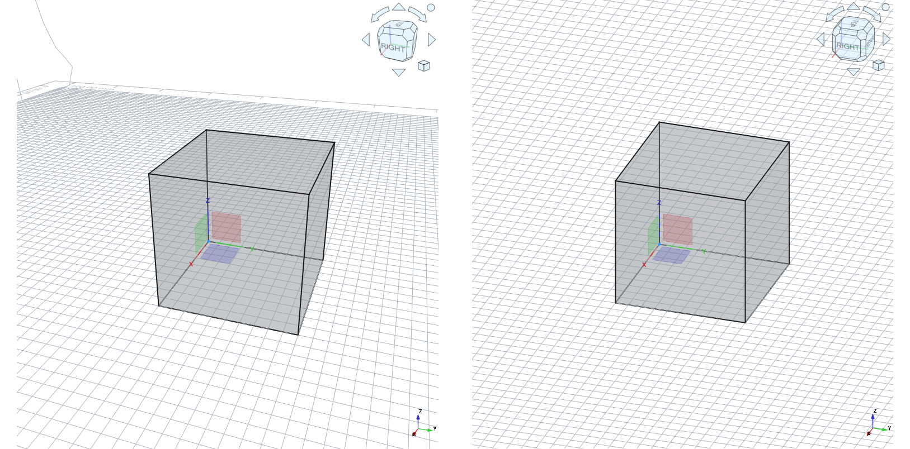

# Projekcije

Projekcija je način prikaza tridimenzionalnega objekta na dvodimenzionalni površini, kot je papir ali zaslon. V inženirski praksi je to ključno za natančno komunikacijo oblike, dimenzij in odnosa med deli. V tem učnem sklopu se bomo spoznali z osnovnimi vrstami projekcij, ki se uporabljajo v tehničnem risanju.

V nadaljevanju razširimo opis projekcij v tehnični dokumentaciji tako, da poudarimo razliko med perspektivo in pravokotno (ortografsko) projekcijo ter izkoristimo konkretni primer kocke na [@fig:Projekcija_kocka_persp_pravokotna]:

{#fig:Projekcija_kocka_persp_pravokotna}

Perspektivna projekcija posnema način, kako vidimo svet, in pri tem nastopi učinek, kjer območja daleč stran stremijo v manjše projicirane velikosti, kar daje občutek globine, vendar omogoča manj natančne meritve in večjo odstopanje pri dimenzijah zaradi različnih pogledov. Precej boljša za natančno komunikacijo oblik in dimenzij pa je pravokotna projekcija, ki predstavlja objekt skozi različne projekcije (sprednja, zgornja, desna) brez popačenja zaradi oddaljenosti gledalca, zato dolžine, širine in višine ostajajo enake v vseh projekcijah. Čeprav sta obe projekciji v praksi uporabni, je za tehnično dokumentacijo smiselno uporabiti le pravokotno kot osnovo za merjenje in določanje toleranc ter za preverjanje skladnosti med deli.

**Računanje rotacij in projekcij v tehnični dokumentaciji in modeliranju** temelji na uporabi vektorjev in matrik; obravnavane transformacije omogočajo pretvorbo koordinat med različnimi referenčnimi sistemi in njihovo projekcijo na dvodimenzionalne predstave. 

**Enotski vektorji koordinatnega sistema**: V kartezičnem koordinatnem sistemu so osnovni enotski vektorji definirani kot:

$$
\mathbf{i} =
\begin{bmatrix}
1\\0\\0
\end{bmatrix},
\qquad
\mathbf{j} =
\begin{bmatrix}
0\\1\\0
\end{bmatrix},
\qquad
\mathbf{k} =
\begin{bmatrix}
0\\0\\1
\end{bmatrix}
$$

Ti vektorji določajo smeri osi $X$, $Y$ in $Z$.

**Rotacija poljubnega vektorja**: je izvedena tako, da vektor pomnožimo z rotacijsko matriko $\mathbf{R}$. Na primer, naj bo $\mathbf{v}$ poljuben vektor v prostoru. Rotacija vektorja je linearna preslikava, opisana z rotacijsko matriko $\mathbf{R}$:

$$
\mathbf{v}' = \mathbf{R}\,\mathbf{v}
$$

Rotacija ohranja dolžine vektorjev in kote med njimi. Na primer, rotacijske matrike okoli koordinatnih osi $X, Y, Z$ za kot $\alpha$ lahko zapišemo kot:

$$
\mathbf{R}_X(\alpha)=
\begin{bmatrix}
1 & 0 & 0 \\
0 & \cos\alpha & -\sin\alpha \\
0 & \sin\alpha & \cos\alpha
\end{bmatrix}
\qquad
\mathbf{R}_Y(\alpha)=
\begin{bmatrix}
\cos\alpha & 0 & \sin\alpha \\
0 & 1 & 0 \\
-\sin\alpha & 0 & \cos\alpha
\end{bmatrix}
\qquad
\mathbf{R}_Z(\alpha)=
\begin{bmatrix}
\cos\alpha & -\sin\alpha & 0 \\
\sin\alpha & \cos\alpha & 0 \\
0 & 0 & 1
\end{bmatrix}
$$

Če izvedemo več zaporednih rotacij, je skupna rotacija dana s produktom posameznih rotacijskih matrik. Primer (najprej rotacija okoli osi $Z$ in nato okoli osi $X$):

$$
\mathbf{R}
=
\mathbf{R}_X(\beta)\,\mathbf{R}_Z(\alpha)
$$

Vrstni red je bistven: rotacije **niso komutativne**. Za rotacijske matrike velja: $\mathbf{R}^{-1} = \mathbf{R}^T$.

Takšne transformacije so temelj vizualizacije, primerjave med različnimi projekcijami in zagotavljanja natančnih dimenzij v tehničnih risbah, pri čemer se v praksi pogosto izvedejo kot nabor postopkov znotraj enega ali več referenčnih okvirjev.

**Vsebina sklopa**

Ta učni sklop vsebuje naslednje učne enote:

- **2.1 Principi prve in tretje kotne projekcije**  
  Pregled osnovnih pristopov k projekciji predmetov in razlik med evropskim in ameriškim sistemom.

- **2.2 Pravokotne projekcije (večpogledne risbe)**  
  Prikaz osnovnih pravil pri ustvarjanju večpoglednih risb (zgornji, čelni, stranski pogled).

- **2.3 Aksonometrične projekcije (izometrična projekcija)**  
  Teoretična podlaga in uporaba izometrične projekcije za prikaz kompleksnih oblik.

Vsaka enota vsebuje ločen teoretični del s primeri ter praktične vaje z nalogami in izzivi.

