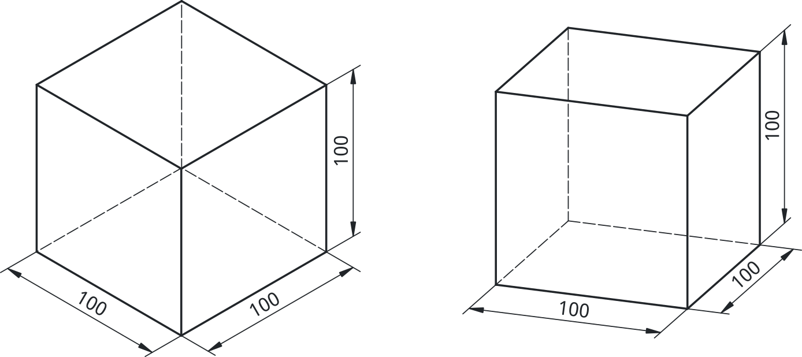

## Aksonometrične projekcije

Aksonometrična projekcija je metoda tehnične risbe, ki omogoča prikaz tridimenzionalnih objektov na dvodimenzionalni ravni, pri čemer se ohrani razmerje med dimenzijami v vseh treh prostornih oseh (x, y in z). Ta projekcija se uporablja v tehnični dokumentaciji in inženiringu bolj redko. Pogosteje je uporabljena za širšo javnost, ki niso vešči večpoglednih projekcij. Aksonometrična projekcija omogoča jasen in natančen vpogled v obliko in strukturo objekta. Aksonometrične risbe so še posebej uporabne pri predstavi kompleksnih elementov, saj omogočajo hkrati prikaz prednje, stranske in zgornje perspektive, kar olajša predsavo objekta.

Med najbolj pogosto uporabljenimi oblikami aksonometrične projekcije sta izometrična in dimetrična projekcija. V nadaljevanju bomo podrobneje raziskali izometrično projekcijo, ki je specifična vrsta aksonometrične risbe, ter njene značilnosti in prednosti pri tehničnem risanju.

Izometrična projekcija je posebna oblika aksonometrične projekcije, kjer so tri glavne osi objekta prikazane pod enakimi koti (120° med seboj) in brez perspektive. Uporablja se za bolj intuitiven prikaz 3D oblik. Od vseh aksonomitričnih projekcij se le-ta največkrat uporablja. Pri predmetih, katerih se prednji in zadnji robovi prekrivajo (npr. pri kocki, 4-strana piramida) lahko uporabimo dimetrično projekcijo, kot na [@fig:izo_vs_di]. Čeprav se le-ta praviloma uporablja ko želimo večji poudarek dati eni ploskvi predmeta.

{#fig:izo_vs_di}

### Izometrična projekcija

**Izometrična projekcija** je vrsta **pravokotne aksonometrične projekcije**, pri kateri je mogoče z istim merilom (isto metriko) meriti dolžine vzdolž osi $\mathbf{X}$,  $\mathbf{Y}$ in $\mathbf{Z}$. Na primer, da želimo na ravnino $\Pi_{XZ}$ projecirati osnovne enotske vektorje:

$$
\mathbf{i} = [1, 0, 0]^T,\ 
\mathbf{j} = [0, 1, 0]^T,\ 
\mathbf{k} = [0, 0, 1]^T.
$$

V trenutni orientaciji bi njihove projekcije na ravnino $\Pi_{XZ}$ lahko izračunali s produktom z matriko $\mathbf{P_{XZ}}$:

$$
\mathbf{P_{XZ}}=\begin{bmatrix} 1, 0, 0 \\0, 0, 0 \\0, 0, 1 \end{bmatrix},
\begin{matrix}
\mathbf{i}'=\mathbf{P_{XZ}}\mathbf{i}=\mathbf{i},\\
\mathbf{j}'=\mathbf{P_{XZ}}\mathbf{j}=0,\\
\mathbf{k}'=\mathbf{P_{XZ}}\mathbf{k}=\mathbf{k}
\end{matrix}.
$$

Ugotovimo lahko, da v tem primeru njihove dolžine niso enake ($\| \mathbf{i}' \| = \| \mathbf{k}' \| = 1; \| \mathbf{j}' \| = 0$) in da jih moramo pravilno zarotirati. Rešitev je seveda več, izberemo lahko, rotacijo okoli $z$ osi za kot $\alpha$ in rotacija po $y$ osi za kot $\beta$:

$$
\mathbf{R} = \mathbf{R}_X(\beta) \cdot \mathbf{R}_Z(\alpha) =
\begin{bmatrix}
\cos\alpha & -\sin\alpha & 0 \\
\cos\beta \cdot \sin\alpha & \cos\beta \cdot \cos\alpha & -\sin\beta \\
\sin\beta \cdot \sin\alpha & \sin\beta \cdot \cos\alpha & \cos\beta
\end{bmatrix}
$$

in dobimo rotacijsko matriko $\mathbf{R_{XZ}}$. Ko tej matriki dodamo še projekcijo na ravnino $\Pi_{XZ}$, dobimo končno transformacijstko matriko $\mathbf{T}$:

$$
\mathbf{T} = \mathbf{P}_{XZ} \cdot \mathbf{R}_{XZ} = 
\begin{bmatrix}
\cos\alpha & -\sin\alpha & 0 \\
0 & 0 & 0 \\
\sin\beta \cdot \sin\alpha & \sin\beta \cdot \cos\alpha & \cos\beta
\end{bmatrix}.
$$

Če upostevamo pogoj za **izometrično projekcijo**:

$$
\| \mathbf{i}' \| = \| \mathbf{j}' \| = \| \mathbf{k}' \|,
$$

dobimo rezultat transformacijstke matrike in s tem tudi kotov $\alpha$ in $\beta$: 

$$
\mathbf{T} =
\begin{bmatrix}
\frac{\sqrt{2}}{2} & -\frac{\sqrt{2}}{2} & 0 \\
0 & 0 & 0 \\
-\frac{1}{\sqrt{6}} & -\frac{1}{\sqrt{6}} & \sqrt{\frac{2}{3}}
\end{bmatrix};\ \ \alpha=45^\circ;\ \ \beta=-35.25^\circ.
$$

### Rotacija predmeta v FreeCAD

se lahko na osnovni ravni izvede neposredno prek grafičnega uporabniškega vmesnika: predmet najprej označimo v drevesu (Tree View), nato nanj kliknemo z desnim miškinim gumbom in med ponujenimi možnostmi izberemo orodje *Transform*. S tem dobimo interaktivno orodje, ki omogoča rotacijo predmeta okoli posameznih osi ter vizualno prilagajanje njegove orientacije v prostoru. Poleg tega pa lahko rotacijo predmeta izvedemo tudi na bolj matematičen in formaliziran način, in sicer z uporabo rotacijskih matrik preko `Python` programske kode, kjer je orientacija predmeta opisana eksplicitno z matematičnimi transformacijami:

```python
import math

obj = FreeCAD.ActiveDocument.getObject("Body")

a = math.radians(45)                        # rotacija okoli Z
b = -math.acos(math.sqrt(2/3))              # rotacija okoli X

Rz = FreeCAD.Matrix(
    math.cos(a), -math.sin(a), 0, 0,
    math.sin(a),  math.cos(a), 0, 0,
    0,            0,           1, 0,
    0,            0,           0, 1
)

Rx = FreeCAD.Matrix(
    1, 0,            0,           0,
    0, math.cos(b), -math.sin(b), 0,
    0, math.sin(b),  math.cos(b), 0,
    0, 0,            0,           1
)

obj.Placement.Rotation = FreeCAD.Rotation(Rx.multiply(Rz))
FreeCAD.ActiveDocument.recompute()

```

Po tej rotaciji dobimo sliko, ki jo prikazuje [@fig:rotacija_na_XZ].

{#fig:rotacija_na_XZ}

Rotacija predmeta je v praksi lahko nepriročna, kadar želimo predmet prikazati v izometrični projekciji, saj spreminja njegovo dejansko orientacijo v prostoru. V takih primerih je bolj smiselno ohraniti predmet v izhodiščnem položaju in namesto tega obravnavati rotacijo projekcijske ravnine, kar omogoča enakovreden matematični opis izometričnega prikaza. Ta pristop je podrobneje razložen v nadaljevanju.

#### Rotacija projekcijske ravnine

je alternativna interpretacija te iste projekcijske situacije. Le da v tem primeru ne rotiramo samega predmeta, pač pa rotiramo projekcijsko ravnino.Torej zanima nas kam moramo premakniti projekcijsko ravnino $\Pi_{iso}$ z normalnim vektorjem $\mathbf{n}$, da dobimo enak rezultat kot v prejšnji situaciji? Ker je rotacija linearna transformacija, lahko prejšnji normalni vektor $\mathbf{n}_y$ projekcijske ravnine $\Pi_{XZ}$ rotiramo z inverzno matriko $\mathbf{R}^{-1}$:

$$ n = \mathbf{R}^{-1}e_y = \frac{1}{\sqrt{3}} \begin{bmatrix} 1 \\1 \\1 \end{bmatrix} \approx \begin{bmatrix} 0.5774 \\0.5774 \\0.5774 \end{bmatrix} $${#eq:normalni_vektor_izometricne_projekcije}

Ker normalni vektor $\mathbf{n}$ definira smer projicirnih žarkov in smer pogleda na predmet, je ta točka pogosto imenovana kot (angl.) **P**oint-**O**f-**V**iew. V programu FreeCAD se ta smer pogleda določi pri vstavljanju novega pogleda (*New View*) na risalni list, kjer v *Task panelu* v sredinski celici nastavimo smer pogleda z vektorjem, na primer $(1,1,1)$, kot je prikazano na [@fig:Aksonometricna_POV].

{#fig:Aksonometricna_POV height=8cm}

#### Prikaz izometrične projekcije

temelji na značilni orientaciji objekta, pri kateri so robovi, vzporedni z osmi $X$, $Y$ in $Z$, enakovredno nagnjeni glede na ravnino risbe. Pri izometričnem prikazu kocke je kot med vodoravnico in spodnjima robovoma kocke na levi in desni strani enak $30^\circ$, kar ustreza projekcijama osi $X$ in $Y$. V skladu s standardom ISO 5456 je izometrična projekcija definirana tako, da se robovi telesa rišejo v merilu $1:1$ glede na njihovo pravo dolžino. Ker pa je pri izometrični projekciji dejanska projekcija telesa krajša od realnih robov – in sicer približno za $18,35\%$ – je za pravilen prikaz potrebno projekcijo ustrezno povečati. To dosežemo v nastavitvah pogleda v zavihku *Data*, kjer parameter *Scale* nastavimo na vrednost približno $1{,}23$.

{#fig:Askonometricna_projekcija_izometricne}

### Dimetrična projekcija

Dimetrična projekcija je namenjena poudarjanju ene izmed ploskev predmeta, medtem ko drugi dve ploskvi ostaneta nekoliko zapostavljeni. Takšen prikaz je značilen za predmete, pri katerih se večina pomembnih konstrukcijskih ali funkcionalnih elementov nahaja na eni strani, zato je smiselno, da je ta ploskev predmeta v projekciji bolj izrazita.

{#fig:dimetricna_projekcija}

Postopek za konstrukcijo dimetrične projekcije je podoben postopku pri izometrični projekciji, zato ga na tem mestu ne bomo ponovno podrobno obravnavali. Ključni pogoj dimetrične projekcije je izbira takšne orientacije predmeta, pri kateri sta dva robova kocke projicirana v enakem merilu, tretji rob pa je polovico krajši. Rešitev tega problema ponovno vodi do zaporedja dveh zasukov: najprej zasuka $\alpha$ okoli osi $Z$ za $20{,}74^\circ$, nato pa zasuka $\beta$ okoli osi $X$ za $19{,}47^\circ$. Z uporabo inverzne rotacije lahko iz te orientacije izračunamo normalni vektor projekcijske ravnine, ki je podan z izrazom:

$$
\mathbf{n} =
\begin{bmatrix}
\sqrt{\frac{1}{9}} \\
\sqrt{\frac{7}{9}} \\
\sqrt{\frac{1}{9}}
\end{bmatrix}
=
\begin{bmatrix}
\frac{1}{3} \\
\sqrt{\frac{7}{9}} \\
\frac{1}{3}
\end{bmatrix}
\approx
\begin{bmatrix}
0{,}3333 \\
0{,}8819 \\
0{,}3333
\end{bmatrix}.
$$

Tudi v primeru dimetrične projekcije standard ISO 5456 določa, da moramo robove kocke risati v merilu $1 : 1 : 0{,}5$. Na primer, rob kocke, ki je v resnici dolg 100 mm (kot je prikazano na [@fig:dimetricna_projekcija]), je v projekciji prikazan kot 94.28 mm. Podobno je projekcija roba v smeri x, ki bi moral meriti 50 mm, prikazana z dolžino 47.14 mm. Ker je zaradi same projekcije dejanska dolžina projiciranih robov nekoliko manjša od predpisanih vrednosti, je za skladnost s standardom potrebno projekcijo ustrezno povečati. V tem primeru to dosežemo tako, da celotno projekcijo pomnožimo s faktorjem $1{,}0606$, s čimer zagotovimo, da dimetrični prikaz ustreza definiciji iz standarda ISO 5456.

{#fig:Dimetricna_pov_scale}

