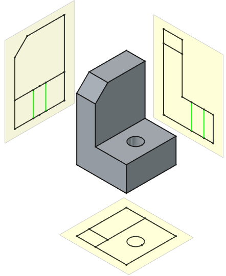
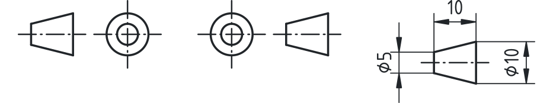
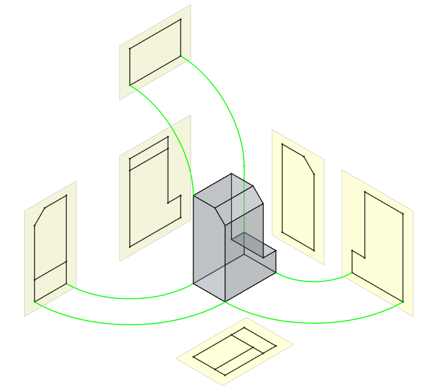
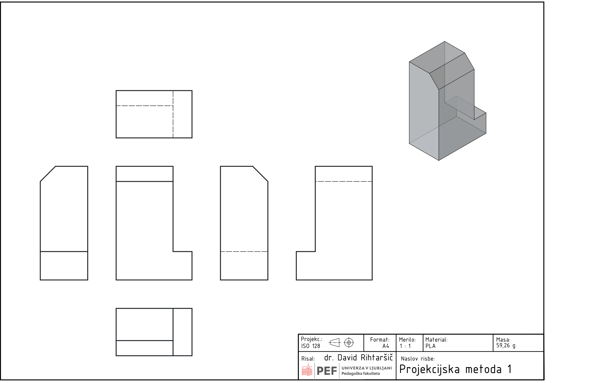
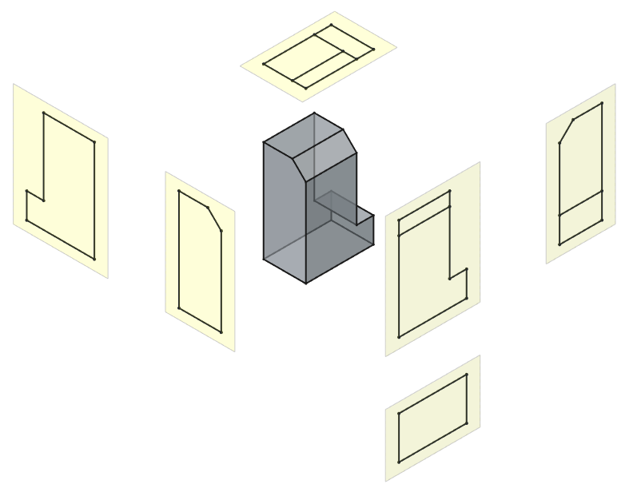

## Večpogledne projekcije

Večpogledne projekcije so osnovni način grafičnega prikaza tridimenzionalnih predmetov v tehnični dokumentaciji. Temeljijo na pravokotni projekciji predmeta na več med seboj pravokotnih projekcijskih ravnin. Namen večpogledne projekcije je podati natančen, enoznačen in nedvoumen opis oblike predmeta, brez perspektivnih popačenj, tako da je predmet mogoče izdelati, preveriti in kontrolirati.

V praksi večpogledna projekcija predstavlja povezavo med prostorskim razumevanjem oblike in dvodimenzionalno tehniško risbo.

{#fig:Projekcija_first_angle width=7cm}

### Prva in tretja kotna projekcija

V tehničnem risanju poznamo dva osnovna sistema pravokotnega večpoglednega projiciranja:

- **prvo kotno projekcijo (projekcijska metoda 1)** in
- **tretjo kotno projekcijo (projekcijska metoda 3)**.

Za njuno predstavitev se običajno uporabljata dva standardizirana grafična simbola. Levo na [@fig:simbol_kotne_projekcije] je predstavljen simbol za prvo kotno projekcijo in na sredini za tretjo, kar bralcu jasno nakaže načrtovane razporeditve pogledov. Simbol je določen v standardu ISO5456 z dimenzijami, ki so prikazane na [@fig:simbol_kotne_projekcije] desno.

{#fig:simbol_kotne_projekcije width=10cm}

Razlika med obema metodama večpoglednih projekcij ni v samem predmetu, temveč v medsebojni legi opazovalca, predmeta in projekcijske ravnine: pri prvi kotni projekciji je predmet med projekcijsko ravnino in opazovalcem, zato se projekcije razvrstijo na način, ki odraža ta pristop, medtem ko v tretji kotni projekciji predmet leži za projekcijsko ravnino in se projekcije razporejajo nasprotno, kar omogoča intuitivno razumevanje in skladnost meril med različnimi pogledi.

#### Prva kotna projekcija

Pri prvi kotni projekciji leži predmet **med opazovalcem in projekcijsko ravnino**. Projekcijski žarki potekajo pravokotno na projekcijsko ravnino, pogled pa nastane na ravnini, ki se nahaja za predmetom.

Značilnost tega sistema je, da se pogledi na risbi pojavijo **na nasprotni strani glede na dejanski položaj pogleda v prostoru**. Tako je na primer tloris narisan pod narisom, desni stranski ris pa levo od narisa.

{#fig:razvoj_metoda_1 width=10cm}

Prva kotna projekcija je standardizirana v Evropi in Sloveniji ter se uporablja v skladu z ISO standardi. Iz tega razloga je v nadaljevanju obravnave poudarek predvsem na tem projekcijskem sistemu.

{#fig:projekcijska_metoda_1}

#### Tretja kotna projekcija

Pri tretji kotni projekciji leži projekcijska ravnina **med opazovalcem in predmetom**. Pogledi se na risbi razporedijo na isti strani, kot jih opazujemo v prostoru.

{#fig:iso5456_ThidrAngle width=10cm}

Ta sistem se uporablja predvsem v ZDA in nekaterih drugih neevropskih okoljih. V evropski tehniški dokumentaciji se praviloma ne uporablja, vendar ga je pomembno prepoznati pri branju tujih risb.

Na tehnični risbi mora biti izbrani projekcijski sistem vedno jasno označen s standardiziranim simbolom.

---

### Projekcijske ravnine in nastanek večpogledne risbe

Večpogledna projekcija temelji na projiciranju predmeta na več pravokotnih projekcijskih ravnin:

- vodoravno ravnino (tlorisna ravnina),
- navpično ravnino (narisna ravnina),
- stransko ravnino (ravnina stranskega risa).

Pri teoretični obravnavi si te ravnine predstavljamo kot ravnine, ki obdajajo predmet. Z vrtenjem projekcijskih ravnin v skupno ravnino risanja dobimo razporeditev posameznih pogledov na tehnični risbi.

Čeprav je ta postopek izvorno del opisne geometrije, je njegovo razumevanje pomembno za pravilno branje in izdelavo večpoglednih risb.

---

### Osnovni pogledi v večpogledni projekciji

V praksi večino tehničnih predmetov opišemo s tremi osnovnimi pogledi:

- **naris** (pogled od spredaj),
- **tloris** (pogled od zgoraj),
- **stranski ris** (pogled z leve ali desne strani).

Ostali pogledi (pogled od spodaj, od zadaj) se uporabljajo le pri zahtevnejših predmetih, kadar osnovni pogledi ne zadostujejo za enoznačen opis oblike.

#### Naris

Naris je glavni in najpomembnejši pogled. Praviloma ga izberemo tako, da:

- najbolje prikaže obliko predmeta,
- vsebuje največ funkcionalno pomembnih elementov,
- omogoča pregledno in smiselno kotiranje.

Izbira narisa bistveno vpliva na berljivost celotne tehniške risbe.

#### Tloris

Tloris prikazuje predmet gledan od zgoraj. Uporablja se za prikaz globine, razporeditve odprtin, lukenj in drugih elementov, ki v narisu niso razvidni.

Tloris je vedno usklajen z narisom, kar pomeni, da so ustrezne mere in oblike poravnane.

#### Stranski ris

Stranski ris dopolnjuje naris in tloris ter omogoča popoln prostorski opis predmeta. Najpogosteje se uporablja levi ali desni stranski ris, odvisno od preglednosti oblike.

---

### Medsebojna skladnost pogledov

Osnovno pravilo večpogledne projekcije je, da so vsi pogledi:

- med seboj geometrijsko povezani,
- poravnani glede na skupne robove in osi,
- dimenzijsko skladni.

Vsak element, prikazan v enem pogledu, mora imeti svoj logični in prostorsko skladen odraz tudi v ostalih pogledih.

Večpogledna projekcija tako ne predstavlja treh ločenih risb, temveč enoten, povezan sistem prikazov istega predmeta.

