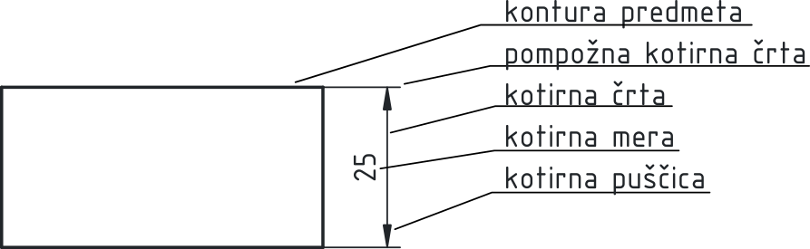
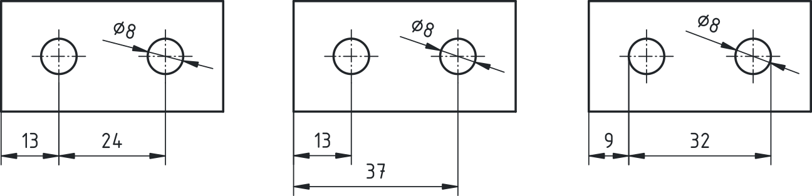
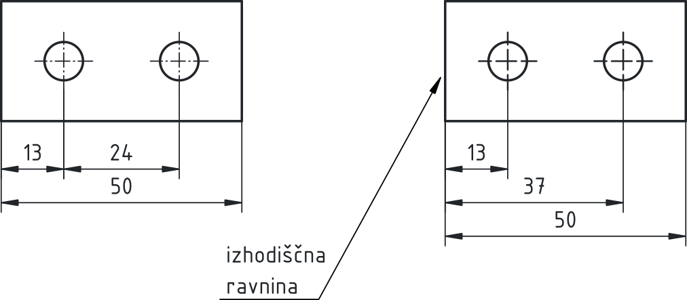
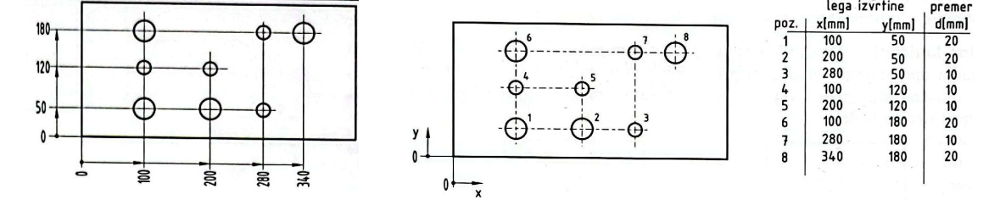

# PREDSTAVITEV TELES

Kotiranje je postopek vpisovanja kot oziroma mer na tehniško risbo, s katerim natančno določimo velikost, lego in medsebojna razmerja posameznih elementov predmeta. Kotiranje je ključen del tehniške dokumentacije, saj povezuje geometrijski prikaz oblike s podatki, potrebnimi za izdelavo, montažo in kontrolo izdelka.

Osnovno pravilo kotiranja je, da morajo biti vse mere podane **nedvoumno, pregledno in funkcionalno smiselno**, pri čemer vsako mero na risbi praviloma zapišemo le enkrat. Osnovni elementi kotiranja so prikazani na [@fig:elementi_kotiranja].

**Elementi kotiranja**

{#fig:elementi_kotiranja}

- **Kontura predmeta**:
    Kontura predmeta predstavlja vidni obris telesa v posameznem pogledu tehniške risbe. Sestavljena je iz zunanjih in notranjih robov, ki so v danem pogledu vidni, in je narisana s polno debelo črto. Kontura določa geometrijsko obliko predmeta in je osnovni nosilec informacij o obliki. Vsi ostali elementi risbe – kotirne črte, pomožne črte, osi in oznake – se morajo konturi jasno podrejati. Pri kotiranju velja več pomembnih pravil:
    - kontura predmeta se ne sme nadomeščati s kotirnimi ali pomožnimi črtami,
    - pomožne kotirne črte ne smejo sovpadati s konturo,
    - kontura mora ostati neprekinjena in jasno razpoznavna tudi pri gosto kotiranih risbah.
    
    Razlikovati je treba med konturo in skritimi robovi. Skriti robovi niso del vidne konture in se rišejo s črtkano črto.

- **Pomožna kotirna črta**:
    Pomožna kotirna črta je tanka polna črta, ki izhaja iz roba predmeta ali iz osi simetrije ter omejuje območje, na katerega se nanaša kotirna mera. Pomožne kotirne črte praviloma potekajo pravokotno na kotirno črto in jo nekoliko presežejo (2 mm).
    Njihova vloga je jasno določiti, **med katerima točkama ali robovoma** se meri razdalja. Pomožne kotirne črte naj se ne sekajo z robovi predmeta in ne smejo biti del konture telesa.

- **Kotirna črta**:
    Kotirna črta je tanka polna črta, ki poteka vzporedno z merjeno razdaljo. Nameščena je med pomožnima kotirnima črtama in predstavlja nosilko kotirne mere.
    Razdalja kotirne črte od obrisa predmeta mora biti dovolj velika, da je risba pregledna (vsaj 10 mm). Pri več vzporednih kotirnih črtah morajo biti razmiki med njimi enakomerni (7 mm).

- **Omejitev kotirne črte**:
    Kotirna črta je na obeh koncih omejena z oznakami, najpogosteje v obliki **puščic**. Puščice označujejo začetek in konec merjene razdalje.
    Velikost in oblika puščic morata biti enotni na celotni risbi. Dolžina puščic je enaka kot višina kotirne mere (za A4 je priporočena višina 3,5 mm). Puščice se ne smejo prekrivati z robovi predmeta. V posebnih primerih, kadar ni dovolj prostora, se lahko uporabijo druge oblike omejitev (glej [@fig:omejitve]), vendar mora biti pomen vedno jasen in nedvoumen.

{#fig:omejitve}

- **Kotirna mera**:
    Kotirna mera je številčna vrednost dimenzije, zapisana nad ali na kotirni črti. V tehničnih risbah so mere praviloma podane v milimetrih, brez navedbe enote.
    Višina pisave mora biti prilagojena formatu risbe in merilu. Kotirne številke so orientirane tako, da jih lahko beremo iz spodnjega ali desnega roba risbe. Njihova lega mora zagotavljati dobro berljivost in ne sme povzročati zmede pri interpretaciji risbe.

## Kotiranje

<!--
na to mesto dodaj še tisti dokument, ki ga je Samo pripravil za kratek kurz za OŠ.
-->

Kotiranje ni zgolj tehnični dodatek k risbi, temveč ključen informacijski sloj tehniške dokumentacije.
Kotiranje mora biti vedno prilagojeno namenu risbe, tehnologiji izdelave in zahtevani funkcionalnosti izdelka. Pravilno izbrani način kotiranja bistveno zmanjša možnost napak pri izdelavi in uporabi tehničnega izdelka. Osnovni trije načini kotiranja glede na namen uporabe mer so prikazani na [@fig:namen_mer]:

{#fig:namen_mer}

**Funkcija oblike**:

Funkcionalne mere določajo tiste dimenzije, ki neposredno vplivajo na delovanje izdelka. To so na primer razdalje med središči lukenj, naležne površine ali vodilni elementi. Te mere imajo pogosto predpisane tolerance in so bistvene za pravilno delovanje sklopa.

**Izdelava**:

Izdelovalne mere so prilagojene tehnološkemu postopku. Nanašajo se na obdelovalne površine, izhodiščne ravnine in zaporedje obdelave. Pri teh merah je pomembno, da omogočajo enostavno in ponovljivo izdelavo.

**Preverjanje**:

Kontrolne mere so namenjene preverjanju izdelka po izdelavi. Omogočajo meritve na končnem izdelku in zagotavljajo, da izdelek ustreza predpisanim zahtevam. Pogosto so povezane s funkcionalnimi zahtevami.

### Načini kotiranja

**Zaporedno kotiranje**:

Pri zaporednem kotiranju si kotirne mere sledijo ena za drugo. Vsaka mera se nanaša na prejšnjo. Ta način kotiranja poudarja **medsebojne relacije posameznih elementov** (glej [@fig:zaporedno_vzporedno_kotiranje]), vendar lahko povzroči seštevanje toleranc. Zaporedno kotiranje se uporablja predvsem tam, kjer natančnost posameznih razdalj ni kritična ali kjer je pomembna predvsem relativna lega elementov.

**Vzporedno kotiranje**:

Pri vzporednem kotiranju se vse mere nanašajo na **eno skupno izhodiščno ravnino ali rob**. Ta način omogoča boljši nadzor nad tolerancami in je primeren za funkcionalno pomembne dimenzije. Vzporedno kotiranje je značilno za zahtevnejše strojne dele in je pogosto povezano z izdelovalnimi in kontrolnimi merami.

{#fig:zaporedno_vzporedno_kotiranje}

**Poenostavljeno vzporedno kotiranje**:

Poenostavljeno vzporedno kotiranje je posebna oblika vzporednega kotiranja (glej [@fig:Poenostavljeno_kotiranje]), kjer so vse kotirne črte izpeljane iz skupnega izhodišča, pogosto označenega s simbolom izhodišča. Posamezne mere so zapisane ob pomožnih kotirnih črtah. Ta način izboljša preglednost risbe, zlasti pri večjem številu ponavljajočih se elementov.

{#fig:Poenostavljeno_kotiranje}

**Kotiranje s koordinatami**:

Pri kotiranju s koordinatami so lege elementov podane s koordinatami glede na izhodiščni koordinatni sistem. Mere so pogosto zapisane v tabeli. Ta način kotiranja je posebej primeren za izdelke, ki se izdelujejo na numerično krmiljenih strojih, saj se neposredno povezuje z G-kodo in računalniško podprto izdelavo (glej [@fig:Poenostavljeno_kotiranje] - desno).

