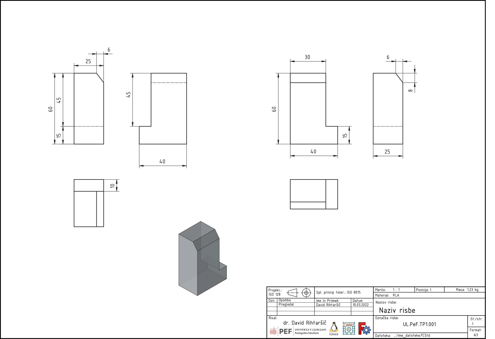
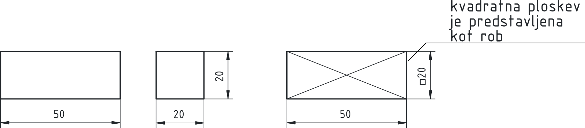
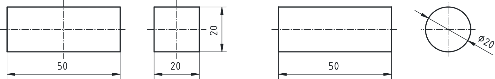

## Kotiranje teles

V tem podpoglavju so predstavljena osnovna načela kotiranja, ki jih najprej obravnavamo na **preprostih prizmatičnih predmetih** in **predmetih z ravnimi ploskvami**. Poudarek kotiranja je na funkcionalnem pomenu mer, preglednosti risbe in pravilni organizaciji kotiranja v večpoglednih projekcijah.

### Osnovna načela kotiranja

Kotiranje teles mora vedno slediti načelom preglednosti, funkcionalnosti in standardizacije. Pravilna izbira pogledov, organizacija mer in upoštevanje osnovnih pravil bistveno prispevajo k jasni in uporabni tehniški dokumentaciji.
Prizmatična telesa (npr. kvader) imajo tri osnovne mere: **dolžino, širino in višino**. Osnovno pravilo je, da vsako od teh mer kotiramo **le enkrat**, in sicer v tistem pogledu, kjer je razvidna v pravi velikosti. Na [@fig:kotiranje_osnove] ([osnove kotiranja](./slike/4.1_Kotiranje_Osnove.pdf))je prikazano nekaj primerov nepravilnega kotiranja in predlog ene možne rešitve, v kateri upoštevamo prej omenjene smernice.

{#fig:kotiranje_osnove}

#### Kontura

Kotiranje vedno izhaja iz **konture predmeta**, ki predstavlja vidni obris telesa v posameznem pogledu. Kontura mora ostati jasno razpoznavna in se ne sme nadomeščati s kotirnimi ali pomožnimi črtami. Predmet skušamo orientirati tako, da je v narisni ravnini kar največ vidnih funkcionalnosti in posledično največ kotirnih mer.

#### Gabaritna mera

Gabaritne mere določajo **skupno zunanje dimenzije** telesa (skrajne mere v vse tri smeri). Te mere so praviloma kotirane na **zunanjem obrobju prikazov**, saj so pomembne za vgradnjo, transport in splošno prostorsko umeščanje predmeta.

#### Kotiranje izven kontur

Kotirne črte postavljamo po možnosti **izven konture predmeta**, s čimer povečamo preglednost tehniške risbe. Le kadar za to ni dovolj prostora ali kadar bi bila risba manj pregledna, je dovoljeno kotiranje znotraj konture.

#### Prosta mera in krog mer

Pri zaporedju mer, ki tvorijo t. i. **krog mer**, mora biti ena mera vedno **prosta** (nekotirana). Ta mera je posredno določena z izračunom in ne sme biti funkcionalno pomembna, saj se pri njej seštevajo tolerance.

#### Nesekanje kotirnih in pomožnih črt

Kotirne črte se med seboj ne smejo sekati. Prav tako se je treba izogibati sekanju kotirnih črt s pomožnimi kotirnimi črtami, saj to zmanjšuje preglednost risbe. Če je mogoče, naj bodo razmiki med sosednjimi kotirnimi črtami enakomerni.

#### Odmik kotirnih črt

Prva kotirna črta naj bo odmaknjena od konture približno **10 mm**, vsaka naslednja pa dodatnih **7 mm**. Ta razporeditev zagotavlja jasno ločitev konture, pomožnih črt in kotirnih mer.

#### Kotiranje vidnih robov

Kotiramo **le vidne robove** predmeta. Nevidnih robov (črtkanih črt) praviloma ne kotiramo, saj to povzroča nejasnosti pri interpretaciji risbe. V primerih ko gre za kotne izreze raje kotiramo preostali material in ne izreza.

#### Kvadratne ploskve

Pri kvadratnih ploskvah, kjer sta dolžina in širina enaki, to enakost posebej označimo z **oznako za kvadrat**. Oznaka se zapiše pred mero in nadomesti podvajanje istih dimenzij. V primeru na [@fig:kvadratna_ploskev] (desno) je prizma predstavljena z le enim pogledom. Tanki polni črti po diagonalah poudarjata, da gre za ravno površino in ne okroglino.

{#fig:kvadratna_ploskev}

#### Ploščati izdelki z ravnimi površinami

Ploščati izdelki (npr. pločevine, plošče) so telesa z eno izrazito manjšo mero – **debelino**.
Debelina ploščatih izdelkov se praviloma kotira z ločeno mero, pogosto v stranskem pogledu ali prerezu, kjer je debelina jasno razvidna. S tem se izognemo nejasnostim in preobremenitvi glavnega pogleda.

#### Simetrala in rotacijska os

Pri simetričnih predmetih uporabljamo **simetralo**, ki je označena s tanko črto tipa srednjice. Predmet je simetričen, kadar sta obe polovici glede na simetralo enaki. Navodilo o simetričnosti vpliva na način kotiranja in izdelave.

**Rotacijska os** pa se uporablja pri rotacijskih telesih (npr. valji, stožci). Tudi rotacijska os je označena s srednjico, vendar njen pomen ni enak simetrali: določa os vrtenja in je ključna za kotiranje premerov in radialnih elementov.

Razlikovanje med simetralo in rotacijsko osjo je pomembno za pravilno razumevanje oblike in izbiro ustreznega načina kotiranja.

{#fig:simetrala_os}

