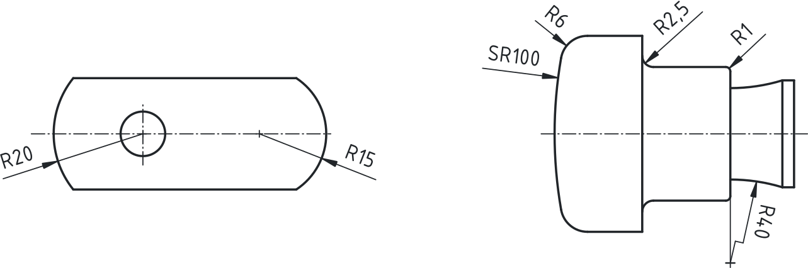
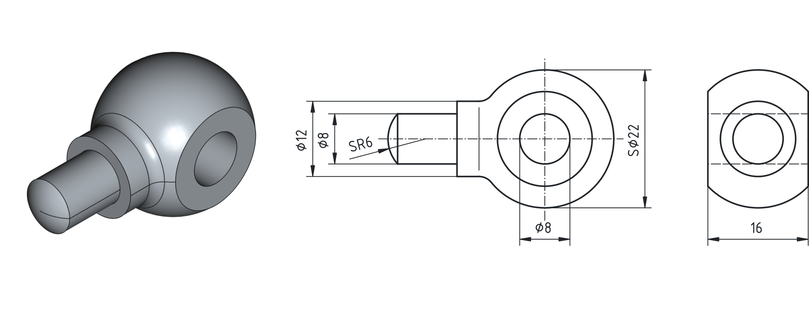

## Kotiranje valjastih teles, premerov, radijev in kroglastih elementov

Rotacijska telesa so telesa, pri katerih je geometrija določena z vrtenjem profila okoli osi. Značilna lastnost takih teles je **rotacijska os**, ki ima v tehnični risbi vlogo simetrale. Os rišemo s tanko črta-pika črto in jo po potrebi uporabljamo tudi kot pomožno kotirno črto. Kotiranje rotacijskih teles vedno izhaja iz **osi ali simetrale**. Mere zapisujemo praviloma ob osi, saj to povečuje preglednost in zmanjšuje možnost napačne interpretacije.

Valj je osnovno rotacijsko telo, ki ga v tehnični risbi praviloma določimo z **dvema merama**: premerom $\varnothing$ in višino (dolžino) valja. Pri pokončno postavljenem valju sta stranski in čelni pogled geometrijsko enakovredna pravokotniku, zato dodatni pogledi pogosto niso potrebni, če so vse mere jasno in nedvoumno podane.

Za potrebe jasne in pregledne razlage je smiselno več pravilnih primerov združiti na **eno samo risbo**, pri čemer posamezni elementi zasedajo različne dele slike.

{#fig:kotiranje_valjastih_teles}

Če sta na risbi zapisana tako premer kot višina valja, lahko v določenih primerih izpustimo tloris. Kadar je iz zapisa jasno razvidno, da gre za krožno obliko, se premer vedno označi z znakom $\varnothing$ (to ni grška črka $\phi$, ampak krožec s poševno črto), zapisanem pred številčno vrednostjo mere. Označevanje premera mora biti izvedeno jasno in nedvoumno, z osjo valja kot referenco (glej levo in desno stran [@fig:kotiranje_valjastih_teles]).

Pri sestavljenih ali stopničastih valjih mora biti kotiranje prilagojeno **zaporedju obdelave**. Kotiranje začnemo na tisti ravnini oziroma robu, ki je v tehnološkem postopku prva obdelovalna referenca (izhodiščna ravnina), dolžinske mere pa nizamo vzdolž osi valja (sredina [@fig:kotiranje_valjastih_teles]).

Pri več koncentričnih premerih morajo biti mere razporejene tako, da se izognemo križanju kotirnih črt in zmanjšani preglednosti. Če bi zaradi večjega števila premerov risba postala nepregledna, je dovoljeno razporejanje mer po različnih pogledih, pri čemer mora ostati vsaka mera jasno povezana z geometrijskim elementom, na katerega se nanaša.

### Kotiranje radijev (majhni in veliki radiji)

Polmere oziroma radije označujemo s črko **R**, ki jo zapišemo pred številčno vrednost mere. Kotirna črta ima puščico le na strani loka, medtem ko se druga stran zaključi brez puščice.

Če je središče radija znano in se nahaja v presečišču srednic, lahko radij kotiramo neposredno. Če središče ni razvidno ali leži izven risanega območja, uporabimo lomljeno ali podaljšano kotirno črto oziroma pomožno označbo s križcem.

{#fig:Kotiranje_radijev}

V programu FreeCAD imajo kote radijev tudi nekaj dodatnih nastavitev, do katerih dostopamo v oknu `Model`, kjer se v zavihku `View` lahko nastavi: `Flip Arrowhead`, `Rendering Extend`. Prav tako lahko nastavljamo lastnost pogleda ali želimo videti vse majhne označbe središča radijev -> `Arc Center Marks`. Z lomljeno črto radija, katerega središče se nahaja zunaj pogleda, pa bomo imeli več težav. Za risanje pomožnih črt so koristna orodja kot so: `Add Cosmetic Intersection Vertex`, `Add Offset Vetex`, `Add Cosmetic Line`, `Add Cosmetic Perpendicular Line`...

V praksi se uporabljajo tipični, standardizirani radiji, ki omogočajo lažjo izdelavo, uporabo standardnega orodja in boljšo ponovljivost izdelave. Pregled najpogosteje uporabljenih radijev je podan v spodnji tabeli.

| Namen zaokrožitve                   | Tipični radiji (R) [mm] |
|:------------------------------------|:-----------------------:|
| Odstranitev ostrih robov            |      0,3 · 0,5 · 1      |
| Splošni prehodi med ploskvami       |       1 · 2,5 · 4       |
| Konstrukcijsko pogojeni prehodi     |        4 · 6 · 10       |
| Oblikovne in ergonomske zaokrožitve |       10 · 16 · 20      |

Table: Uporaba standardnih radijev omogoča preglednejšo tehniško risbo in zmanjšuje potrebo po podrobnem kotiranju vsake posamezne zaokrožitve. {#tbl:standardni_radiji}

Majhni radiji, ki služijo za posnemanje robov ali lažji prehod med ploskvami, so pogosto standardizirani. Pri večjih radijih je pomembno jasno razlikovati med funkcionalnimi in oblikovnimi zaokrožitvami, saj imajo lahko različen vpliv na delovanje in izdelavo kosa.

### Kotiranje kroglastih elementov

Krogle in kroglasti deli predstavljajo poseben primer rotacijskih teles, pri katerih geometrija ni določena z valjastim ovojem, temveč s sferično površino. Kotiranje teh elementov mora biti še posebej jasno, saj napačna ali nepopolna oznaka hitro vodi do napačne interpretacije oblike.

Kroglaste elemente v tehnični dokumentaciji najpogosteje srečamo v naslednjih oblikah:

- polna krogla (npr. kroglični elementi, ležaji),
- kroglasta podložka ali kroglasti sedež,
- odrezek krogle (sferična kapica),
- kroglasti zaključek ali kroglasti prehod med dvema rotacijskima oblikama.

Pri kotiranju je bistveno razlikovati med valjastimi in kroglastimi geometrijami. Premer krogle zato ne označujemo z običajnim simbolom $\varnothing$, temveč s simbolom **S$\varnothing$**, ki nedvoumno pove, da gre za sferični premer. Analogno temu sferični radij označimo z oznako **SR**.

Pri kroglastih prehodih med valjem in kroglo mora biti prehod jasno razviden iz risbe. Zaradi boljše berljivosti se meja med valjastim in kroglastim delom pogosto označi s tanko črto, ki ni del dejanske konture, temveč služi izključno razlagi oblike.

{#fig:Kotiranje_sfere}

<!--

### Pogoste napake pri kotiranju rotacijskih teles

Pri kotiranju rotacijskih teles se v praksi pogosto pojavljajo ponavljajoče se napake, ki zmanjšujejo berljivost tehniške risbe ali lahko vodijo do napačne izdelave kosa. Namen tega razdelka je opozoriti na najpogostejše nepravilnosti in s tem prispevati k bolj zavestnemu in pravilnemu kotiranju.

**1. Manjkajoč ali nepravilno zapisan simbol $\varnothing$ ali R**\
Ena najpogostejših napak je zapis premera brez simbola $\varnothing$ ali radija brez oznake R. Tak zapis povzroča dvoumnost, saj ni jasno, ali gre za linearno mero ali rotacijsko mero.

> Slika 11: Napačen zapis premera brez simbola $\varnothing$.

**2. Kotiranje premera kot razdalje med dvema robovoma**\
Premere ni dovoljeno kotirati kot navadne dolžine med dvema vzporednima robovoma. Premer mora biti vedno kotiran glede na os rotacije.

> Slika 12: Napačno kotiranje premera kot linearne mere.

**3. Kotiranje glede na nevidne robove**\
Mere se ne smejo nanašati na nevidne robove ali skrite konture. Če je mera pomembna, mora biti zagotovljen ustrezen pogled ali prerez.

> Slika 13: Napačno kotiranje na nevidni rob.

**4. Neupoštevanje izhodiščne ravnine pri stopničastih valjih**\
Pogosta napaka je naključno razporejanje dolžinskih mer brez jasne izhodiščne ravnine. Takšno kotiranje otežuje tehnološko obdelavo in kontrolo mer.

> Slika 14: Nepravilen potek kotiranja brez izhodiščne ravnine.

**5. Prekrižane ali preblizu postavljene kotirne črte**\
Križanje kotirnih in pomožnih črt zmanjšuje preglednost risbe. Posebej problematično je to pri več koncentričnih premerih v istem pogledu.

> Slika 15: Nepregledno kotiranje z več križanji kotirnih črt.

**6. Nepojasnjeno kotiranje več enakih radijev**\
Pri več enakih zaokrožitvah je napačno, da vsak radij posebej kotiramo. Pravilno je uporabiti skupno opombo, npr. *Vsi nekotirani radiji R6*.

> Slika 16: Napačno posamično kotiranje enakih radijev.

**7. Napačna ali manjkajoča oznaka pri kroglastih elementih**\
Krogle in kroglasti deli morajo biti označeni s simboloma S$\varnothing$ ali SR. Zapis zgolj $\varnothing$ ali R pri kroglastih oblikah je napačen.

> Slika 17: Napačna oznaka kroglastega elementa.

**8. Preobremenjena risba z nepotrebnimi merami**\
Preveliko število mer, zlasti podvojenih ali tehnološko nepomembnih, zmanjšuje jasnost risbe. Vsaka mera mora imeti jasno funkcijo.

> Slika 18: Preobremenjena tehnična risba z odvečnimi merami.

-->

