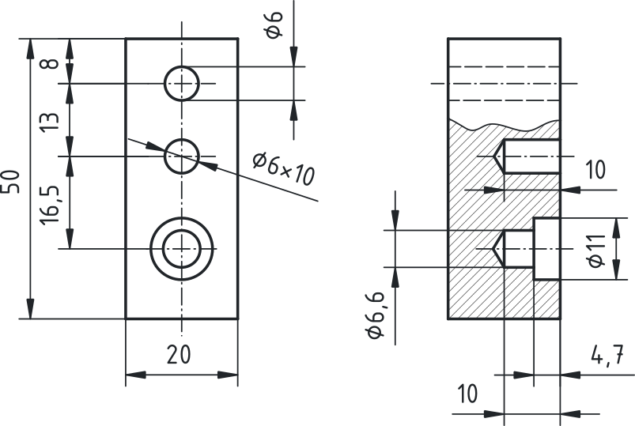
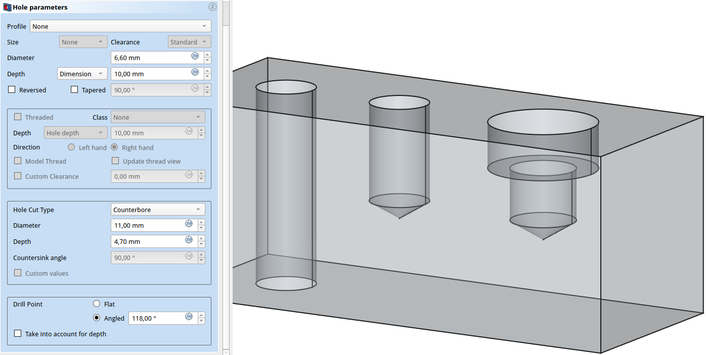
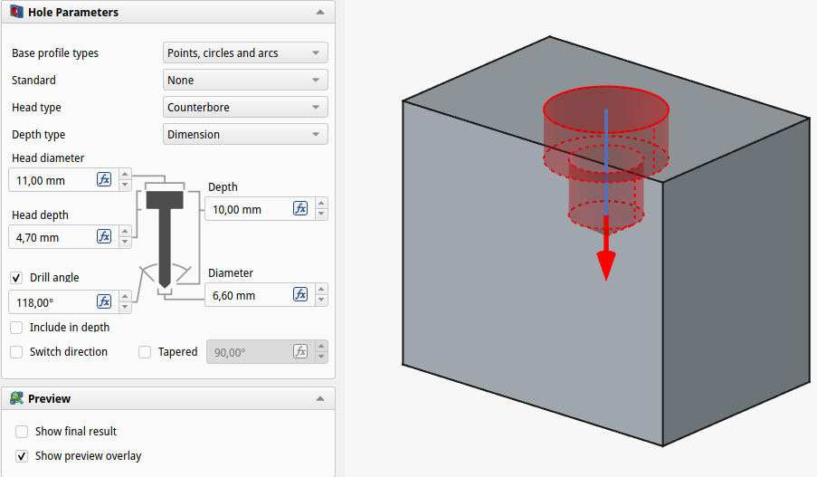
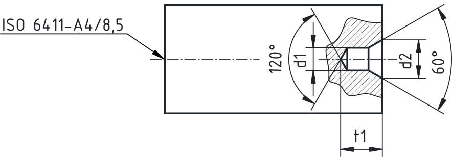
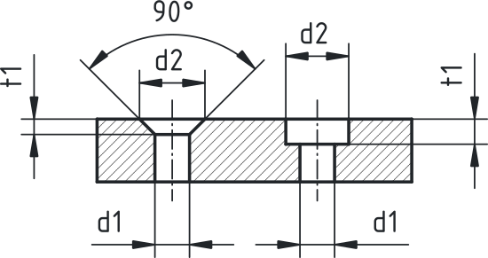

## Kotiranje izvrtin

Izvrtine so med najpogostejšimi konstrukcijskimi elementi strojnih delov. Njihova pravilna predstavitev in kotiranje sta ključna za funkcionalnost izdelka, natančnost izdelave ter pravilno montažo.

**Prebodna izvrtina** (skoznja luknja) poteka skozi celoten predmet. Kotiramo:

- premer izvrtine ($\varnothing d$),
- po potrebi lego osi izvrtine,
- dodatne elemente (posnetje, ugreznino).

**Slepa izvrtina** ne prebada predmeta v celoti. Kotiramo:

- premer izvrtine ($\varnothing d$),
- globino izvrtine (npr. $\varnothing 10 × 15$), pri čemer globina pomeni **globino valjastega dela izvrtine**,
- lego osi,
- dodatne elemente (posnetje, ugreznino, poglobitev), če so prisotni.

Pri slepih izvrtinah **ne kotiramo kota stožčastega zaključka na dnu izvrtine**, saj je ta posledica standardnega vrtalnega orodja (običajno 118°) in ni konstrukcijsko določen element, temveč tehnološka posledica postopka izdelave.

{#fig:Kotiranje_izvrtin}

Pri **slepih izvrtinah** je prerez običajna in priporočena praksa. Izvrtin nikoli ne kotiramo po skritih robovih (črtkane črte), saj tak prikaz ni dovolj jasen in lahko povzroči napačno interpretacijo globine ali dodatnih elementov.

S tem zagotovimo:

- jasno berljivost risbe,
- skladnost s standardi tehničnega risanja,
- nedvoumno interpretacijo mer,
- pravilno razumevanje, da stožčasti zaključek na dnu ni konstrukcijsko kotiran element.

### Digitalno modeliranje – orodje »Hole« (FreeCAD)

V FreeCADu, v delovnem okolju Part Design, orodje Hole omogoča hitro in parametrično postavitev izvrtin z osnovnimi parametri, kot so:

- premer izvrtine,
- globina (slepa ali skozi),
- oblika dna, ter
- prisotnost ugreznin ali poglobitev;

hkrati podpira standardne izvedbe glede na vijake, kar omogoča dosledno oblikovanje in skladnost z uporabo vijačnih spojev.

{#fig:FreeCAD_Hole_feature_vFC102}

Pri načrtovanju je priporočljivo jasno določiti, ali bo luknja skozi telo ali le delna, ter izbrati ustrezno vrsto dna (ravno, stožčasto ali končno) glede na zahteve povezave in nosilnosti. Z uvedbo teh parametrov se zagotovita pravilna toleranca, pravilna poravnava in trajna skladnost med sestavnimi deli, kar olajša kasnejše posodabljanje modelov in interpretacijo risbe. V novejši različici FreeCAD programa (različica 1.1) je ta uporabniška izkušnja še nekoliko bolj intuitivna.

{#fig:FreeCAD_Hole_feature_vFC11}

### Središčne (centrirne) izvrtine

Središčne izvrtine uporabljamo predvsem pri obdelavi na stružnici. Nahajajo se na čelnih ploskvah obdelovancev in omogočajo vpetje med konice. Središčne izvrtine praviloma nimajo funkcionalne vloge v končnem izdelku, temveč služijo tehnologiji izdelave.

Poznamo več oblik središčnih izvrtin (npr. tipi A, B, C, R po ustreznih standardih), ki se razlikujejo glede na dodatne zaščitne stožce ali radije. V tem učnem gradivu podrobneje obravnavamo najenostavnejšo in najpogosteje uporabljeno obliko **tip A**. Tip A je stožčasta oblika brez zaščitnega posnetja ali dodatnega radija.

Značilnosti tipa A:

- stožčasti kot ugreznine 60°,
- manjši vodilni premer $d_1$,
- večji stožčasti premer $d_2$.

{#fig:Kotiranje_srediscne_izvrtine}

Središčno izvrtino označimo z navedbo standarda in karakterističnih mer, npr.: ISO 6411–A4. Na risbi jo praviloma kotiramo s poenostavljenim prikazom in simbolnim zapisom.

| $d_1 (mm)$ | $d_2 (mm)$ | $t_{1min} (mm)$ |
|:----------:|:----------:|:--------------:|
|      1     |    2,12    |       1,9      |
|      2     |    4,25    |       3,7      |
|      4     |     8,5    |       7,4      |
|     6,3    |    13,2    |      11,5      |
|     10     |    21,2    |      18,4      |

Table: Tipične mere središčne izvrtine za tip A. {#tbl:tip_A_srediscna}

### Ugreznine

Ugreznine omogočajo, da glava vijaka ne izstopa iz površine ali da je ustrezno nalegana. Obravnavamo dve najpogostejši obliki:

- **Oblika A** – stožčasta ugreznina 90° (za vijake z ugrezno glavo),
- **Oblika H** – valjasta poglobitev (za vijake z valjasto glavo).

#### Ugreznina oblika A (90°) – za vijake z ugrezno glavo

Uporaba:

- vijaki z ugrezno glavo z zarezo ali križno zarezo (npr. po SIST ISO 2009, DIN 963, DIN 965),
- primeri, kjer mora biti glava vijaka poravnana s površino.

Geometrija:

- premer skoznje luknje $\varnothing d_1$,
- premer stožčaste ugreznine $\varnothing d_2$,
- kot 90°.

| Imen. premer vijaka $\varnothing d (mm)$ | $\varnothing d_1 (mm)$ | $\varnothing d_2 (mm)$ | $t\approx$ (mm) |
|------------------------------------------|----------------------|----------------------|-----------------|
| 3                                        | 3,4                  | 6,6                  | 1,6             |
| 4                                        | 4,5                  | 9                    | 2,3             |
| 5                                        | 5,5                  | 11                   | 2,8             |
| 6                                        | 6,6                  | 13                   | 3,2             |

Table: Tipične mere srednje (po ISO označimo z `m`) izvedbe ugreznine tipa A za vijake s stožčasto ugrezno glavo. {#tbl:mere_ugreznine_tip_A}

{#fig:Kotiranje_ugreznin_A_H}

#### Ugreznina oblika H – valjasta poglobitev

Uporaba:

- vijaki z valjasto glavo z zarezo,
- vijaki z valjasto glavo z notranjim šestkotnikom (npr. po SIST ISO 4762),
- primeri, kjer želimo glavo vijaka poglobiti pod nivo površine.

Geometrija:

- premer skoznje luknje $\varnothing d_1$,
- premer poglobitve $\varnothing d_2$,
- globina poglobitve $t_1$.

| Imen. premer vijaka $\varnothing d (mm)$ | $\varnothing d_1 (mm)$ | $\varnothing d_2 (mm)$ | $t_1 (mm)$ |
|------------------------------------------|------------------------|------------------------|------------|
| 4                                        | 4,5                    | 8                      | 3,2        |
| 5                                        | 5,5                    | 10                     | 4          |
| 6                                        | 6,6                    | 11                     | 4,7        |
| 8                                        | 9                      | 15                     | 6          |
| 10                                       | 11                     | 18                     | 7          |

Table: Tipične mere srednje (po ISO označimo z `m`) izvedbe ugreznine tipa H za vijake z valjasto ugrezno glavo. {#tbl:mere_ugreznine_tip_H}

