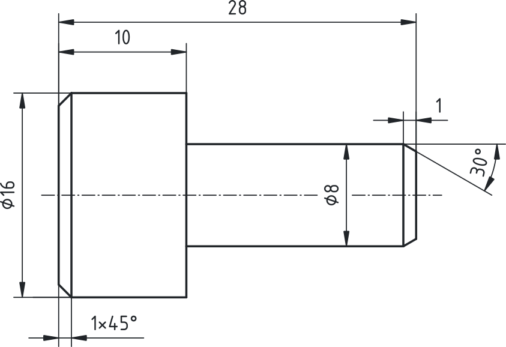
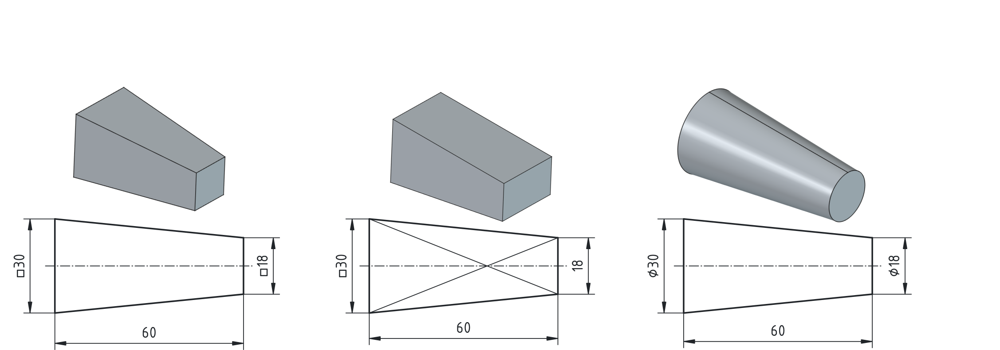
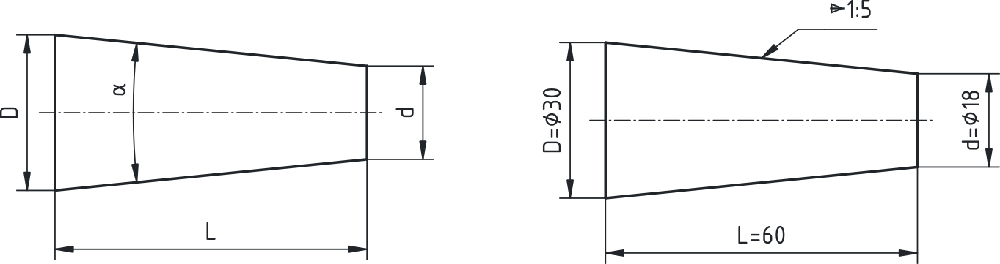
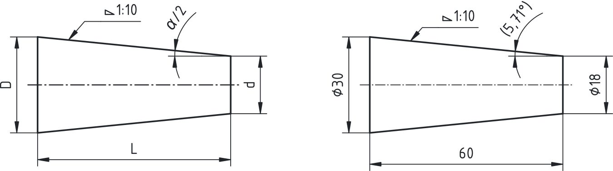
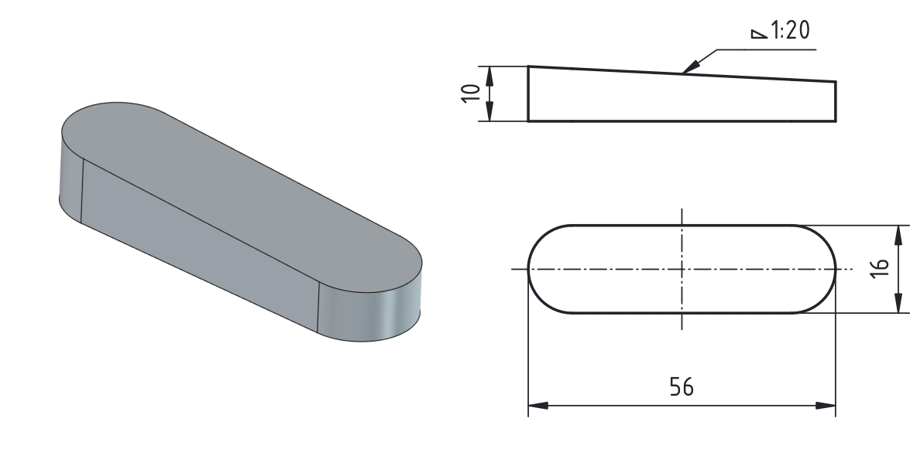

## Kotiranje poševnih ploskev

Poševne ploskve so v tehničnih risbah zelo pogoste. Pojavljajo se kot posnetja robov, poševne ploskve pri prizmah ali stožcih, stožčasti elementi (konusi) ter pri različnih klinastih strojnih elementih, kot so zagozde. Pri kotiranju takšnih elementov moramo zagotoviti, da so podatki na risbi jasni, nedvoumni in zadostni za izdelavo ter kontrolo izdelka.

### Posnetja robov

Najpogostejši primer poševne ravnine na strojnih delih je posnetje robov (angl. *chamfer*). Posnetje se uporablja predvsem za odstranjevanje ostrih robov, lažje sestavljanje delov ter za izboljšanje varnosti pri rokovanju z izdelkom. Pogosto ima tudi tehnološki pomen, saj olajša začetek navojev ali vstavitev elementov v izvrtine.

Pri kotiranju posnetij velja posebno pravilo za posnetje pod kotom 45°. V tem primeru zadostuje zapis ene mere in kota na isti kotirni črti. Običajen zapis je na primer **1 × 45°** ali **2 × 45°**, kjer prva vrednost pomeni dolžino posnetja (levi primer na [@fig:Kotiranje_posevnih_ploskev_1x45_1x30]). Tak zapis je pregleden in omogoča hitro razumevanje geometrije elementa.

{#fig:Kotiranje_posevnih_ploskev_1x45_1x30 width=70mm}

Kadar posnetje ni izvedeno pod kotom 45°, moramo njegovo geometrijo določiti z dvema kotama. Tak primer je 30° posnetje na desni starni [@fig:Kotiranje_posevnih_ploskev_1x45_1x30]. V tem primeru podamo dolžino posnetja in velikost kota posnetja. Tak zapis omogoča nedvoumno določitev poševne ploskve.

### Poševne ploskve

Poševne ploskve se pojavljajo tudi pri različnih geometrijskih telesih, na primer pri prizmah ali stožčastih oblikah. Takšne ploskve pogosto določajo funkcionalno obliko izdelka ali omogočajo pravilno naleganje med posameznimi deli.

Pri kotiranju poševnih ploskev moramo izbrati tak zapis, ki jasno določa obliko telesa. V nekaterih primerih zadostuje že naris osnovne ploskve skupaj z ustreznim simbolom in mero, ki določa obliko prereza. Pri prizmah lahko na primer uporabimo znak za kvadrat ($\square$) skupaj z mero stranice, pri valjastih ali stožčastih oblikah pa znak za premer ($\varnothing$) z ustrezno mero.

Tak zapis omogoča jasno določitev oblike brez dodatnih pogledov ali prerezov.

{#fig:Kotiranje_posevnih_ploskev_PrizmaStozec}

### Konusi

V strojništvu se stožčaste oblike najpogosteje pojavljajo kot prisekani stožci (desni primer na [@fig:Kotiranje_posevnih_ploskev_PrizmaStozec]). Takšne oblike najdemo pri številnih strojnih elementih, na primer pri gredi, osnih elementih, orodjih ter pri različnih centrirnih spojih. Pri teh elementih zoženje praviloma definiramo z zoženjem, ki opisuje zmanjšanje premera stožca na določeni razdalji, manj pogosto pa s kotom $\alpha$. 

{#fig:Kotiranje_posevnih_ploskev_Konus}

Zoženje podajamo z razmerjem:

$$ 1 : x = \frac{1}{x} = \frac{(D-d)}{L}$${#eq:zozenje}

kjer je:

- D večji premer,
- d manjši premer,
- L dolžina stožca.

To razmerje pomeni, da se premer stožca zmanjša za 1 mm na vsakih x mm dolžine. Za konkreten primer iz [@fig:Kotiranje_posevnih_ploskev_Konus] to pomeni da se na dolžini 60 mm  premer zoži za 12 mm.

Zoženje na risbi označimo s posebnim simbolom, ki ima obliko enakokrakega trikotnika. Konica simbola vedno kaže v smer zmanjševanja premera.

V evropskem prostoru se uporabljajo normirani metrski konusi po standardu ISO 1119 z razmerji, ki so predstavljeni v [@tbl:metrski_konusi].

| Zoženje | Kot $\alpha$ | Uporaba               |
|--------:|:------------:|:----------------------|
|     1:5 |    11.42°    | torne sklopke         |
|     1:6 |     9.53°    | tesnila pip           |
|    1:10 |     5.72°    | ležajne puše          |
|    1:12 |     4.77°    | kotalni ležaji        |
|    1:20 |     2.86°    | konična držala orodij |

Table: Normirani metrski konusi. {#tbl:metrski_konusi}

Kot $\alpha$ je neposredno določen z zoženjem in sicer preko enačbe:

$$ \tan (\alpha)= 1:x. $${#eq:alpha_in_zozenje}

Ker ta kot ni posebno praktičen za izdelavo take oblike, raje vpeljemo termin nagib ploskve.

### Nagib

Pri izdelavi konusov na stružnici ima pomembno vlogo tudi nastavitveni kot orodja. Ta kot določa nagib obdelovalnega noža glede na os vrtenja obdelovanca. Pri konusih pogosto uporabljamo polovični kot stožca, ki ga označimo z $\frac{\alpha}{2}$. Ta kot predstavlja nagib stružnega noža, potreben za obdelavo konične površine.

{#fig:Kotiranje_posevnih_ploskev_Nagib}

Nagib prav tako lahko izračunamo iz razmerja nagiba po enaki formuli:

$$ \tan (\frac{\alpha}{2})= 1:x $${#eq:nagib_izracun}

, kjer je $1:x$ razmerje nagiba. Ta kot se na risbah pogosto zapiše v oklepajih, saj predstavlja predvsem tehnološki podatek za nastavitev stroja in ne osnovne geometrijske mere izdelka.

Podobno velja pri modeliranju, kjer orodja ponujajo funkcijo nagiba ploskev. Pogosto moramo v teh primerih vstaviti kot nagiba. Ta kot lahko enostavno izračunamo iz razmerja nagiba po [@eq:nagib_izracun] in enačbo vstavimo v polje za izračun kota ($fx$).

```python
atan(1/10)
```

## Zagozde

Zagozde so strojni elementi klinaste oblike, ki omogočajo prenos vrtilnega momenta med gredjo in pestom. Njihova oblika temelji na majhnem naklonu ene ploskve, ki omogoča zatezanje zveze. Za zagozde so značilni naslednji nagibi: **1 : 20** pri pogosto razstavljivih zvezah, **1 : 100** pri trajnih zvezah.

{#fig:Kotiranje_posevnih_ploskev_ris_Zagozde width=8cm}

Tak zapis nagiba je preprost in omogoča hitro razumevanje geometrije elementa ter njegove funkcije v strojni zvezi.

