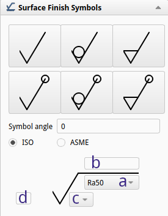

## Hrapavost površin

Pri obdelavi materialov nobena površina ni popolnoma gladka. Tudi zelo natančno obdelane površine imajo na mikroskopski ravni vrhove in doline, ki nastanejo zaradi orodja, vibracij stroja, strukture materiala ali načina obdelave. Te nepravilnosti imenujemo **hrapavost površine**. Hrapavost je pomembna lastnost strojnih elementov, saj neposredno vpliva na **trenje, obrabo, sposobnost mazanja, tesnjenje in kontakt med površinami**. Zato mora biti v tehnični dokumentaciji pogosto natančno določeno, kakšna hrapavost je dovoljena na posamezni površini izdelka.

Za opis hrapavosti se uporabljajo **standardizirani parametri**, ki omogočajo merjenje in primerjavo kakovosti površine. Oceno hrapavosti izdelamo iz prečnega preseka površine, ki jo predstavimo z idealizirano mero **m**. Pri oceni hrapavosti se profil površine analizira na določeni **referenčni dolžini** - $l_r$. Pet referenčnih dolžin skupaj sestavlja **merilno dolžino** - $l_m$. Standardne dolžine pri različnih hrapavostih so prikazane v [@tbl:std_dolzina_hrapavost]. Na tem območju izmerimo najvišje odstopanje **Zp** od srednje linije profila in najnižjo točko profila - **Zv**. Iz teh parametrov izračunamo povprečno oddaljenost vseh točk od srednje vrednosti **m**. Najpogosteje uporabljen parametra za opis hrapavosti je **Ra**.

|   Ra [µm]   | Referenčna dolžina lr (mm) | Merilna dolžina ln (mm) |
|:-----------:|:--------------------------:|:-----------------------:|
| 0.025 – 0.1 |            0.08            |           0.4           |
|   0.1 – 2   |            0.25            |           1.25          |
|    2 – 10   |             0.8            |            4            |
|   10 – 80   |             2.5            |           12.5          |

Table: Standadne referenčne dolžine $l_r$ pri različnih hrapavostih $Ra$. {#tbl:std_dolzina_hrapavost}

**Ra (aritmetična srednja hrapavost)** predstavlja povprečno absolutno odstopanje profila površine od srednje črte na določeni referenčni dolžini. Preprosto povedano: Ra določa, **koliko povprečno odstopa površina od idealno gladke ravnine**. Ra je najpogosteje uporabljen parameter hrapavosti v tehnični dokumentaciji, ker daje stabilno in enostavno primerljivo informacijo o kakovosti površine.

**Rz** predstavlja **največjo razdaljo med najvišjo in najnižjo točko profila površine** znotraj referenčne dolžine **lr**.

### Osnovni simboli za označevanje hrapavosti

Na tehničnih risbah se hrapavost označuje s posebnim simbolom, ki ima obliko **poševne kljukice s podaljškom**. Pomen različnih simbolv je:

- **Odprta kljukica**: površina je lahko izdelana s poljubnim postopkom.
- **Zaprta kljukica**: zahtevan je odvzem materiala.
- **Kljukica s krogcem**: odvzem materiala ni dovoljen.

{#fig:Hrapavost_simbol height=5cm}

Osnovni simbol hrapavosti se lahko dopolni z dodatnimi informacijami, ki so prikazani na sliki. Višina teh črk in številk je enaka višini številk kotirnih mer (torej, pri črtnem razredu 0.5 mm, je višina številk 3,5 mm). Program FreeCAD v teh dimenzijah nekoliko odstopa, zato moramo za simbol ročno povečati za **faktor 2,6**. Pomen teh dopolnilnih polj je naslednji:

- **a – osnovni parameter hrapavosti**\
V tem polju se navede **numerična vrednost izbranega parametra hrapavosti**, s katerim konstruktor določi zahtevano kakovost površine. V praksi se skoraj vedno uporablja parameter **Ra**, ker predstavlja stabilno in statistično zanesljivo merilo povprečne hrapavosti. Osnovni zapis je navadno podan v obliki: **Ra 3.2**. Ta zapis pomeni, da povprečna hrapavost površine ne sme presegati **3.2 µm**. Tak zapis predstavlja **najpogostejši primer v tehnični dokumentaciji** in se uporablja pri večini strojno obdelanih površin. V nekaterih primerih se lahko v tem polju uporabijo tudi **drugi parametri hrapavosti**, kadar narava funkcije površine zahteva drugačno interpretacijo mikrogeometrije. V posebnih primerih se lahko poleg parametra navede tudi **območje dovoljenih vrednosti**, na primer: Ra 0.8 – 1.6. Tak zapis pomeni, da mora biti površina izdelana znotraj določenega razpona hrapavosti. To se uporablja predvsem tam, kjer je pomembno ravnotežje med **trenjem, zadrževanjem maziva in obrabo**, na primer pri drsnih ležajih ali vodilih strojev.

- **b – postopek obdelave ali prevleka**\
V tem polju se lahko navede **postopek obdelave površine ali vrsta površinske prevleke**, kadar je način izdelave pomemben za funkcijo elementa ali za doseganje zahtevane hrapavosti. Konstruktor s tem podatkom ne določa samo končne kakovosti površine, temveč tudi **tehnološki postopek**, s katerim je treba površino izdelati. V praksi se to polje uporablja predvsem takrat, ko ima izbrani postopek pomemben vpliv na **lastnosti površine, odpornost proti obrabi ali korozijsko zaščito**. Pogosti primeri zapisov so na primer:
    - **brušeno** – površina je obdelana z brušenjem, kar omogoča zelo majhne vrednosti hrapavosti (npr. Ra 0.2–1.6 µm) in visoko dimenzijsko natančnost
    - **polirano** – površina je dodatno obdelana za doseganje zelo gladke strukture (npr. $Ra \less 0.2\mu m$), kar se uporablja pri optičnih ali tesnilnih površinah
    - **honano** – značilno za notranje cilindrične površine (npr. valji motorjev), kjer honanje ustvari značilno križno strukturo brazd, ki omogoča dobro zadrževanje maziva
    - **pocinkano** – površina je zaščitena s plastjo cinka zaradi izboljšane **korozijske odpornosti**, pri čemer osnovna hrapavost izhaja iz predhodne obdelave.\
    Tak zapis omogoča, da tehnična dokumentacija poleg zahtevanega parametra hrapavosti določa tudi **tehnološki kontekst izdelave površine**, kar je pomembno za pravilno interpretacijo zahtev v proizvodnji.

- **c – orientacija hrapavosti**\
Določa smer poteka brazd površine oziroma **vrsto površinske teksture**. Orientacija hrapavosti opisuje, kako so mikroskopske brazde razporejene glede na funkcionalno smer gibanja ali obremenitve. V tehničnih risbah se uporabljajo standardni simboli, ki opisujejo tip površine:
    - **= (paralelna orientacija)** – brazde potekajo vzporedno z referenčno smerjo, kar je značilno za postopke kot so struženje ali rezkanje.
    - **$\perp$ (pravokotna orientacija)** – brazde potekajo pravokotno na referenčno smer.
    - **X (križna struktura)** – površina ima križno razporeditev brazd, kar je značilno za postopke kot je **honanje**, kjer križna struktura omogoča dobro zadrževanje maziva.
    - **M (večsmerna orientacija)** – brazde so razporejene v več smereh brez izrazite prevladujoče smeri; takšna struktura nastane npr. pri **peskanju ali nekaterih postopkih brušenja**.
    - **C (krožna orientacija)** – brazde so razporejene v koncentričnih krogih, kar je značilno za rotacijske obdelave kot je **struženje čelnih površin**.
    - **R (radialna orientacija)** – brazde potekajo radialno od središča navzven, kar se lahko pojavi pri nekaterih oblikah obdelave rotacijskih površin.\
    Določitev orientacije hrapavosti je pomembna predvsem pri **drsnih površinah, tesnilnih površinah in ležajih**, saj smer brazd vpliva na trenje, obrabo ter sposobnost zadrževanja maziva.

- **D – najmanjši odvzem materiala**\
Ta oznaka se pogosto uporablja pri **polizdelkih**, na primer pri odlitkih ali odkovkih, kjer končna dimenzija še ni dosežena. Konstruktor s tem podatkom določi, kolikšen sloj materiala moramo minimalno odstraniti, da je mogoče v naslednjih tehnoloških postopkih (npr. struženje, rezkanje ali brušenje) doseči končno hrapavost površine. Tak dodatek je pomemben predvsem zato, ker imajo postopki, kot sta **litje ali kovanje**, relativno grobo površino in večja dimenzijska odstopanja.

- **Krogec na vrhu simbola**\
Pomeni, da zahteva hrapavosti velja za **celotno površino rotacijskega telesa**.

### Tipične vrednosti hrapavosti za različne postopke obdelave

| Postopek obdelave | Tipična hrapavost Ra [µm] |
|------------------:|:-------------------------:|
|    Ročna obdelava |         12.5 – 50         |
|    Grobo piljenje |          6.3 – 25         |
|     Fino piljenje |         3.2 – 12.5        |
|           Kovanje |         12.5 – 50         |
|             Litje |         12.5 – 50         |
|         Struženje |         1.6 – 12.5        |
|        Skobljanje |         3.2 – 12.5        |
|           Pehanje |         0.8 – 3.2         |
|          Brušenje |         0.2 – 1.6         |
|         Poliranje |        0.025 – 0.2        |
|           Honanje |        0.025 – 0.4        |
| Obdelava zobnikov |         0.4 – 3.2         |

Table: Tipične vrednosti hrapavosti za različne postopke obdelave. {#tbl:tipicne_vrednosti_ra}

Z natančnejšimi postopki obdelave se dosega vedno manjša vrednost parametra Ra, kar pomeni **bolj gladko površino**.

