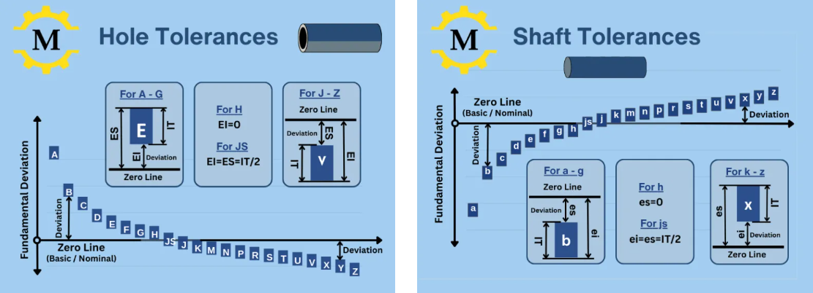
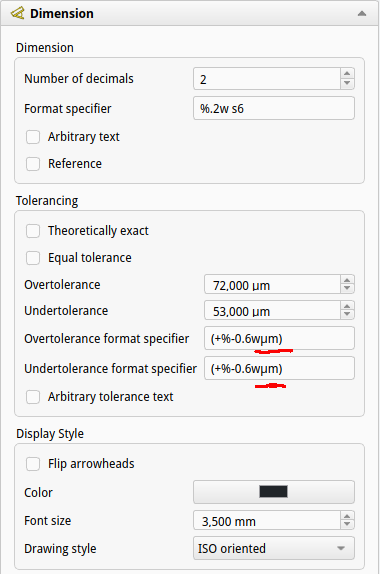

## Tolerance in ujemi

V strojništvu noben proizvodni postopek ne omogoča izdelave elementov z absolutno natančnimi merami. Vedno obstajajo manjša odstopanja, ki so posledica obrabe orodja, elastičnih deformacij strojev, temperaturnih vplivov ter lastnosti materiala. Zaradi tega konstruktor v tehnični dokumentaciji določi **toleranco**, to je dovoljeno območje odstopanja dejanske mere od predpisane nominalne vrednosti.

Pri definiranju tolerance uporabljamo več osnovnih pojmov.

- **Imenska mera (nazivna mera)** – osnovna dimenzija elementa, ki jo konstruktor določi na risbi.
- **Ničelnica** – referenčna črta, ki predstavlja imensko mero in od katere merimo odstopke.
- **Zgornja meja mere** – največja dovoljena dejanska mera elementa.
- **Spodnja meja mere** – najmanjša dovoljena dejanska mera elementa.
- **Zgornji odstopek** – razlika med zgornjo mejo in imensko mero.
- **Spodnji odstopek** – razlika med spodnjo mejo in imensko mero.

Razlika med zgornjo in spodnjo mejo mere predstavlja **velikost tolerance**. Tolerance imajo pomembno vlogo pri nadzoru izdelave. Z njimi določimo, **kako natančno mora biti element izdelan**. Na primer zapis 18 ± 0,2 mm pomeni, da mora biti dejanska razdalja med dvema izvrtinama med **17,8 mm in 18,2 mm**.

Še pomembnejša pa je vloga toleranc pri sestavljanju elementov. Pogost primer sta **izvrtina (notranja mera)** in **gred (zunanja mera)**. Če želimo, da se gred lahko vstavi v luknjo, mora biti izvrtina običajno nekoliko večja od imenske mere, gred pa nekoliko manjša. Na primer: izvrtina: 20.00 – 20.02 mm in gred: 19.98 – 20.00 mm. Takšna razporeditev toleranc omogoča, da se elementa sestavita brez sile.

### Velikost tolerančnega razreda (IT)

Po standardu **ISO 286** so tolerance razdeljene v **20 tolerančnih razredov**, ki jih označujemo s številkami: IT00, IT01, IT1, IT2 ... IT17, IT18. Manjša kot je številka, **natančnejša je obdelava**:

- **IT00 – IT5**: zelo natančni elementi (merilna orodja, kontrolna merila, merilni instrumenti)
- **IT5 – IT11**: običajna strojna obdelava (struženje, rezkanje, brušenje)
- **IT11 – IT18**: groba obdelava (kovanje, valjanje, litje, rezanje, lesarstvo)

Velikost tolerančnega polja je odvisna od **imenske mere**. Večje kot so mere elementa, večje so tudi tolerance. V [@tbl:velikost_tolerancnih_polj] je le nekaj primerov tolerančnega polja glede na njegov razred in območje imenske mere. Več vrednosti lahko najdete na [ENGINEERING FITS & TOLERANCES – CALCULATOR & CHARTS](https://www.machiningdoctor.com/calculators/tolerances/#charts).

| Območje imenske mere (mm) | IT6 | IT7 | IT8 | IT9 | IT10 |
|--------------------------:|:---:|:---:|:---:|:---:|:----:|
|                od 6 do 10 |  9  |  15 |  22 |  36 |  58  |
|               od 30 do 50 |  16 |  25 |  39 |  62 |  100 |
|              od 80 do 120 |  22 |  35 |  54 |  87 |  140 |

Table: Velikost tolerančnih polj po ISO 286 (IT v $\mu m$). {#tbl:velikost_tolerancnih_polj}

Primer: Če ima gred imensko mero **40 mm** in toleranco **IT7**, je velikost tolerančnega polja približno **0.025 mm**.

### Lega tolerančnega polja

Poleg velikosti tolerance je pomembna tudi **lega tolerančnega polja glede na ničelnico**. Lega določa, ali je tolerančno polje nad, pod ali okoli imenske mere. Na [@fig:Lega_Tolerancnega_polja] je prikazana razporeditev teh tolerančnih polj.

- **Notranje mere (luknje)** označujemo z **velikimi črkami**.
- **Zunanje mere (gredi)** označujemo z **malimi črkami**.

{#fig:Lega_Tolerancnega_polja}

Tabela prikazuje tipične kombinacije tolerančnih polj za **notranje in zunanje mere**, ki določajo različne vrste ujemov.

| Območje imenske mere (mm) |   Imenska mera   | Luknja (notranja mera) |  Gred (zunanja mera) | Vrsta ujema |
|--------------------------:|:----------------:|:----------------------:|:--------------------:|:-----------:|
|               od 18 do 24 | $\varnothing 20$ |  H7 (20.000 – 20.021)  | g6 (19.980 – 19.994) |   ohlapni   |
|               od 30 do 50 | $\varnothing 40$ |  H7 (40.000 – 40.025)  | m6 (40.004 – 40.020) |   prehodni  |
|               od 50 do 80 | $\varnothing 60$ |  H7 (60.000 – 60.030)  | s6 (60.053 – 60.072) |    tesni    |

Table: Lega tolerančnih polj za določena območja imenskih mer. {#tbl:lega_tolerancnega_polja}

Lega tolerančnega polja določa tudi **vrsto ujema** med dvema elementoma.

- **a – h** : ohlapni ujem
- **j – p** : prehodni ujem
- **r – z** : tesni ujem

| Polje |    Tip ujema    |              Značilnost              |
|------:|:---------------:|:------------------------------------:|
|     g |   ohlapni ujem  | gred nekoliko manjša od imenske mere |
|     h | nevtralno polje |     spodnja meja je na ničelnici     |
|     m |  prehodni ujem  |    možen majhen zračnost ali stisk   |
|     s |    tesni ujem   |         gred večja od luknje         |

Table: Primeri uporabe pomembnejših tolerančnih polj. {#tbl:uporaba_tolerancnega_polja}

V CAD programih, kot je **FreeCAD**, uporabnik izbere tolerančno polje (npr. H7 ali g6), program pa glede na imensko mero samodejno določi dejanske numerične vrednosti zgornjih in spodnjih odstopkov. Čeprav naj bi odstopke pisali v milimetrih, jih FreeCAD zaokroži na $\mu m$, če gre za manj kot stotino mm. V tem primeru moramo v polje pripisati še enoto $\mu m$, kot je to prikazano na [@fig:Tolerance_pripis_enote].

{#fig:Tolerance_pripis_enote height=7cm}

### Ujemi

**Ujem** pomeni skladnost med dvema sestavnima elementoma, ki imata **enako imensko mero**, vendar različni toleranci. Najpogosteje obravnavamo ujem med **luknjo (D)** in **gredjo (d)**, pri čemer velja $D_i = d_i$. Vrsta ujema je odvisna od razlike med dejansko mero luknje in dejansko mero gredi, ki jo določimo z lego tolerančnega razreda.

Pri ohlapnem ujemu je luknja vedno večja od gredi, zato med elementoma nastane **zračnost** (glej [@tbl:lega_tolerancnega_polja]).Na primer, zelo pogosto uporabljamo ujem H7/g6, ki se uporablja pri: drsnih spojih, gibljivih mehanizmih. V kolikor je potrebno nekoliko več prostora za mazanje z mastjo pa celo H8/f7.

Pri prehodnem ujemu je lahko rezultat **majhna zračnost ali majhen stisk**. Na primer H7/k6, se uporablja pri elementih, kjer mora biti pozicija natančna, vendar montaža še vedno možna brez večjih sil. Tak spoj lahko običajno sestavimo tako, da gred ohladimo in luknjo segrejemo.

Pri tesnem ujemu je dejanski premer gredi večji od dejanskega premera luknje, zato je potrebno elementa sestaviti s **stiskanjem**. Na primer H7/r6 se uporablja pri: trajnih spojih, zobnikih na gredi in pestih koles.

#### Sistemi ujemov

V strojništvu pogosto uporabljamo dva osnovna sistema ujemov: sistem enotne notranje mere in sistem enotne zunanje mere. Pri prvem ima luknja vedno enako tolerančno polje **H**, gredi pa različna polja. Primer: H7/g6. Ta sistem je najpogosteje uporabljen, ker je izdelava izvrtin s standardnimi orodji lažja.

Pri sistemu enotne zunanje mere ima **gred** vedno enako tolerančno polje **h**, luknje pa različna polja. Na primer: G7/h6. Čeprav sta oba sistema enakovredna in omogočata enak končni učinek ujema, se ta redkeje uporablja.
Spodaj je ista vsebina zapisana **v bolj priročniški, razlagalni obliki**, primernejši za skripto ali učbenik.

