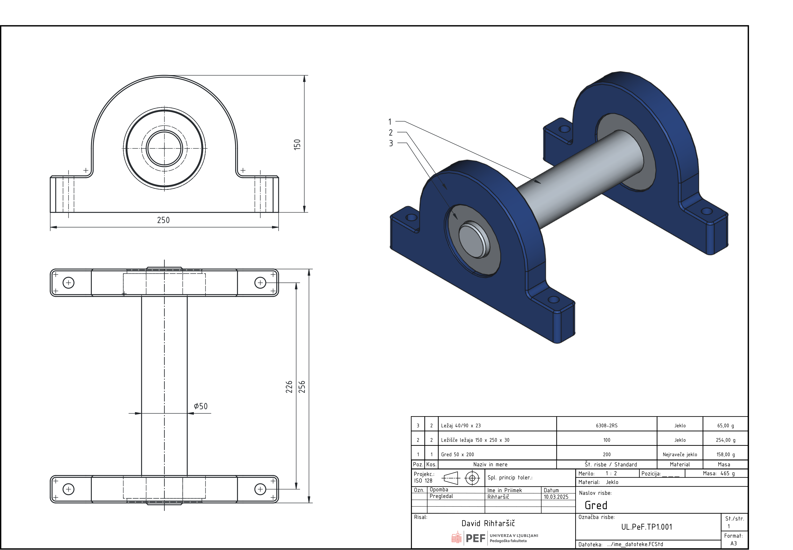
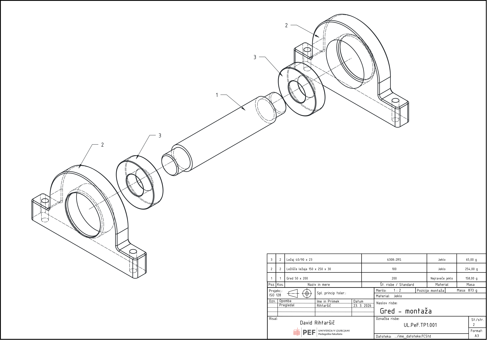

# SESTAVLJANJE SESTAVNIH DELOV

Sestavljanje sestavnih delov predstavlja ključen korak v procesu tehničnega načrtovanja, kjer posamezni elementi preidejo iz izoliranih modelov v funkcionalno celoto. Namen sestavljanja ni zgolj vizualna predstavitev izdelka, temveč preverjanje pravilnega ujemanja, funkcionalnosti in možnosti montaže. Za razumevanje osnov bomo obravnavali enostaven, a inženirsko relevanten primer: sestav, ki vključuje dve ležišči, dva kroglična ležaja tipa 6308 in gred, vpeto med oba ležaja.

{#fig:Sestavnica-gred}

V takšnem sestavu ležaji omogočajo rotacijo gredi, ležišči pa zagotavljata pravilno pozicioniranje in podporo. Že na tej ravni lahko analiziramo osnovne zahteve: pravilne tolerance, poravnavo osi ter ustrezne naležne površine. Na [@fig:Sestavnica-gred] je tudi nekaj osnovnih dimenzij, ki so ključne za definicijo tega sestava. Sestavna risba predstavlja celoten izdelek in prikazuje, kako so posamezni deli med seboj povezani. Njena glavna naloga je podati pregled nad sestavom in omogočiti razumevanje medsebojnih odnosov med komponentami. Na sestavni risbi so posamezni deli označeni s pozicijskimi številkami, ki se navezujejo na kosovnico. Pogosto vključuje tudi prereze, ki omogočajo vpogled v notranje elemente, kot so naleganja ležajev in stik gredi z notranjim obročem.

**Kosovnica** je tabelarični prikaz vseh sestavnih delov, ki sestavljajo končni izdelek. Predstavlja vezni člen med sestavno risbo in posameznimi delavniškimi risbami.

> Slika 3: Kosovnica z označenimi pozicijami, imeni delov, količinami in morebitnimi materiali.

Tipična kosovnica vsebuje:

- pozicijsko številko,
- naziv dela,
- količino,
- material ali standard,
- opombe.

Pomembno je poudariti, da standardnih elementov, kot so ležaji (npr. 6308), vijaki, matice in podložke, ne izdelujemo sami, temveč jih izberemo iz kataloga. Zato zanje ne pripravljamo delavniških risb, ampak jih v kosovnici navedemo s standardno oznako. Za nestandardne dele, kot so ležišča in gred, pripravimo delavniške risbe. Te risbe vsebujejo vse potrebne podatke za izdelavo: mere, tolerance, hrapavost in material.

> Slika 4: Delavniška risba ležišča ležaja z označenimi naležnimi površinami.

> Slika 5: Delavniška risba gredi z določenimi premeri in tolerancami za naleganje ležajev.

Delavniška risba mora biti enoznačna in nedvoumna, saj predstavlja osnovo za proizvodnjo. Pri tem je ključnega pomena pravilno določanje ujemov med gredjo in ležajem ter med ležajem in ležiščem. 
Spodaj imaš ločen sestavek, ki ga lahko vključiš kot podpoglavje (ali samostojen vložek) v priročnik:

Poleg sestavne risbe, kosovnice in delavniških risb lahko tehniška dokumentacija vključuje tudi **montažno risbo**. Njena osnovna naloga je prikazati **postopek sestavljanja izdelka**, kar je še posebej pomembno pri kompleksnejših sistemih ali kadar montažo izvaja druga oseba kot načrtovalec. Montažna risba se od sestavne risbe razlikuje po tem, da ne prikazuje zgolj končnega stanja izdelka, temveč poudarja **zaporedje sestavljanja** in medsebojne odnose med deli med procesom montaže. V našem primeru (gred, dva ležaja 6308 in dve ležišči) lahko montažna risba (na [@fig:Sestavnica-gred-montazna]) jasno pokaže:

1. vstavljanje prvega ležaja v ležišče,
2. vstavitev gredi skozi prvi ležaj,
3. namestitev drugega ležaja na gred,
4. zapiranje sestava z drugim ležiščem.

Takšen prikaz omogoča hitro razumevanje postopka, tudi brez dodatnih navodil.

{#fig:Sestavnica-gred-montazna}

Montažna risba je v praksi najpogosteje predstavljena kot eksplodirani pogled, pri katerem so posamezni sestavni deli med seboj razmaknjeni vzdolž osi sestavljanja. Takšen prikaz omogoča jasen vpogled v medsebojne odnose komponent in način njihovega povezovanja. Za dodatno razumljivost so pogosto dodane puščice, ki prikazujejo smer vstavljanja posameznih delov, ter označeno zaporedje sestavljanja, bodisi s številčenjem korakov bodisi s pozicijami, ki se ujemajo s kosovnico. Pri tem je pomembno poudariti, da montažna risba ni namenjena podrobnemu dimenziranju. Podatki o merah, tolerancah in drugih tehničnih zahtevah so podani v delavniških risbah posameznih delov. Montažna risba se zato opira predvsem na pozicijske številke iz kosovnice, lahko pa vključuje tudi dodatne informacije, ki so pomembne za izvedbo montaže, kot so na primer momenti privijanja, zahteve po mazivu ali uporaba posebnih orodij. V sodobnih CAD okoljih, kot je FreeCAD, lahko montažno risbo pripravimo na več načinov. Najpogosteje izhajamo iz sestava, kjer ustvarimo eksplodirani pogled – bodisi ročno z razmikanjem komponent bodisi s pomočjo namenskih orodij. Pri tem si lahko pomagamo tudi s shranjenimi pozicijami posameznih delov, kar omogoča enostavno preklapljanje med sestavljenim in eksplodiranim stanjem. Končni prikaz nato prenesemo v tehnično risbo, na primer z uporabo delovnega okolja TechDraw.

> Slika Y: Eksplodirani pogled v FreeCAD okolju z razmaknjenimi komponentami vzdolž osi sestavljanja.

Vključitev montažne risbe bistveno poveča uporabno vrednost tehniške dokumentacije, saj povezuje statični prikaz izdelka z dejanskim postopkom njegove sestave. To je še posebej pomembno v izobraževalnem procesu, kjer študenti ne razvijajo le sposobnosti modeliranja, temveč tudi razumevanje celotnega procesa – od zasnove do končne montaže.

