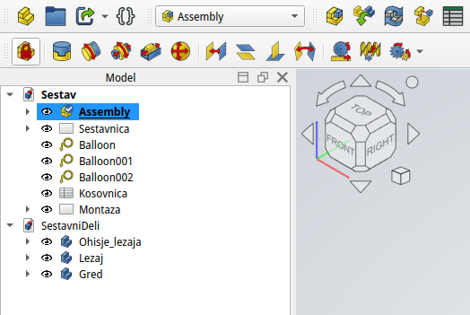
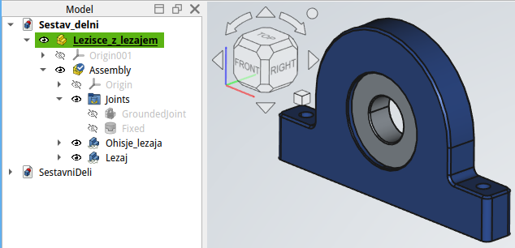

## Organizacija modelov v CAD okolju

Pri načrtovanju v programu FreeCAD je priporočljivo, da vsak sestavni del modeliramo v svoji datoteki oz., če je teh malo so lahko organizirani v isti datoteki (kot na primer pri [sestv gredi z ležaji](./slike/Sestav.FCStd)). To omogoča boljšo preglednost, ponovno uporabo in enostavnejše spremembe. Sestav kot celota naj bo prav tako shranjen v ločeni datoteki, kjer združujemo posamezne komponente.

{#fig:Sestav_ureditev_sestavnih_delov width=12cm}

Takšna organizacija omogoča učinkovito delo, saj lahko sprememba posameznega dela samodejno vpliva na celoten sestav.

V FreeCAD okolju lahko sestavne dele organiziramo na dva osnovna načina: kot posamezna telesa (Body) ali kot objekti tipa Part. Objekt **Body** predstavlja posamezen kos, ki je modeliran znotraj Part Design okolja. Objekt **Part** pa omogoča združevanje več teles ali drugih objektov v logično celoto. Pri kompleksnejših izdelkih je smiselno uporabiti **podsestave**. To pomeni, da več sestavnih delov najprej združimo v manjšo funkcionalno enoto, ki jo nato vključimo v končni sestav, kot na primer na [@fig:Sestav_ureditev_sestavnih_delov].

{#fig:Sestav_delni_lezisce_in_lezaj width=12cm}

Tak pristop izboljša preglednost modela, omogoča modularno načrtovanje in poenostavi upravljanje večjih projektov.

### Proces sestavljanja

Proces sestavljanja v CAD okolju sledi logičnemu zaporedju:

1. priprava posameznih modelov,
2. uvoz komponent v sestav,
3. določitev osnovnega (fiksnega) dela,
4. postopno dodajanje ostalih delov,
5. definiranje medsebojnih vezi (poravnava osi, naleganje površin),
6. preverjanje pravilnosti sestava.

> Slika 9: Postopek sestavljanja – zaporedno dodajanje komponent in definiranje vezi.

Pri našem primeru najprej fiksiramo eno ležišče, nato vanj umestimo ležaj, dodamo gred in na koncu še drugo ležišče z ležajem. Ključna je poravnava osi vseh komponent ter pravilno naleganje.

