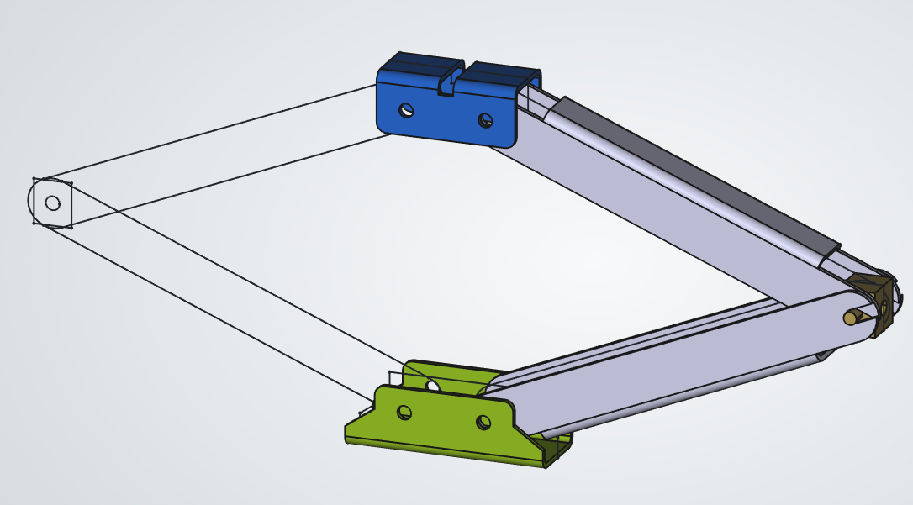
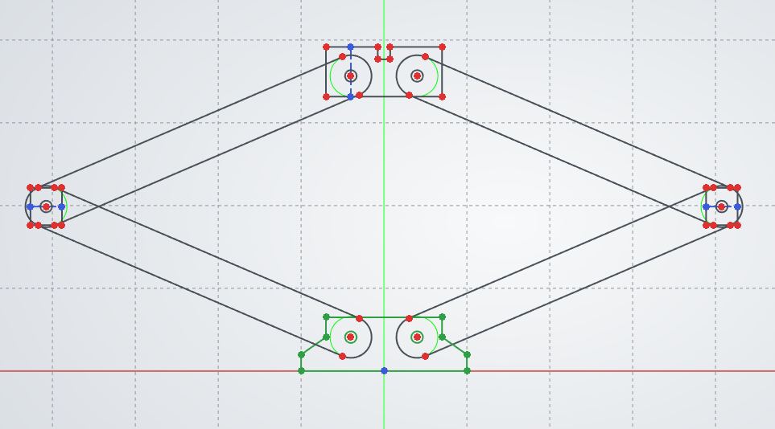
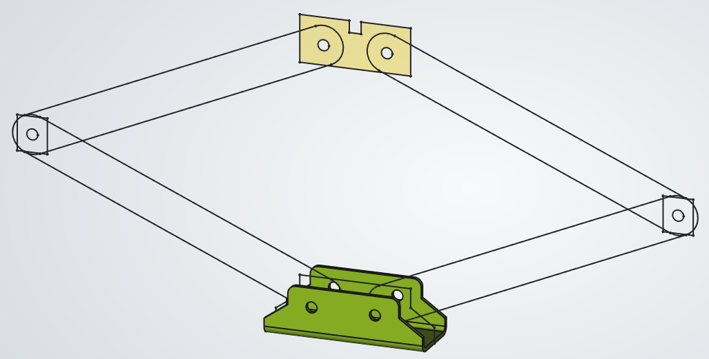
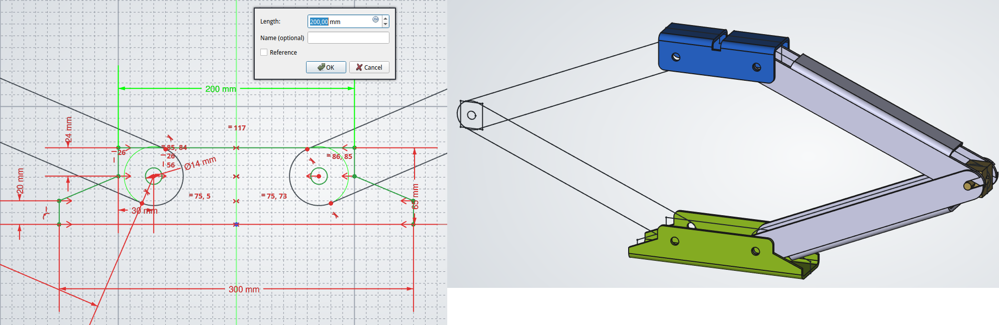

## Glavna skica

Uporaba glavne skice (*master sketch*) postane posebej smiselna v situacijah, kjer geometrija ni naključna, temveč izhaja iz jasno definiranih odnosov med elementi. Tak pristop se pogosto uporablja v dveh značilnih scenarijih:

1. Prvi je načrtovanje posameznega sestavnega dela, ki vsebuje več medsebojno povezanih funkcionalnih oblik, kjer morajo biti razdalje, osi ali položaji elementov med seboj usklajeni.
2. Drugi scenarij pa je načrtovanje sestavov, kjer se morajo posamezni deli natančno dopolnjevati, na primer pri ujemih, poravnavi osi ali razporeditvi pritrdilnih elementov. V obeh primerih osnovna skica omogoča, da ključne dimenzije in geometrijski odnosi izhajajo iz enotne reference, kar povečuje preglednost modela, zmanjšuje možnost napak in omogoča učinkovito prilagajanje spremembam v procesu načrtovanja.

### Uporaba osnovne skice na primeru škarjaste dvigovalke

Škarjasta dvigovalka ([glej datoteko Glavna_skica_dvigalka](./slike/Glavna_skica_dvigalka.FCStd))za avto predstavlja tipičen primer mehanizma, kjer je delovanje neposredno odvisno od geometrijskih odnosov med posameznimi elementi. Sestavljena je iz več med seboj povezanih ročic, ki tvorijo členkasti mehanizem, ter navojne palice, ki omogoča dvigovanje z nadzorovanim spreminjanjem razdalje med spodnjima zgloboma.

Pri takšnem sistemu ni pomembna zgolj oblika posameznega dela, temveč predvsem medsebojni odnosi: položaji zglobov, dolžine ročic in njihova kinematična povezava. Že majhna sprememba ene dimenzije lahko bistveno vpliva na delovanje celotnega mehanizma.

{#fig:Glavna_skica_dviovalka width=8cm}

### Problem nepovezanega modeliranja

Če posamezne ročice modeliramo ločeno, brez skupne geometrijske reference, določimo položaje lukenj in dolžine elementov v vsakem delu posebej. Tak pristop lahko vodi do situacije, kjer se deli sicer prilegajo v določenem položaju, vendar mehanizem ne deluje pravilno skozi celoten hod.

Pogoste težave so:

* ročice se ne odpirajo simetrično,
* zglobi niso poravnani,
* mehanizem se v določenem položaju blokira,
* sprememba ene dimenzije zahteva popravljanje več delov.

Takšen pristop ne upošteva dejstva, da je geometrija sistema definirana z odnosi, ne z izoliranimi dimenzijami posameznih delov.

### Osnovna skica kot kinematični model

Uporaba osnovne skice omogoča drugačen pristop. Namesto modeliranja posameznih delov najprej definiramo geometrijo celotnega mehanizma v obliki skice. Ta skica ne predstavlja končnih oblik delov, temveč določa:

* položaje vseh zglobov,
* dolžine ročic,
* simetrijo sistema,
* razdaljo med spodnjima nosilnima točkama,
* os navojne palice.

Takšna skica predstavlja poenostavljen kinematični model dvigalke. V njej določimo ključne odnose, ki morajo biti izpolnjeni, da mehanizem deluje pravilno.

{#fig:Glavna_skica_dvigovalka_design width=8cm}

### Prenos geometrije na posamezne dele

Ko je osnovna skica definirana, posamezne dele modeliramo na njeni osnovi. Ročice prevzamejo dolžine iz skice, položaji lukenj ustrezajo točkam zglobov, simetrija pa je zagotovljena že na ravni osnovne geometrije.

Navojna palica je umeščena glede na definirano razdaljo med spodnjima zgloboma, kar zagotavlja pravilno delovanje pogonskega dela mehanizma.

Tak pristop omogoča, da so vsi deli med seboj usklajeni že v fazi načrtovanja, brez potrebe po kasnejših popravkih.

{#fig:Glavna_skica_prenos_oblike width=8cm}

### Vpliv sprememb na celoten sistem

Ena največjih prednosti uporabe osnovne skice je v obvladovanju sprememb. Če na primer spremenimo dolžino ročic ali maksimalno višino dviga, to storimo neposredno v osnovni skici.

Sprememba se nato samodejno prenese na:

* vse ročice,
* položaje zglobov,
* celotno geometrijo sestava.

Na ta način ohranimo funkcionalnost mehanizma, ne glede na prilagoditve dimenzij.

{#fig:Glavna_skica_sprememba}

### Pomen za načrtovalni proces

Primer škarjaste dvigalke jasno pokaže, da osnovna skica ni zgolj pomoč pri modeliranju, temveč predstavlja temelj načrtovanja. Najprej določimo geometrijske in funkcionalne odnose, šele nato oblikujemo posamezne komponente.

Tak pristop omogoča boljše razumevanje delovanja sistema, zmanjšuje možnost napak in bistveno poenostavi prilagajanje konstrukcije. Študenta usmeri od risanja posameznih oblik k razmišljanju o sistemu kot celoti, kar je ena ključnih kompetenc inženirskega načrtovanja.
