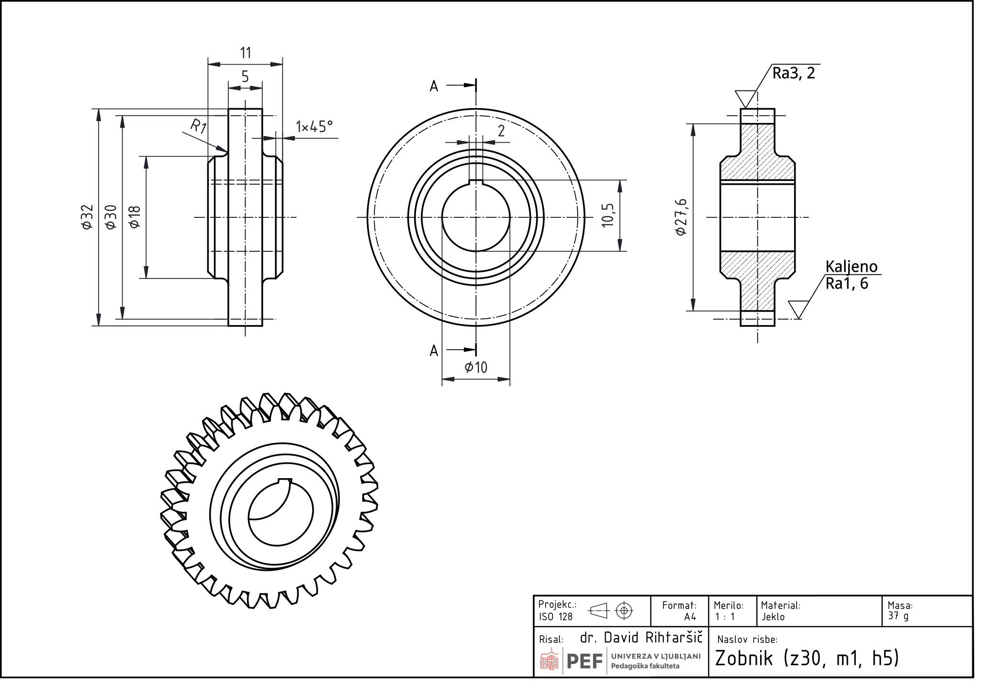
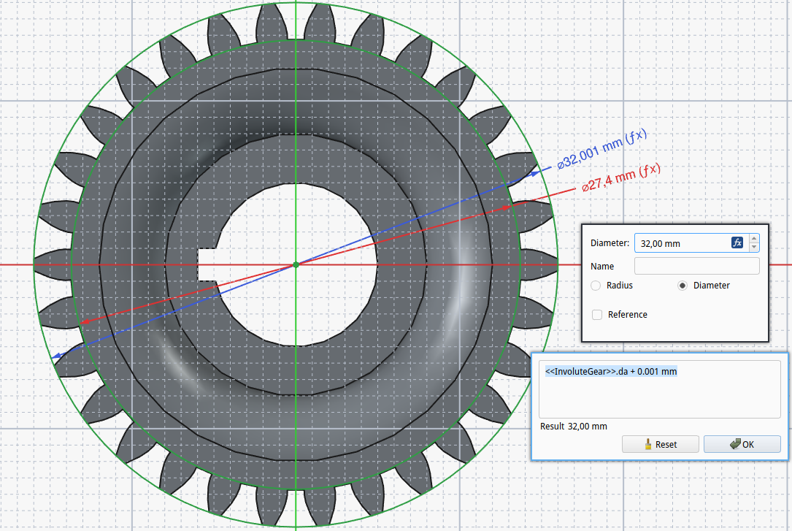
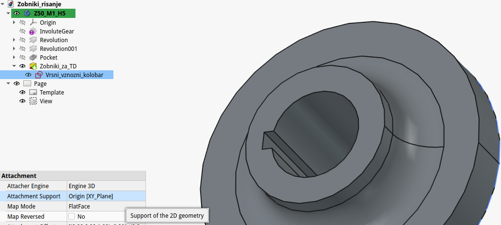
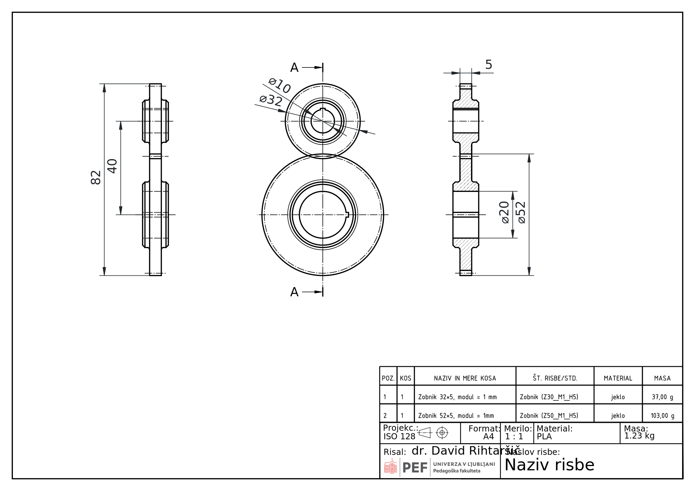

## Zobniška gonila

Zobniška gonila uporabljamo za prenos vrtilnega momenta, spremembo vrtilne hitrosti in spremembo smeri vrtenja. V tehnični dokumentaciji jih praviloma prikazujemo poenostavljeno, saj natančen profil zob za izdelavo ni potreben, temveč podamo le bistvene mere in podatke za izdelavo in delovanje.

Geometrija zobnika temelji na razmerju med velikostjo zob in številom zob na delilnem krogu. Ključna mera pri tem je modul, ki določa velikost zob in je osnovni parameter za načrtovanje ozobljenja. Modul (*m*) je definiran kot razmerje med delilnim premerom in številom zob. Hkrati je povezan tudi z delitvijo na delilnem krogu, kjer razdaljo med sredinama dveh sosednjih zob imenujemo delitev *p*. Ta se meri na delilnem krogu in je neposredno povezana z modulom.

{#fig:Zobniska_gonila_ozobljenje_zobnika}

Delilni premer zobnika (*d* ali *dw*) predstavlja osnovno geometrijsko referenco, po kateri se zobniki teoretično kotalijo. Določen je z modulom in številom zob. Vršni premer (*da*) je večji od delilnega premera in vključuje višino glave zoba, medtem ko je korenski premer (*df*) manjši od delilnega premera in vključuje višino noge zoba. Za standardne evolventne zobnike velja, da je vršni premer večji od delilnega za dvakratno višino glave zoba, korenski premer pa manjši za dvakratno višino noge zoba. Pomembno je poudariti, da morata imeti zobnika v paru enak modul in enako delitev, sicer pravilno ujemanje ni mogoče.

Pri modeliranju v programu FreeCAD (Gear Workbench) ustvarimo zobnik z objektom *InvoluteGear*. Uporabnik določi modul, število zob in širino zobnika. Pri tem je priporočljivo, da pri načrtovanju zobniškega para uporabimo enake vrednosti modula.

Primer:

Z1: m = 1 mm, z = 16  
Z2: m = 1 mm, z = 40

Takšna izbira omogoča pravilno ujemanje zobnikov in definira prestavno razmerje med njima.

{#fig:Zobniska_gonila_design_modul}

### Zobata letev

Zobata letev predstavlja poseben primer zobnika, pri katerem je delilni krog razvit v premico. Uporablja se za pretvorbo vrtilnega gibanja v premočrtno gibanje.

{#fig:Zobniska_gonila_ozobljenje_letve}

Tudi pri zobati letvi modul določa velikost zob in razmik med njimi. Delitev na letvi je enaka delitvi na delilnem krogu zobnika, zato mora biti modul zobnika in zobate letve enak, če želimo zagotoviti pravilno ujemanje.

## Sestavljanje zobniškega gonila

Zobniško gonilo tvori par zobnikov, ki se med seboj ujemata (glej primer [Zobniški sestav](./slike/Zobniki_sestava.FCStd)). Pravilno ujemanje je zagotovljeno, če imata oba zobnika enako delitev. Prenos gibanja poteka od pogonskega na gnani zobnik, pri čemer se vrtilna hitrost spreminja glede na razmerje števila zob.

{#fig:Zobniska_gonila_skica_ambly width=6cm}

Medosna razdalja med zobnikoma je določena kot vsota polmerov delilnih krogov obeh zobnikov. Pri sestavljanju v FreeCAD-u (Assembly Workbench) bomo v demonstracijske namene uporabili poenostavljen pristop, kjer zobnike ne pritrdimo z dejanskimi gredmi ali ležaji, temveč si pomagamo s skico. Skica nam služi kot referenčni element za določanje položaja in razdalj med komponentami.

Postopek sestavljanja izvedemo postopno. Najprej vsakemu zobniku priredimo rotacijsko zvezo (revolute joint), s katerim omogočimo vrtenje okoli njegove osi. Šele nato med zobnikoma definiramo zobniško zvezo (gear joint), ki določa medsebojno odvisnost vrtenja obeh zobnikov.

Pri nastavitvi zobniške zveze lahko uporabimo razmerje med številom zob. Ker velja, da je razmerje polmerov zobnikov enako razmerju števila zob, lahko namesto dejanskega polmera v parameter radija neposredno vpišemo število zob posameznega zobnika.

Primer:

Z1: m = 1 mm, z = 16  
Z2: m = 1 mm, z = 40

V tem primeru določimo razmerje vrtenja na podlagi vrednosti 16 in 40.

Pri sestavu zobnika in zobate letve uporabimo podoben pristop. Zobnik najprej opremimo z rotacijskim sklopom, zobato letev pa z linearno zvezo. Nato med njima definiramo zobniško povezavo. Pri tem ima poseben pomen parameter *pitch radius*. V primeru zobnika ustreza polmeru delilnega kroga, pri zobati letvi pa ta vrednost predstavlja kar delilni premer zobnika, ki sodeluje v paru. Če želimo spremeniti smer gibanja zobate letve, lahko to dosežemo z enostavno spremembo predznaka vrednosti *pitch radius* v nastavitvah (*Data*) tega sklopa.

{#fig:Zobniska_gonila_letev_modul}

### Poenostavljeno risanje zobnikov

Pri tehničnem risanju zobnikov uporabljamo poenostavljen prikaz, saj natančnih profilov zob praviloma ne rišemo. Namen risbe je podati ključne podatke za izdelavo in razumevanje delovanja, ne pa prikazati dejansko obliko evolventnega profila. Na [@fig:Zobniki_risanje_Zobnik_Z30_M1_H5] je prikazanih nekaj pogledov s katerimi lahko dokumentiramo zobnik (bolj podrobna risba je dosigljiva v dokumentu [Zobnik_Z3_0M1_H5.pdf](./slike/Zobniki_risanje_Zobnik_Z30_M1_H5.pdf)).

{#fig:Zobniki_risanje_Zobnik_Z30_M1_H5}

Osnovno pravilo je, da zobnik predstavimo z značilnimi krogi. Vršni krog (*da*) rišemo s polno debelo črto, delilni krog (*d* ali *dw*) s tanko črta-pika črto, ki presega konturo zob. Korenskega kroga (*df*) pogosto ne rišemo, lahko pa ga predstavimo s tanko debelo ali tanko črtkano črto. V prerezu pa narišemo tudi korensko črto in sicer z debelo črto. Posameznih zob praviloma ne rišemo, čeprav so v tehnični dokumentaciji pogosto omenjene tudi površinske obdelave le teh (pomembno vpliva na funkcionalnost tega strojnega elementa). Tak način prikaza zagotavlja preglednost risbe in je skladen s standardizirano prakso.

#### Poenostavitev modela v FreeCAD (TechDraw)

Pri pripravi tehnične risbe v FreeCAD-u (TechDraw) je priporočljivo, da dejanske zobe v modelu skrijemo ali nadomestimo z enostavnejšo geometrijo. Ena izmed učinkovitih rešitev je, da čez ozobljenje dodamo kolobar (valjasti ovoj), katerega premer ustreza vršnemu premeru zobnika (*da*). Tak kolobar v celoti prekrije zobe, zato se ti v tehnični risbi ne bodo prikazali.

{#fig:Zobnik_risanje_kolobarja width=11cm}

Prednost tega pristopa je, da ohranimo parametrično povezavo z osnovnim modelom, hkrati pa dobimo čist in pregleden prikaz v risbi.

{#fig:Zobnik_risanje_dodatni_kolobar width=11cm}

V kolikor skice za nadaljnje modeliranje (npr. luknje, ročice, izvrtine) niso vezane na ploskve zobnika, temveč na  ravnine izhodiščnega koordinatnega sistema (kot je to na [@fig:Zobnik_risanje_kolobarja] v razdelku "Attachment"), lahko kolobar uporabimo že v fazi modeliranja ali pa celo popolnoma izpustimo izračunavanje ozobljenja. To dosežemo tako, da funkcijo za generiranje zob (*InvoluteGear*) začasno izključimo z uporabo funkcije *Suppressed*.

Tak pristop ima dve pomembni prednosti:

- bistveno zmanjša zahtevnost izračuna modela,
- razbremeni računalnik pri kompleksnejših sestavih.

Pri tem moramo paziti, da so vsi nadaljnji feature-ji (npr. izvrtine) neodvisni od geometrije zob, sicer lahko pride do napak pri ponovnem vklopu funkcije. Kot primer si lahko pogledate datoteko [Poenostavljeno_risanje_zobnika.FCStd](./slike/Poenostavljeno_risanje_zobnika_v11.FCStd).

#### Poenostavljen prikaz v sestavih

Pri risanju zobniške dvojice ali sestava z zobato letvijo prav tako uporabimo poenostavljen prikaz. Oba elementa prikažemo z značilnimi krogi oziroma črtami, v območju ujemanja pa lahko prikažemo le osnovni stik brez podrobnosti zob, kot je top prikazano na [@fig:Zobniki_risanje_Zobniski_par] ali v datoteki [Zobniški_par.pdf](./slike/Zobniki_risanje_Zobniski_par.pdf).

{#fig:Zobniki_risanje_Zobniski_par}

Na risbi podamo osnovne podatke, kot so modul (*m*), število zob (*z*) in širina zobnika, kar omogoča popolno določitev geometrije brez potrebe po risanju posameznih zob.

