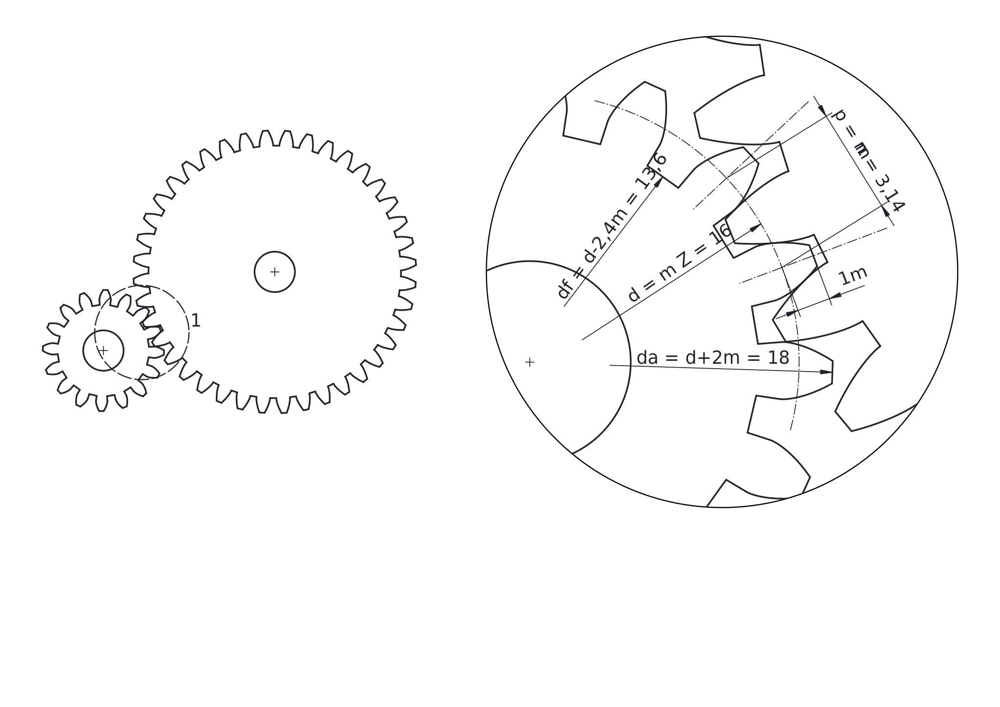
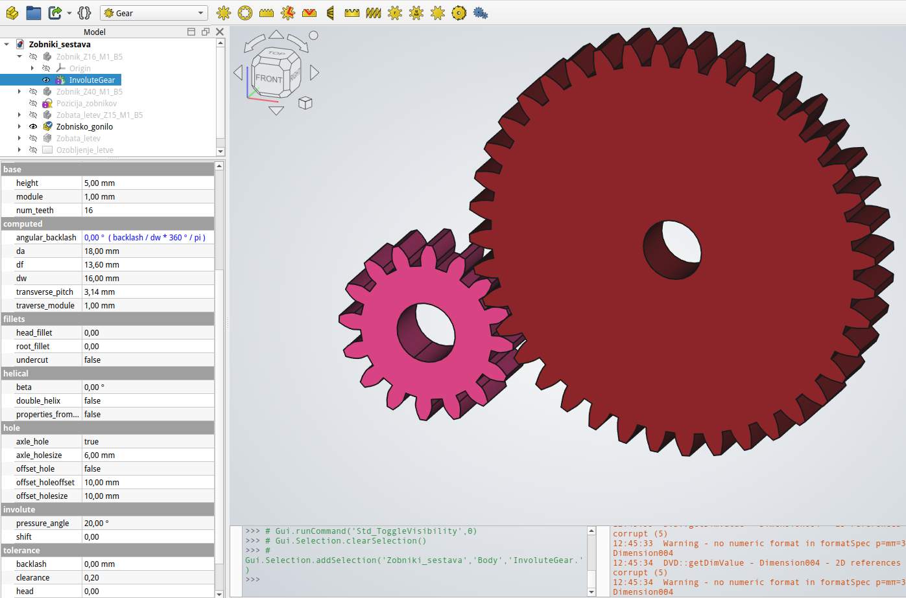
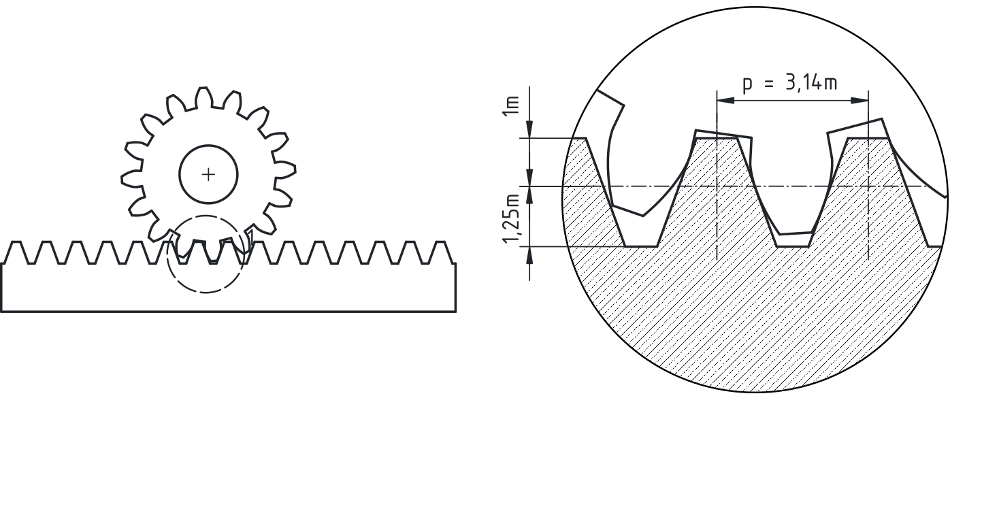
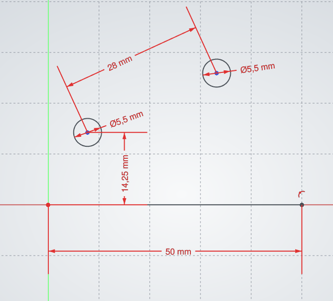
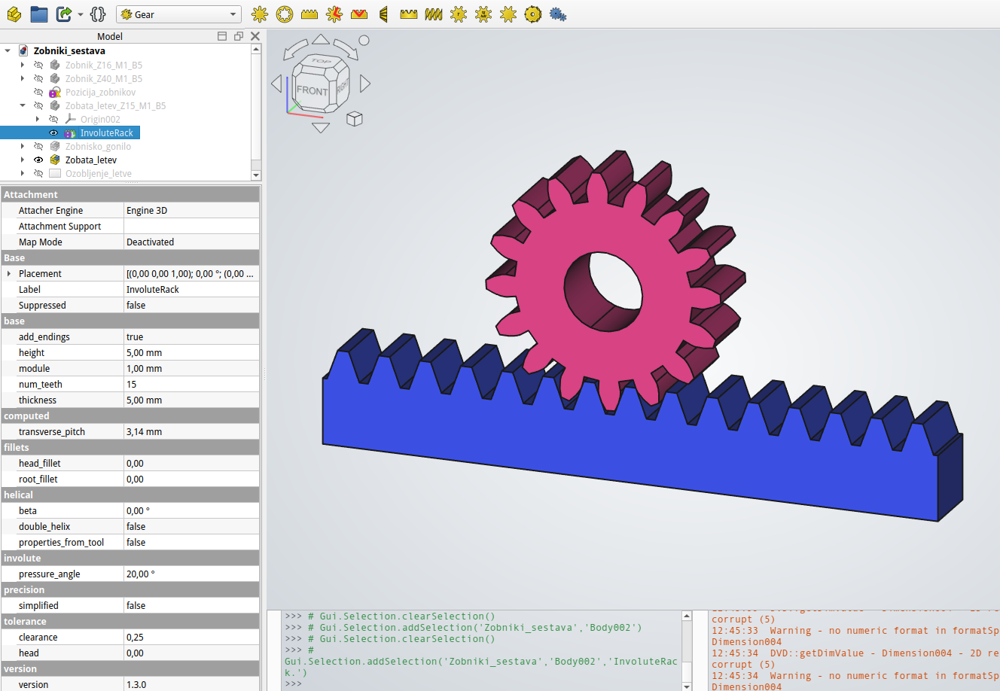

## Zobniška gonila

Zobniška gonila uporabljamo za prenos vrtilnega momenta, spremembo vrtilne hitrosti in spremembo smeri vrtenja. V tehnični dokumentaciji jih praviloma prikazujemo poenostavljeno, saj natančen profil zob za izdelavo ni potreben, temveč podamo le bistvene mere in podatke za izdelavo in delovanje.

Geometrija zobnika temelji na razmerju med velikostjo zob in številom zob na delilnem krogu. Ključna mera pri tem je modul, ki določa velikost zob in je osnovni parameter za načrtovanje ozobljenja. Modul (*m*) je definiran kot razmerje med delilnim premerom in številom zob. Hkrati je povezan tudi z delitvijo na delilnem krogu, kjer razdaljo med sredinama dveh sosednjih zob imenujemo delitev *p*. Ta se meri na delilnem krogu in je neposredno povezana z modulom.

{#fig:Zobniska_gonila_ozobljenje_zobnika}

Delilni premer zobnika (*d* ali *dw*) predstavlja osnovno geometrijsko referenco, po kateri se zobniki teoretično kotalijo. Določen je z modulom in številom zob. Vršni premer (*da*) je večji od delilnega premera in vključuje višino glave zoba, medtem ko je korenski premer (*df*) manjši od delilnega premera in vključuje višino noge zoba. Za standardne evolventne zobnike velja, da je vršni premer večji od delilnega za dvakratno višino glave zoba, korenski premer pa manjši za dvakratno višino noge zoba. Pomembno je poudariti, da morata imeti zobnika v paru enak modul in enako delitev, sicer pravilno ujemanje ni mogoče.

Pri modeliranju v programu FreeCAD (Gear Workbench) ustvarimo zobnik z objektom *InvoluteGear*. Uporabnik določi modul, število zob in širino zobnika. Pri tem je priporočljivo, da pri načrtovanju zobniškega para uporabimo enake vrednosti modula.

Primer:

Z1: m = 1 mm, z = 16  
Z2: m = 1 mm, z = 40

Takšna izbira omogoča pravilno ujemanje zobnikov in definira prestavno razmerje med njima.

{#fig:Zobniska_gonila_design_modul}

### Zobata letev

Zobata letev predstavlja poseben primer zobnika, pri katerem je delilni krog razvit v premico. Uporablja se za pretvorbo vrtilnega gibanja v premočrtno gibanje.

{#fig:Zobniska_gonila_ozobljenje_letve}

Tudi pri zobati letvi modul določa velikost zob in razmik med njimi. Delitev na letvi je enaka delitvi na delilnem krogu zobnika, zato mora biti modul zobnika in zobate letve enak, če želimo zagotoviti pravilno ujemanje.

## Sestavljanje zobniškega gonila

Zobniško gonilo tvori par zobnikov, ki se med seboj ujemata (glej primer [Zobniški sestav](./slike/Zobniki_sestava.FCStd)). Pravilno ujemanje je zagotovljeno, če imata oba zobnika enako delitev. Prenos gibanja poteka od pogonskega na gnani zobnik, pri čemer se vrtilna hitrost spreminja glede na razmerje števila zob.

{#fig:Zobniska_gonila_skica_ambly}

Medosna razdalja med zobnikoma je določena kot vsota polmerov delilnih krogov obeh zobnikov. Pri sestavljanju v FreeCAD-u (Assembly Workbench) bomo v demonstracijske namene uporabili poenostavljen pristop, kjer zobnike ne pritrdimo z dejanskimi gredmi ali ležaji, temveč si pomagamo s skico. Skica nam služi kot referenčni element za določanje položaja in razdalj med komponentami.

Postopek sestavljanja izvedemo postopno. Najprej vsakemu zobniku priredimo rotacijsko zvezo (revolute joint), s katerim omogočimo vrtenje okoli njegove osi. Šele nato med zobnikoma definiramo zobniško zvezo (gear joint), ki določa medsebojno odvisnost vrtenja obeh zobnikov.

Pri nastavitvi zobniške zveze lahko uporabimo razmerje med številom zob. Ker velja, da je razmerje polmerov zobnikov enako razmerju števila zob, lahko namesto dejanskega polmera v parameter radija neposredno vpišemo število zob posameznega zobnika.

Primer:

Z1: m = 1 mm, z = 16  
Z2: m = 1 mm, z = 40

V tem primeru določimo razmerje vrtenja na podlagi vrednosti 16 in 40.

Pri sestavu zobnika in zobate letve uporabimo podoben pristop. Zobnik najprej opremimo z rotacijskim sklopom, zobato letev pa z linearno zvezo. Nato med njima definiramo zobniško povezavo. Pri tem ima poseben pomen parameter *pitch radius*. V primeru zobnika ustreza polmeru delilnega kroga, pri zobati letvi pa ta vrednost predstavlja kar delilni premer zobnika, ki sodeluje v paru. Če želimo spremeniti smer gibanja zobate letve, lahko to dosežemo z enostavno spremembo predznaka vrednosti *pitch radius* v nastavitvah (*Data*) tega sklopa.

{#fig:Zobniska_gonila_letev_modul}

### Poenostavljeno risanje zobnikov

Pri tehničnem risanju zobnikov uporabljamo poenostavljen prikaz, saj natančnih profilov zob praviloma ne rišemo. Namesto tega podamo ključne mere, ki so potrebne za izdelavo.

Poenostavljeno risanje zobnikov je standardizirano in določeno s standardom SIST EN ISO 2203.

> Slika 7: Poenostavljen prikaz zobnika.

Pri tem uporabljamo naslednja pravila:

Delilni krog rišemo s tanko črto, vršni krog s polno črto, vznožni krog pa s tanko ali črtkano črto. Profil zob praviloma ne rišemo, razen v posebnih primerih.

Pri risanju zobniške dvojice oba zobnika prikažemo tudi v območju ujemanja. Če je eden od zobnikov popolnoma prekrit, ga lahko prikažemo kot delni prerez.

> Slika 8: Poenostavljeno risanje zobniške dvojice.

Na tehnični risbi zobnika podamo osnovne podatke, kot so modul, število zob in širina zobnika, ter po potrebi dodatne zahteve glede kakovosti površine in tolerance.

### Povzetek

Modul predstavlja osnovno mero za načrtovanje zobnikov in določa velikost zob. Pravilno ujemanje zobnikov je možno le, če imajo enak modul. Zobata letev omogoča pretvorbo vrtilnega gibanja v linearno gibanje, pri čemer mora biti njen modul enak modulu zobnika. V tehnični dokumentaciji zobnike praviloma prikazujemo poenostavljeno, pri čemer upoštevamo standardizirana pravila risanja.

