# DOKUMENTACIJA ELEKTROTEHNIŠKIH SHEM

Tehniška dokumentacija elektrotehniških sistemov predstavlja temelj za načrtovanje, izdelavo, analizo in vzdrževanje električnih ter elektronskih naprav. Tako kot mehanske tehniške risbe omogočajo opis geometrije in sestave izdelka, elektrotehniške sheme omogočajo prikaz električnih povezav, funkcionalnosti in logike delovanja elektronskega sistema. Namen elektrotehniške dokumentacije ni zgolj grafični prikaz komponent, temveč predvsem jasna in standardizirana komunikacija med načrtovalci, proizvajalci, serviserji in uporabniki sistema.

Pri sodobnem razvoju elektronskih naprav elektrotehniška dokumentacija običajno vključuje:

- električne sheme,
- načrte tiskanih vezij (PCB),
- kosovnice komponent (BOM),
- proizvodne datoteke ter pogosto tudi (t.i. gerber datoteke),
- 3D predstavitve končnega vezja (.step datoteke).

Takšna dokumentacija omogoča sledljivost razvoja, poenostavi odpravljanje napak in omogoča proizvodnjo elektronskih naprav na različnih lokacijah brez dodatnih razlag projektanta.

Elektrotehniške sheme uporabljajo standardizirane grafične simbole, ki predstavljajo elektronske komponente in njihove medsebojne povezave. Zaradi standardizacije lahko inženirji po svetu berejo in razumejo električne sheme ne glede na jezikovno okolje. Pomemben del tehniške pismenosti zato predstavlja sposobnost branja, razumevanja in izdelave kakovostnih elektrotehniških shem.

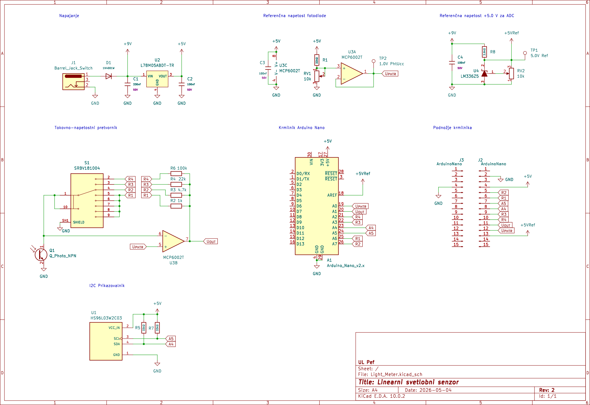{#fig:Light_Meter}

Na sliki [@fig:Light_Meter] ([PDF datoteka](./slike/Light_Meter.pdf)) je prikazan primer električne sheme elektronskega vezja. Iz sheme je razvidno, kako so posamezne komponente povezane med seboj in kakšno funkcijo opravljajo v elektronskem sistemu.

Sodobna elektrotehniška dokumentacija se danes skoraj izključno pripravlja s pomočjo CAD programskih orodij za elektronsko načrtovanje. Med najbolj razširjenimi odprtokodnimi programi za načrtovanje elektronskih vezij je program KiCad, ki omogoča izdelavo električnih shem, načrtovanje tiskanih vezij, upravljanje knjižnic komponent ter pripravo proizvodne dokumentacije.

## Programsko orodje KiCad

KiCad je odprtokodno programsko orodje za načrtovanje elektronskih vezij in pripravo dokumentacije za izdelavo tiskanih vezij. Program je namenjen tako izobraževanju kot profesionalnemu razvoju elektronskih naprav. Zaradi svoje dostopnosti, zmogljivosti in aktivne skupnosti je KiCad postal eno najpomembnejših orodij za načrtovanje elektronike v izobraževalnem okolju.

Na [@fig:KiCAD_okolje_sheme] je prikazano osnovno delovno okolje programa KiCad.

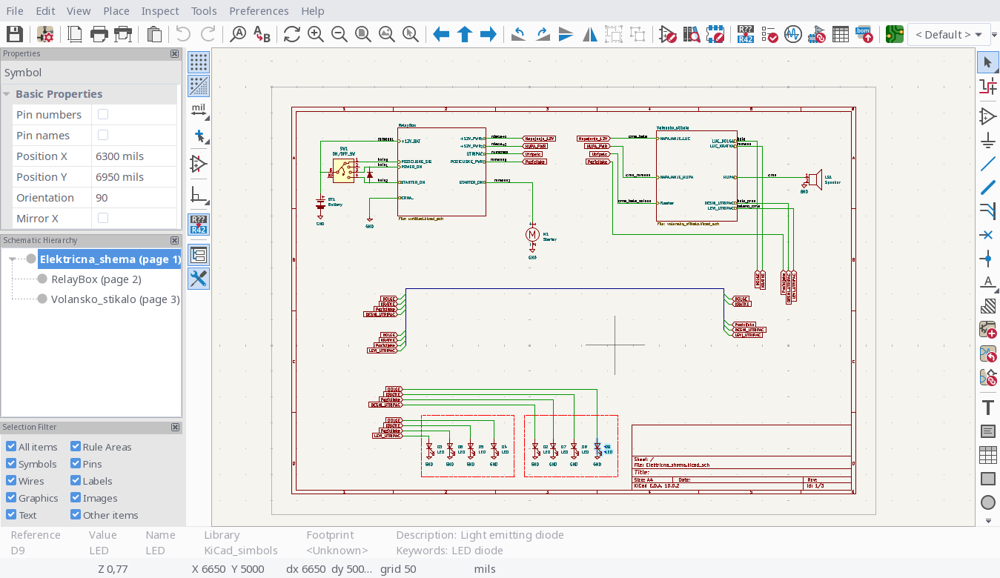{#fig:KiCAD_okolje_sheme}

Program omogoča celoten proces razvoja elektronskega sistema. Uporabnik lahko najprej izdela električno shemo, nato določi fizične komponente oziroma footprint-e, pripravi načrt tiskanega vezja in na koncu izdela še proizvodno dokumentacijo ter 3D prikaz končnega izdelka.

### Namestitev programa KiCad

Program KiCad je na voljo za operacijske sisteme Windows, Linux in macOS. Namestitvene datoteke so dostopne na uradni spletni strani projekta [KiCad](https://www.kicad.org/download/). Pri namestitvi je priporočljivo uporabiti privzete nastavitve, saj program samodejno namesti tudi osnovne knjižnice simbolov, podnjožij in 3D modelov komponent.

Po prvi namestitvi program ustvari okolje za upravljanje projektov. Vsak projekt vsebuje zbirko datotek, ki opisujejo električno shemo, tiskano vezje, nastavitve projekta in proizvodne podatke.

### Pričetek novega projekta

Delo v KiCad-u se običajno začne z ustvarjanjem novega projekta. Projekt predstavlja organizirano zbirko vseh podatkov, povezanih z načrtovanjem elektronskega vezja. Pri ustvarjanju novega projekta uporabnik določi ime projekta in lokacijo shranjevanja datotek.

{#fig:kicad_nov_projekt}

Na sliki [@fig:kicad_nov_projekt] je prikazan postopek ustvarjanja novega projekta.

Po ustvarjanju projekta KiCad samodejno pripravi osnovne datoteke projekta. Med najpomembnejšimi so datoteka električne sheme, datoteka tiskanega vezja in projektna konfiguracija. Pomembno je, da so vse datoteke organizirane znotraj iste projektne mape, saj to omogoča pravilno povezovanje med posameznimi deli dokumentacije.

### Knjižnice komponent

Ena izmed ključnih prednosti programa KiCad je uporaba knjižnic komponent. Knjižnice vsebujejo standardizirane simbole elektronskih komponent, podnožja za tiskana vezja ter pripadajoče 3D modele. Ob prvi uporabi boste najverjetneje izbrali predlagano rešitev, da program samodejno namesti predlagane knjižnice: **Copy default global symbol library table (recommended)**.

Simbol elektronskega elementa predstavlja logični prikaz komponente v električni shemi, podnožje pa določa fizično obliko in priključke komponente na tiskanem vezju. Poleg tega lahko komponenta vsebuje še 3D model, ki omogoča vizualizacijo končnega izdelka. Na [@fig:kicad_simbol_footprint_3d] je prikazana povezava med električnim simbolom, podnožjem in 3D modelom komponente.

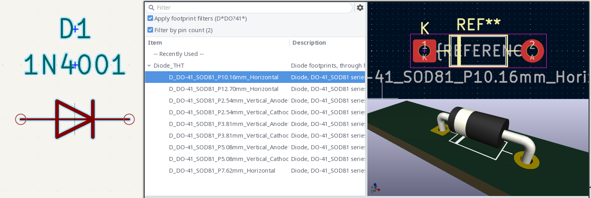{#fig:kicad_simbol_footprint_3d}

Pravilna izbira podnožja je izredno pomembna, saj napačna izbira lahko povzroči fizično neujemanje komponente s tiskanim vezjem. Zaradi tega mora načrtovalec vedno preveriti dimenzije komponent in jih primerjati s tehnično dokumentacijo proizvajalca.

Knjižnice komponent so prosto dostopne na spletni [KiCAD Library](https://www.kicad.org/libraries/download/). Kjer lahko najdete knjižnice: simbolov, podnožij, 3d modelov (.step, .wrl), predlog. Med temi knjižnicami lahko najdete tudi izvorne datoteke 3d modelov v .FCStd formatu datoteke (FreeCAD). Na primer element na [@fig:kicad_simbol_footprint_3d] je mogoče manipulitati v FreeCAD okolju, kot to prikazuje[@fig:KiCAD_3dmodel_FreeCAD].

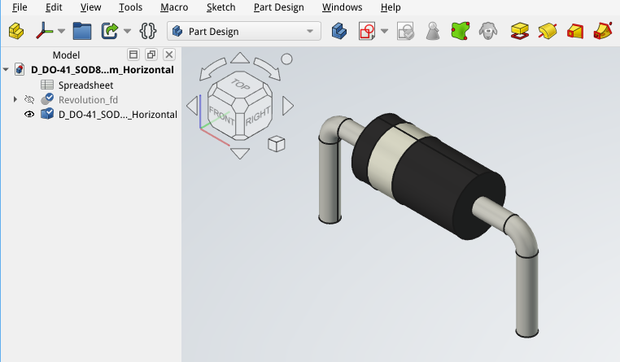{#fig:KiCAD_3dmodel_FreeCAD}

### Električna shema

Električna shema predstavlja logični prikaz elektronskega sistema. V njej so prikazane komponente in njihove električne povezave, ne pa dejanska fizična razporeditev elementov na vezju. Namen sheme je predvsem razumevanje delovanja sistema. 

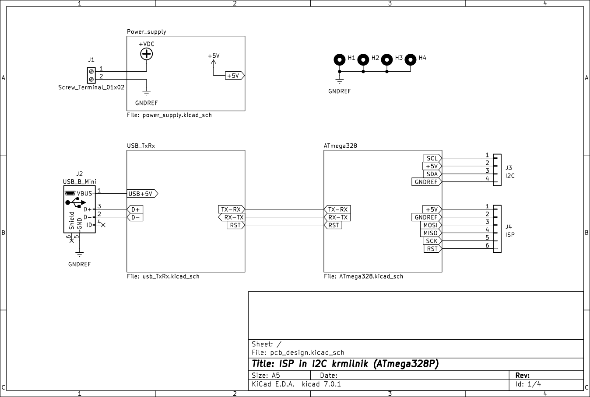{#fig:kicad_shema}

Na sliki [@fig:kicad_shema] je prikazan primer izdelave električne sheme v programu KiCad.

Pomembno je, da je shema pregledna in logično organizirana. Po potrebi lahko vezje razdelimo na več pod-sistemov in jih v glavni shemi prikažemo kot bloke, ki jih povezujejo skupni električni signali (kot na [@fig:kicad_shema]). Signalni tok običajno poteka od leve proti desni, napajalni priključki pa so pogosto postavljeni na vrh in dno sheme. Dobra organizacija sheme močno vpliva na njeno berljivost in možnost kasnejšega odpravljanja napak. Osnovne bloke definiramo v ločenih risbah in naj tvorijo logično zaključeno celoto z neko funkcijo. Na primer prejšnja shema z osnovnimi bloki na [@fig:kicad_shema] se nadaljuje s tremi risbami: napajalno vezje na [@fig:pcb_design-Power_supply], vezje za pretvorbo USB-RS232 komunikacijo na [@fig:pcb_design-USB_TxRx] in povezavo mikrokrmilnika na [@fig:pcb_design-ATmega328].

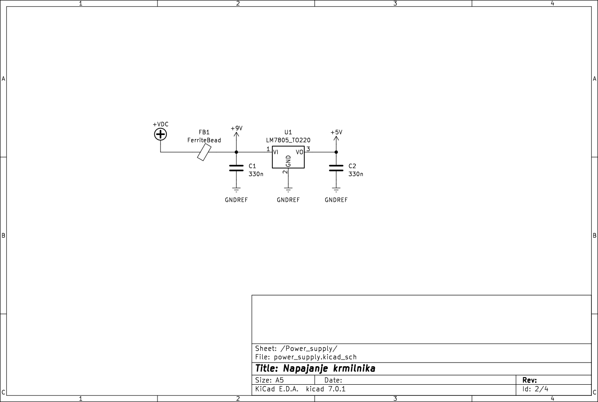{#fig:pcb_design-Power_supply}

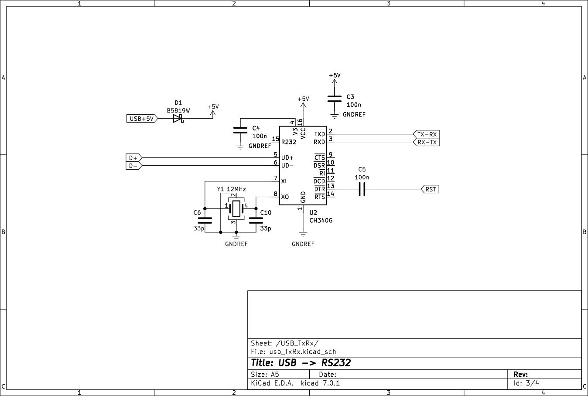{#fig:pcb_design-USB_TxRx}

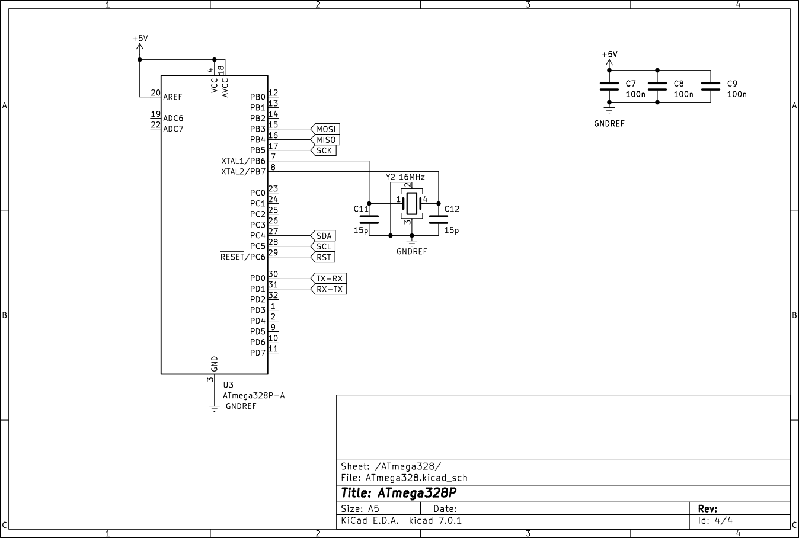{#fig:pcb_design-ATmega328}

Pri izdelavi sheme uporabnik dodaja simbole komponent, jih povezuje z vodniki ter označuje posamezne električne signale. Program omogoča tudi preverjanje pravilnosti povezav s pomočjo funkcije ERC (*Electrical Rules Check*), ki opozarja na morebitne napake v vezju.

### Tiskano vezje

Ko je električna shema zaključena, lahko uporabnik izdela tiskano vezje oziroma PCB (*Printed Circuit Board*). Pri tem programu prenese informacije o povezavah med komponentami iz električne sheme v okolje za načrtovanje tiskanega vezja.

Uporabnik nato določi položaje komponent, načrtuje povezave med njimi ter oblikuje mehanske lastnosti vezja. Program omogoča večplastno načrtovanje, preverjanje proizvodnih pravil in pripravo proizvodnih datotek. Na [@fig:kicad_pcb] je prikazan primer načrtovanja tiskanega vezja.

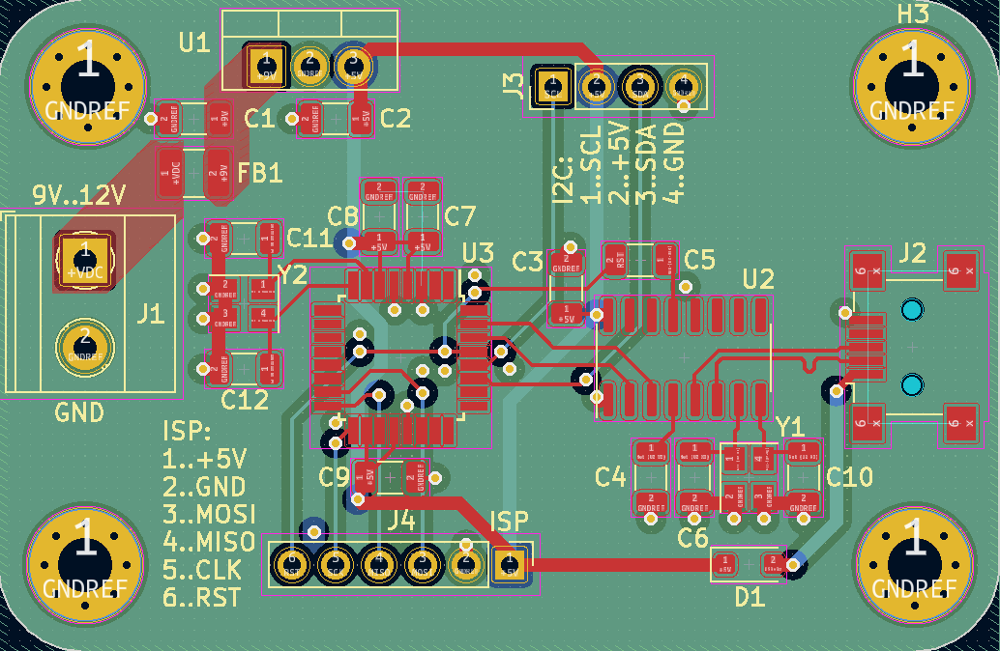{#fig:kicad_pcb width=8cm}

Pri načrtovanju tiskanega vezja je potrebno upoštevati številna pravila, kot so širina povezav, oddaljenost med vodniki, pravilna postavitev komponent in elektromagnetna združljivost sistema.

### 3D model elektronskega sistema

Sodobna CAD orodja omogočajo tudi tridimenzionalni prikaz elektronskega vezja. KiCad omogoča generiranje 3D modela tiskanega vezja skupaj s komponentami, kar bistveno olajša preverjanje mehanske ustreznosti sistema. Na [@fig:kicad_3d_model] je prikazan tridimenzionalni model elektronskega vezja.

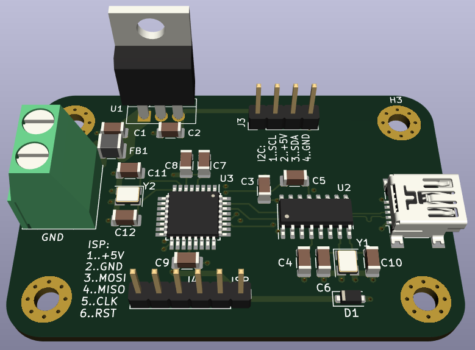{#fig:kicad_3d_model width=8cm}

3D prikaz omogoča preverjanje dimenzij, višine komponent in morebitnih mehanskih omejitev z ohišjem ali drugimi elementi sistema. 3d model je možno izvoziti kot .step datoteke in na to uvoziti v druga modelirna orodja kot je na primer FreeCAD. To nam omogoča, da načrtujemo primerna ohišja (glej [@fig:KiCAD_to_FreeCAD]) ali druge mehanske dele, v katere bo elektronika vgrajena.

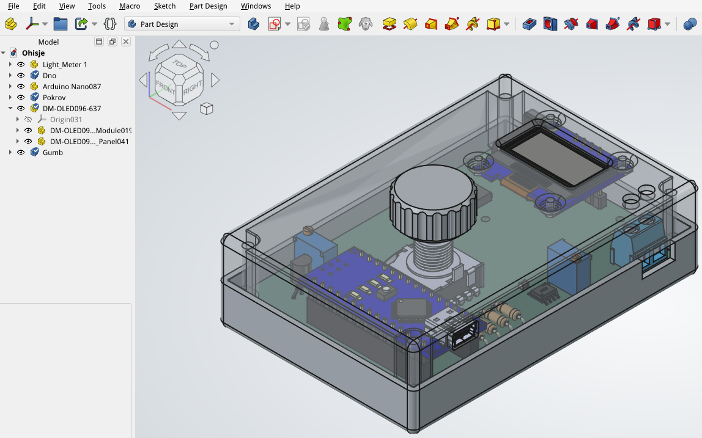{#fig:KiCAD_to_FreeCAD}

