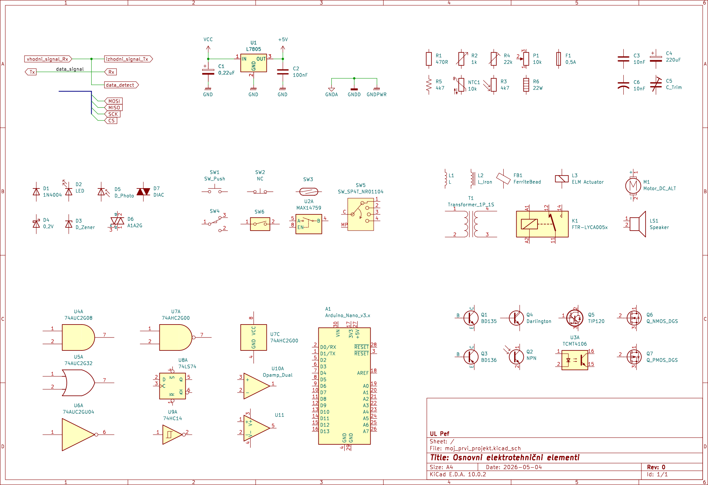
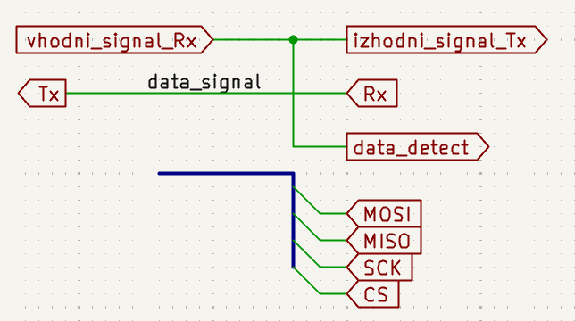
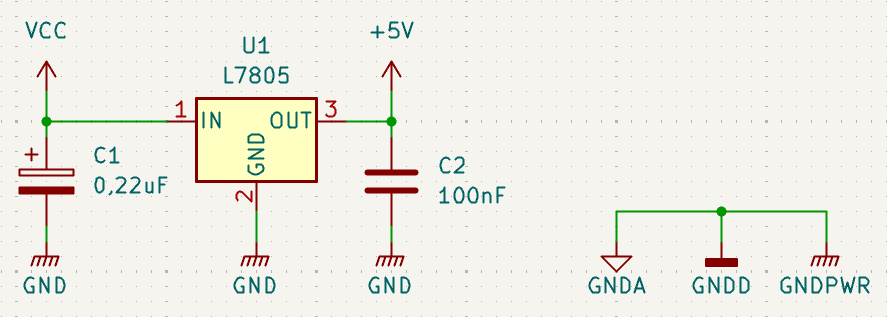
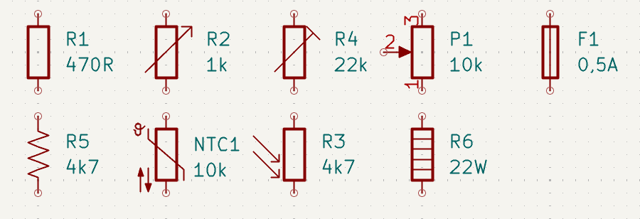
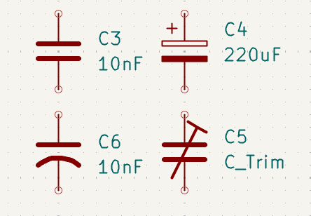
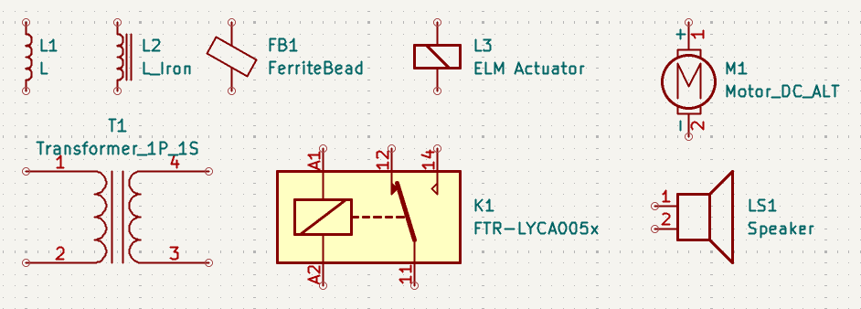
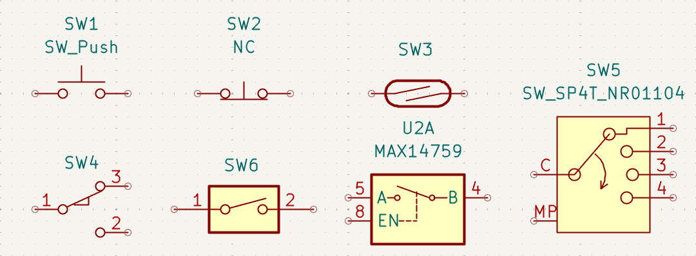
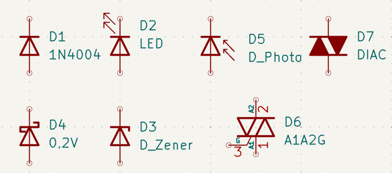
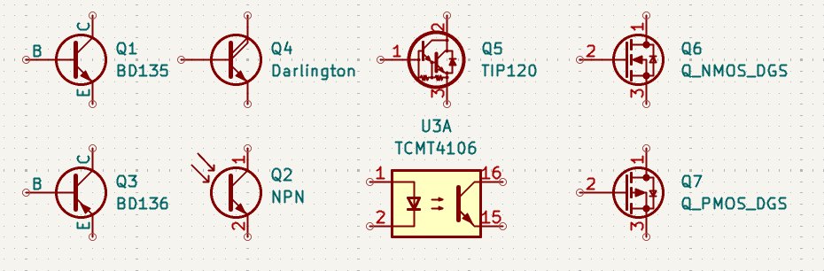
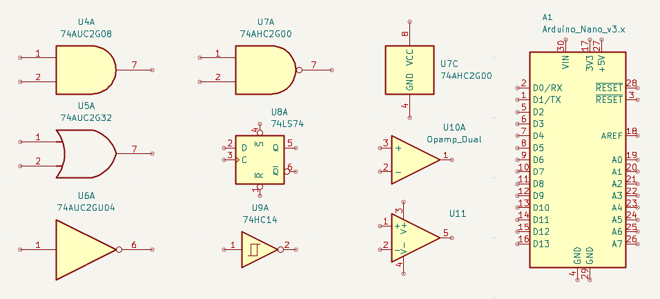

## Osnovni elementi elektrotehniških shem

Električne sheme uporabljajo standardizirane grafične simbole za predstavitev elektronskih komponent in njihovih povezav. Ti simboli omogočajo enoten način zapisovanja elektronskih sistemov ne glede na proizvajalca, državo ali programsko opremo. Pomembno je razumeti, da električna shema običajno ne prikazuje fizične oblike komponent ali njihove dejanske postavitve na vezju. Shema predstavlja predvsem logično delovanje sistema in električne povezave med posameznimi elementi. Na [@fig:osnovni_simboli_komponent] (različnica dokumenta v [PDF](./slike/KiCAD_osnovni_elementi.pdf) datoteki) so prikazani osnovni simboli elektronskih komponent.

{#fig:osnovni_simboli_komponent}

### Električne povezave

Povezave med komponentami predstavljajo električne vodnike. V električnih shemah so običajno prikazane kot ravne črte, ki povezujejo posamezne priključke komponent. Če se vodniki križajo brez električne povezave, običajno med njimi ni označene povezovalne točke. Kadar pa je med vodniki vzpostavljena električna povezava, je to označeno s polno piko na mestu spoja. Na [@fig:povezani_nepovezani_vodniki] je prikazana razlika med povezanimi in nepovezanimi vodniki.

{#fig:povezani_nepovezani_vodniki}

Preglednost povezav je izredno pomembna, saj nepregledne sheme otežujejo razumevanje delovanja vezja in povečujejo možnost napak pri načrtovanju. Priporočljivo je povezave primerno poimenovati tako, da je bolj razumljivo čemu je signal namenjen in iz česar izhajajo določene lastnosti tega signala.

### Napetostni potenciali

Vsako elektronsko vezje potrebuje vir napajanja in referenčni ničelni napetostni potencial. Zaradi večje preglednosti se napajalne povezave pogosto ne rišejo neposredno med vsemi komponentami, temveč se uporabljajo standardizirani simboli za napajalne linije.

Ničenlni potencial predstavlja referenčni potencial električnega sistema in je običajno označena s simbolom GND (*Ground*). Napajalne povezave pa so pogosto označene z oznakami, kot so VCC, +5V ali +3.3V. Na sliki [@fig:napajanje_in_masa] so prikazani tipični simboli za napajanje in maso.

{#fig:napajanje_in_masa}

### Upor

Upor je ena izmed najosnovnejših elektronskih komponent. Njegova naloga je omejevanje toka in določanje napetostnih razmer v vezju. V električnih shemah je upor označen s simbolom in referenčno oznako, običajno s črko R.

Poleg simbola je pogosto navedena tudi vrednost upora, izražena v ohmih. Vrednosti se zapisujejo s standardnimi predponami, kot so kiloohm ($k\Omega$) in megaohm ($M\Omega$). Na [@fig:upor_simbol] je prikazan simbol upora.

{#fig:upor_simbol}

### Kondenzator

Kondenzator omogoča shranjevanje električnega naboja in ima pomembno vlogo pri filtriranju signalov, stabilizaciji napajanja ter časovnih zakasnitvah. Kondenzatorji so lahko polarizirani ali nepolarizirani, kar vpliva tudi na njihov simbol v električni shemi. Na [@fig:kondenzator_simbol] so prikazani različni simboli kondenzatorjev.

{#fig:kondenzator_simbol}

Pri polariziranih kondenzatorjih je potrebno paziti na pravilno orientacijo priključkov, saj napačna priključitev lahko povzroči poškodbo komponente.

### Tuljave in induktivna bremena

Tuljava je elektronska komponenta, ki shranjuje energijo v obliki magnetnega polja. Uporablja se predvsem pri filtriranju signalov, resonančnih vezjih in napajalnikih. V električnih shemah je običajno označena s črko L. Na sliki [@fig:tuljave_simboli] so prikazani različni simboli tuljav.

{#fig:tuljave_simboli}

Transformator je sestavljen iz dveh ali več magnetno povezanih tuljav. Njegova naloga je prenos električne energije med vezji ter spreminjanje napetosti ali toka. Transformatorji se pogosto uporabljajo v napajalnikih in elektroenergetskih sistemih.

### Stikala in tipke

Stikala in tipke so električne komponente, namenjene prekinjanju ali vzpostavljanju električne povezave v vezju. Uporabljajo se za vklop in izklop naprav, izbiro načinov delovanja ter za uporabniški vnos signalov. V električnih shemah so stikala prikazana z različnimi simboli glede na način delovanja. Pomembna razlika je med stikali, ki ostanejo v določenem položaju, in tipkami, ki se po sprostitvi vrnejo v začetni položaj. Na [@fig:stikala_in_tipke] so prikazani simboli različnih stikal in tipk.

{#fig:stikala_in_tipke}

Pri načrtovanju elektronskih vezij je pomembno razlikovati med normalno odprtimi (*NO – Normally Open*) in normalno zaprtimi (*NC – Normally Closed*) kontakti, saj to vpliva na delovanje električnega sistema.

### Diode in LED

Dioda je elektronska komponenta, ki prevaja električni tok predvsem v eni smeri. Zaradi tega se uporablja za usmerjanje toka, zaščito vezij in različne signalne funkcije. Posebna oblika diode je svetleča dioda oziroma LED (*Light Emitting Diode*), ki ob prevajanju toka oddaja svetlobo. Na [@fig:dioda_led] so prikazani simboli polprevodniških elementov, ki so sorodni z diodami.

{#fig:dioda_led}

Pri diodah je zelo pomembna pravilna orientacija anode in katode, saj napačna priključitev prepreči pravilno delovanje komponente.

### Tranzistor

Tranzistor predstavlja eno najpomembnejših komponent sodobne elektronike. Uporablja se za ojačevanje signalov in elektronsko preklapljanje. Obstaja več vrst tranzistorjev, med najpogostejšimi pa so bipolarni tranzistorji (BJT) in tranzistorji MOSFET. Električne sheme uporabljajo različne simbole glede na vrsto tranzistorja. Na [@fig:tranzistorji] so prikazani različni simboli tranzistorjev.

{#fig:tranzistorji}

Razumevanje tranzistorjev predstavlja pomemben korak pri prehodu iz osnovnih elektronskih vezij v kompleksnejše elektronske sisteme.

### Integrirana vezja

Integrirana vezja združujejo večje število elektronskih komponent v enem samem ohišju. Zaradi kompleksnosti notranje zgradbe električne sheme običajno prikazujejo zgolj zunanje priključke integriranega vezja. Integrirana vezja so pogosto označena s črko U in pripadajočo referenčno oznako. Priključki simbola integriranega vezja pogosto vsebujejo še dodatne grafične elemente, kot na primer:

- trikotnik, ki ponazarja urin signal,
- krog, ki označuje, da je signal negiran in
- pravokotnik s podaljški, ki ponazarja, da gre za histerezo oz. da je vhod opremljen s šmitovim sprožilnikom.

Pri teh vezjih pogosto napajalnih priključkov ne rišemo, s čimer povečamo preglednost same funkcionalnisti vezja. Napajalni del teh vezij narišemo ločeno. Na [@fig:integrirano_vezje] je prikazan primer simbola integriranega vezja.

{#fig:integrirano_vezje}

Pri načrtovanju elektronskih sistemov je zelo pomembno natančno preverjanje podatkovnih listov (*datasheet*), saj ti vsebujejo informacije o funkciji posameznih priključkov, napajalnih zahtevah in električnih omejitvah komponente.

