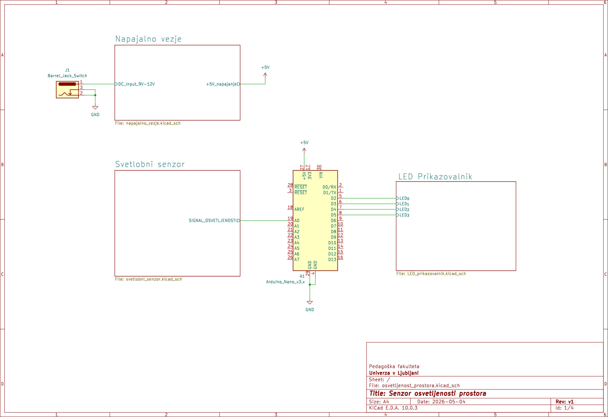
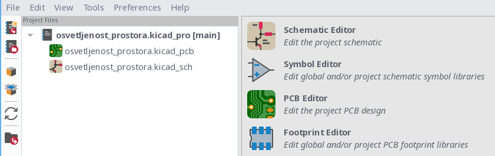
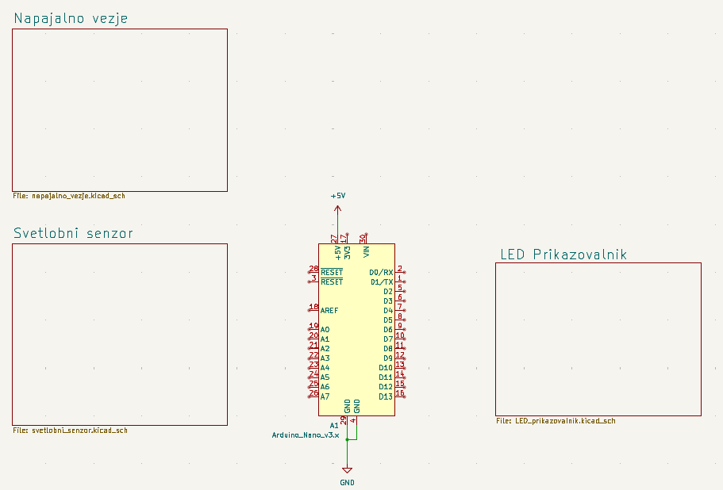
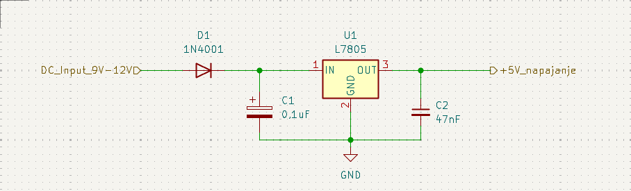
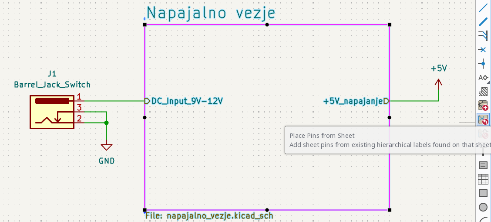
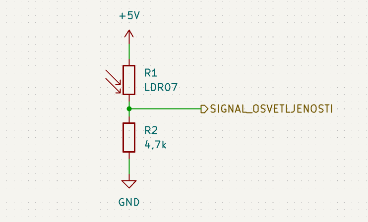
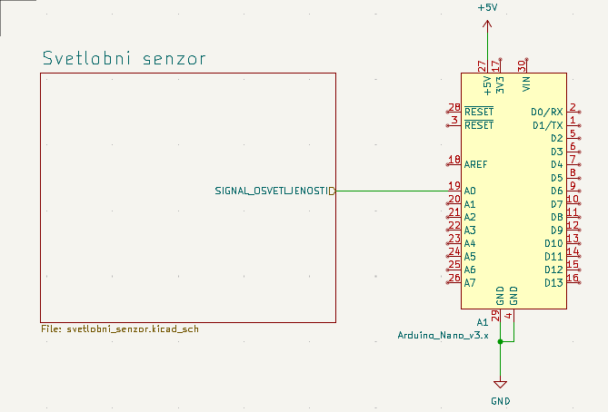
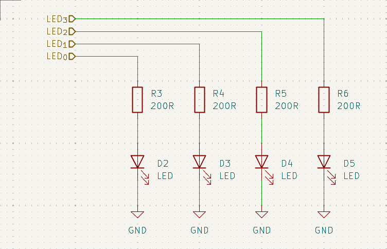
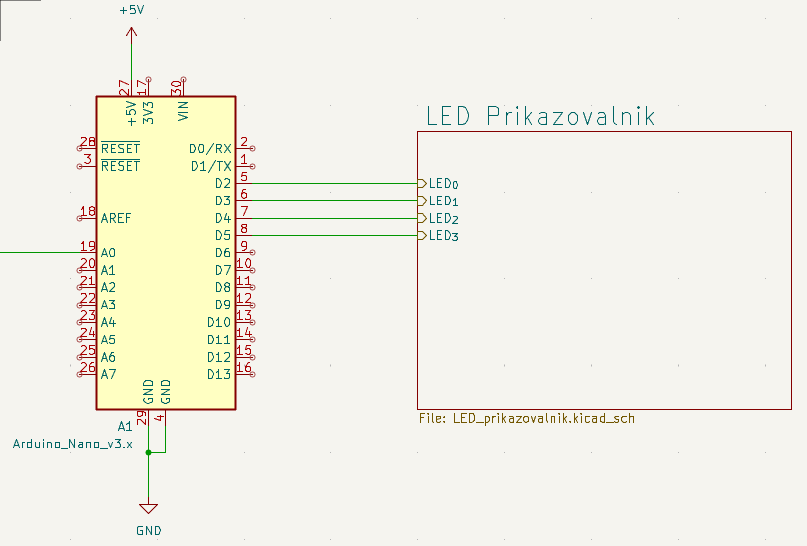

## Hierarhično načrtovanje elektronskih shem v programu KiCad

Pri načrtovanju kompleksnejših elektronskih sistemov se hitro srečamo s problemom preglednosti električne sheme. Če so vse komponente prikazane na enem samem listu, postane shema nepregledna, težje razumljiva in zahtevnejša za vzdrževanje. Zaradi tega sodobna orodja za elektronsko načrtovanje omogočajo uporabo hierarhičnih shem, pri katerih je sistem razdeljen na več logično povezanih podsistemov.

Hierarhično načrtovanje temelji na modularnem pristopu. Posamezne funkcionalne dele sistema predstavimo kot samostojne podsheme, medtem ko glavna shema prikazuje njihovo medsebojno povezavo in organizacijo. Takšen način dela izboljša preglednost projekta ter omogoča lažje načrtovanje, preverjanje in kasnejše spreminjanje vezja. V tem poglavju bomo izdelali preprost merilnik osvetljenosti. Sistem bo meril osvetljenost okolice s pomočjo svetlobnega senzorja, izmerjeno vrednost obdelal z mikrokrmilnikom Arduino Nano in rezultat prikazal s štirimi svetlečimi diodami. Zaradi preglednosti bomo projekt razdelili na tri podsheme:

* napajalni blok (*Power Supply*),
* blok svetlobnega senzorja (*Light Sensor*),
* LED prikazovalnik (*LED Display*).

Arduino Nano bo predstavljen neposredno na glavni shemi, saj predstavlja osrednji element sistema, ki povezuje vse ostale funkcionalne sklope. Na [@fig:kicad_merilnik_osvetljenosti_glavna_shema] je prikazana organizacija projekta (link do [PDF datoteke](./slike/KiCAD_complete_main_schematic.pdf)). Napajalni blok zagotavlja stabilno napajalno napetost za celoten sistem. Svetlobni senzor generira analogni signal, ki ga Arduino Nano zajema preko analognega vhoda. Na podlagi izmerjene vrednosti mikrokrmilnik krmili štiri svetleče diode, ki prikazujejo trenutno stopnjo osvetljenosti okolice.

{#fig:kicad_merilnik_osvetljenosti_glavna_shema}

### Ustvarjanje novega projekta

Delo v programu KiCad se začne z ustvarjanjem novega projekta. Projekt predstavlja zbirko vseh datotek, povezanih z načrtovanjem elektronskega sistema. Vanj so vključene električne sheme, načrt tiskanega vezja, nastavitve projekta in proizvodna dokumentacija. Nov projekt ustvarimo z ukazom **File → New Project**. Program od uporabnika zahteva ime projekta in lokacijo za shranjevanje datotek. Priporočljivo je, da za vsak projekt ustvarimo ločeno mapo, saj bodo vse datoteke projekta organizirane znotraj iste strukture. Na sliki [@fig:kicad_nov_projekt1] je prikazan postopek ustvarjanja novega projekta.

{#fig:kicad_nov_projekt1}

Po ustvarjanju projekta se odpre urejevalnik električnih shem (*Schematic Editor*), v katerem bomo pripravili glavno shemo in vse pripadajoče podsheme.

### Izdelava glavne sheme

Glavna shema predstavlja najvišji nivo projekta. Njena naloga ni prikaz vseh posameznih komponent, temveč prikaz organizacije sistema in povezav med funkcionalnimi sklopi. Na glavno shemo najprej postavimo simbol Arduino Nano iz knjižnice komponent. Nato z orodjem **Add Hierarchical Sheet** ustvarimo tri podsheme z imeni *Power Supply*, *Light Sensor* in *LED Display*. Posamezne podsheme povežemo z ustreznimi signali in napajalnimi vodili.

{#fig:kicad_glavna_shema_nano}

Na sliki [@fig:kicad_glavna_shema_nano] je prikazana glavna shema projekta. Arduino Nano je osrednji element sistema, medtem ko posamezne podsheme predstavljajo funkcionalne sklope elektronskega sistema. Signal **LIGHT_LEVEL** povezuje svetlobni senzor z analognim vhodom mikrokrmilnika. Digitalni izhodi mikrokrmilnika so povezani z LED prikazovalnikom. Napajalni blok zagotavlja napetost 5 V za vse dele sistema.

Preden pričnemo z risanjem posameznih podshem, je priporočljivo načrtovati signale, ki bodo potekali med posameznimi funkcionalnimi sklopi. V našem primeru bo napajalni blok zagotavljal napetost **+5V**, svetlobni senzor bo generiral analogni signal **LIGHT_LEVEL**, Arduino Nano pa bo preko signalov **LED1**, **LED2**, **LED3** in **LED4** krmilil posamezne svetleče diode v izhodnem bloku.

### Izdelava podsheme napajalnega bloka

Vsak elektronski sistem potrebuje ustrezno napajanje. V našem primeru bo vhodna napetost sistema znašala 12 V, medtem ko Arduino Nano, svetlobni senzor in LED prikazovalnik za svoje delovanje potrebujejo napetost 5 V. Naloga napajalnega bloka je zato pretvorba vhodne napetosti v stabilizirano izhodno napetost 5 V. Pri ustvarjanju podsheme najprej dvokliknemo blok *Power Supply* na glavni shemi. KiCad bo samodejno odprl pripadajočo podshemo, v katero bomo dodali elektronske komponente napajalnega vezja.

Za začetni primer bomo uporabili linearni napetostni regulator 7805, saj gre za enostavno in pogosto uporabljeno rešitev. Napajalni blok bo sestavljen iz vhodnega priključka za napajanje, zaščitne diode, regulatorja napetosti ter dveh kondenzatorjev za stabilizacijo napajalne napetosti. Na [@fig:kicad_power_supply_schematic] je prikazana električna shema napajalnega bloka.

{#fig:kicad_power_supply_schematic}

Po vstavitvi komponent jih med seboj povežemo z električnimi vodniki. Posebno pozornost namenimo pravilni orientaciji diode in priključkov regulatorja. Napačna povezava lahko povzroči nepravilno delovanje ali celo poškodbo komponent. Ker želimo izhodno napetost napajalnega bloka uporabiti tudi v drugih delih projekta, moramo ustvariti hierarhični priključek. V ta namen uporabimo orodje **Place Hierarchical Pin** in ustvarimo priključek z imenom **+5V_napajanje**.

Hierarhični priključek predstavlja povezavo med podshemo in glavno shemo projekta. Signali, ki jih želimo prenesti med posameznimi nivoji projekta, morajo biti definirani preko takšnih priključkov. Ko je podshema zaključena, se vrnemo na glavno shemo. Program KiCad bo zaznal nov hierarhični priključek in ga prikazal na bloku *Power Supply*. Tako lahko izhodni signal **+5V** povežemo z Arduino Nano ter ostalimi podsistemi. Na sliki [@fig:kicad_power_supply_main_sheet] je prikazan prikaz hierarhičnega priključka na glavni shemi.

{#fig:kicad_power_supply_main_sheet}

### Izdelava podsheme svetlobnega senzorja

Naslednji funkcionalni sklop predstavlja svetlobni senzor. Njegova naloga je pretvorba osvetljenosti okolice v električni signal, ki ga lahko zajema mikrokrmilnik. Za merjenje osvetljenosti bomo uporabili fotoupor oziroma LDR (*Light Dependent Resistor*). Upornost fotoupora se spreminja glede na količino svetlobe, ki pada na njegovo površino. Večja kot je osvetljenost, manjša je njegova upornost.

Fotoupor sam po sebi ne ustvarja napetosti, zato ga običajno uporabimo kot del napetostnega delilnika. V našem primeru bomo fotoupor povezali z uporom vrednosti 10 kΩ. Na sliki [@fig:kicad_light_sensor_schematic] je prikazana podshema svetlobnega senzorja.

{#fig:kicad_light_sensor_schematic}

Spreminjanje upornosti fotoupora povzroči spremembo napetosti na izhodu delilnika. To napetost bomo zajemali z analognim vhodom Arduino Nano. Za povezavo s preostalim delom projekta ustvarimo dva hierarhična priključka. Prvi predstavlja napajanje **+5V**, drugi pa analogni signal **LIGHT_LEVEL**. Na sliki [@fig:kicad_light_sensor_pins] so prikazani hierarhični priključki svetlobnega senzorja.

{#fig:kicad_light_sensor_pins}

Po vrnitvi na glavno shemo se na bloku *Light Sensor* samodejno prikažeta oba priključka. Signal **LIGHT_LEVEL** nato povežemo z analognim vhodom A0 na Arduino Nano.

### Izdelava podsheme LED prikazovalnika

Zadnji funkcionalni sklop predstavlja prikazovalnik izmerjene osvetljenosti. Za prikaz bomo uporabili štiri svetleče diode, ki bodo predstavljale različne nivoje osvetljenosti. Vsaka LED dioda mora imeti svoj serijski upor, ki omejuje tok skozi diodo in preprečuje njeno poškodbo. V našem primeru bomo uporabili upore vrednosti 220 Ω. Na sliki [@fig:kicad_led_display_schematic] je prikazana podshema LED prikazovalnika.

{#fig:kicad_led_display_schematic}

Vsaka LED dioda bo povezana na svoj digitalni izhod Arduino Nano. Za povezavo z glavno shemo ustvarimo hierarhične priključke z imeni **LED1**, **LED2**, **LED3** in **LED4**. Poleg signalnih priključkov potrebujemo tudi priključek za ničelni potencial (**GND**), saj morajo biti vse komponente povezane na skupni referenčni potencial sistema. Na sliki [@fig:kicad_led_display_pins] so prikazani hierarhični priključki LED prikazovalnika.

{#fig:kicad_led_display_pins}

Po zaključku vseh podshem je glavna shema popolnoma povezana. Arduino Nano prejema signal iz svetlobnega senzorja preko analognega vhoda A0 ter na podlagi izmerjene vrednosti krmili štiri LED diode preko digitalnih izhodov. Na [@fig:kicad_complete_main_schematic] je prikazana zaključena glavna shema projekta (link do [PDF datoteke](./slike/KiCAD_complete_main_schematic.pdf)), ki povezuje vse funkcionalne sklope v enoten elektronski sistem.

{#fig:kicad_complete_main_schematic}

