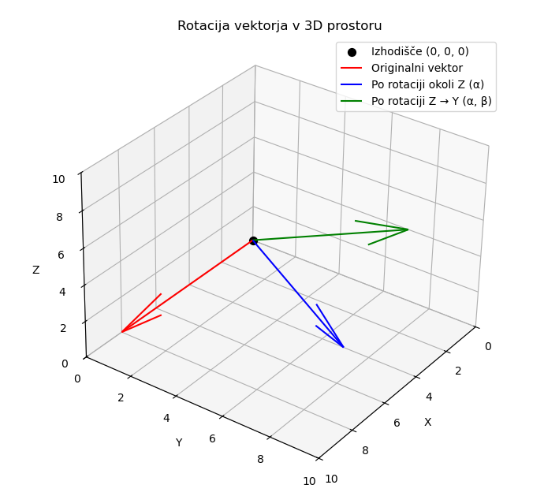

## Izračuni pravokotne projekcije

Za projekcijo vektorja v prostoru lahko uporabimo matrike, kar je posebej uporabno pri računalniški grafiki, linearni algebri in fiziki. Tukaj je razlaga postopka s poudarkom na reševanju z matrikami.

Na primer, da imamo poljuben vektor $e$:

$$
\mathbf{e} = \begin{bmatrix} e_x \\ e_y \\ e_z \end{bmatrix}.
$$

in želimo izračunati pravokotno projekcijo tega vektorja na eno od osnovnih ravnin, na preimer v ravnino $XY$. Ta ravnina ima normalni vektro $n$:

$$
\mathbf{n}=\begin{bmatrix}0 \\ 0 \\ 1 \end{bmatrix}.
$$

Splošna formula za izračun pravokotne projekcije na ravnino, ki gre skozi izhodišče kordinatnega sistema in ima normalo z enotskim vektrojem $\mathbf{n}$ je:

$$
P = I - \mathbf{n}\mathbf{n}^T,
$$

kjer matriko $P$ poimenujemo **projektor** (to je matrika za pravokotno projekcijo na normalo).

Ker je $\mathbf{n}=[0,0,1]^T$, dobimo

$$
P = I -
\begin{bmatrix}0 \\ 0 \\ 1 \end{bmatrix}
\begin{bmatrix}0&0&1\end{bmatrix} = 
\begin{bmatrix}
1&0&0 \\
0&1&0 \\
0&0&0
\end{bmatrix}.
$$

Tako je pravokotna projekcija vektorja $\mathbf{e}$:

$$
\mathbf{e'} = P\mathbf{e}
\begin{bmatrix}
1&0&0 \\
0&1&0 \\
0&0&0
\end{bmatrix}
\begin{bmatrix}
e_x \\ e_y \\ e_z
\end{bmatrix} = 
\begin{bmatrix}
e_x \\ e_y \\ 0
\end{bmatrix}.
$$

Take izračune bomo potrebovali v nadaljevanju, ko bomo želeli poljubne vektorje pravokotno projecirati na osnovne ravnine in določiti njihovo dolžino.

### Izračun rotacije

V tridimenzionalnem prostoru lahko vektorje rotiramo okoli koordinatnih osi s pomočjo **rotacijskih matrik**. Vsaka rotacija v 3D prostoru se lahko predstavi z množico osnovnih rotacij okoli osi **X**, **Y** ali **Z**. Tak pristop se pogosto uporablja v:

* računalniški grafiki,
* robotiki,
* fiziki gibanja in simulacijah,
* analizi prostorskih podatkov.

Z uporabo matrik lahko **enostavno kombiniramo več rotacij** – npr. najprej okoli Z, nato okoli Y – z zaporednim množenjem matrik. S tem dobimo **kompozitno rotacijsko matriko**, ki deluje kot ena sama transformacija.

Imamo vektor:

$$
\mathbf{e} = \begin{bmatrix} x_1 \\ y_1 \\ z_1 \end{bmatrix}
$$

Vektor želimo najprej:

1. **zarotirati okoli osi Z** za kot $\alpha$,
2. nato **še okoli osi Y** za kot $\beta$.

**Rotacijo vektorja okoli osi Z za kot $\alpha$**
lahko izračuna tako, da rotacijsko matriko pomnožimo z vektorjem:

$$
\mathbf{R}_Z(\alpha) =
\begin{bmatrix}
\cos\alpha & -\sin\alpha & 0 \\
\sin\alpha & \cos\alpha & 0 \\
0 & 0 & 1
\end{bmatrix}
$$

Vmesni rezultat po tej rotaciji:

$$
\mathbf{e}' = \mathbf{R}_Z(\alpha) \cdot \mathbf{e}
$$

**Rotacijo vektorja okoli osi Y (kot $\beta$)**
pa tako, da podobno rotacijsko matriko pomnožimo z zgornjim rezulatom:

$$
\mathbf{R}_Y(\beta) =
\begin{bmatrix}
\cos\beta & 0 & \sin\beta \\
0 & 1 & 0 \\
-\sin\beta & 0 & \cos\beta
\end{bmatrix}
$$

Končni rezultat po drugi rotaciji:

$$
\mathbf{e}'' = \mathbf{R}_Y(\beta) \cdot \mathbf{e}' = \mathbf{R}_Y(\beta) \cdot \mathbf{R}_Z(\alpha) \cdot \mathbf{e}
$$

### Primer

Za izračun bomo vzeli poseben primer, kjer bomo vektor e zarotirali tako, da bo vektor zopet končal na eni od glavnih ravnin prostora. Tako ga bomo lahko bolj nazorno prikazali na [@fig:rotacija_vektorja_z_y].

Naj bo:

* **vektor** $\mathbf{e} = [8, 0, 0]^T$
* **rotacija okoli Z** za $\alpha = 60^\circ$
* **nato rotacija okoli Y** za $\beta = -90^\circ$

{#fig:rotacija_vektorja_z_y}

1. Rotacijska matrika okoli Z

$$ \mathbf{R}_Z(\alpha) =
\begin{bmatrix}
\cos\alpha & -\sin\alpha & 0 \\
\sin\alpha & \cos\alpha  & 0 \\
0          & 0           & 1 
\end{bmatrix} =
\begin{bmatrix}
0.5 & -0.8660 & 0 \\
0.8660 & 0.5 & 0 \\
0 & 0 & 1 
\end{bmatrix} $$

2. Rotacijska matrika okoli Y

$$ \mathbf{R}_Y(\beta) = \begin{bmatrix} \cos\beta & 0 & \sin\beta \\ 0 & 1 & 0 \\ -\sin\beta & 0 & \cos\beta \end{bmatrix} = \begin{bmatrix} 0 & 0 & -1 \\ 0 & 1 & 0 \\ 1 & 0 & 0 \end{bmatrix} $$

3. Vmesni rezultat: $\mathbf{e}' = \mathbf{R}_Z(\alpha) \cdot \mathbf{e}$

$$ \mathbf{e}' = \begin{bmatrix} 0.5 & -0.8660 & 0 \\ 0.8660 & 0.5 & 0 \\ 0 & 0 & 1 \end{bmatrix} \cdot \begin{bmatrix} 8 \\ 0 \\ 0 \end{bmatrix} = \begin{bmatrix} 4.0 \\ 6.9282 \\ 0 \end{bmatrix} $$

4. Končni rezultat: $\mathbf{e}'' = \mathbf{R}_Y(\beta) \cdot \mathbf{e}'$

$$ \mathbf{e}'' = \begin{bmatrix} 0 & 0 & -1 \\ 0 & 1 & 0 \\ 1 & 0 & 0 \end{bmatrix} \cdot \begin{bmatrix} 4.0 \\ 6.9282 \\ 0 \end{bmatrix} = \begin{bmatrix} 0 \\ 6.9282 \\ 4.0 \end{bmatrix} $$

5. Rezultat

Po rotaciji vektorja $[8, 0, 0]^T$ za $60^\circ$ okoli Z in nato še za $-90^\circ$ okoli Y dobimo nov vektor:

$$ \mathbf{e}_{\text{rotated}} \approx \begin{bmatrix} 0 \\ 6.93 \\ 4.00 \end{bmatrix} $$

Rezultat je tudi grafično prikazan na [@fig:rotacija_vektorja_z_y].

