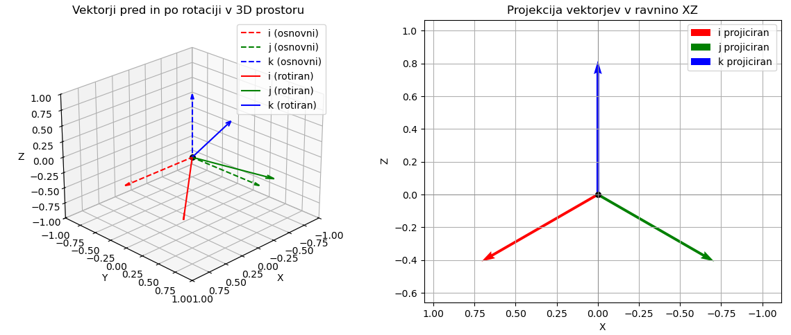

## IZRAČUN KOTOV ROTACIJE IZOMETRIČNE PROJEKCIJE

**Izometrična projekcija** je vrsta **pravokotne aksionometrične projekcije**, kjer so osnovni trije enotski vektorji tega prostora:

* $\mathbf{i} = [1, 0, 0]^T$,
* $\mathbf{j} = [0, 1, 0]^T$,
* $\mathbf{k} = [0, 0, 1]^T$,

projicirani v **ravnino XZ** tako, da so njihove projekcije:

1. enako dolge (izometrične),
2. pod enakimi koti (120° med sabo v ravnini - sledi iz zgornje zahteve),

### Rotacija prostora in projekcija

Najprej zarotiramo 3D prostor, da bo pogled na vektorje iz ustreznega kota. Uporabimo **dve rotaciji**:

1. **rotacijo okoli osi Z** za kot $\alpha$ in
2. **rotacijo okoli osi X** za kot $\beta$.

Po rotaciji nato **projiciramo vektorje v ravnino XZ**.

Rotacija okoli osi Z za kot $\alpha$:

$$
\mathbf{R}_Z(\alpha) =
\begin{bmatrix}
\cos\alpha & -\sin\alpha & 0 \\
\sin\alpha & \cos\alpha & 0 \\
0 & 0 & 1
\end{bmatrix}
$$

Rotacija okoli osi X za kot $\beta$:

$$
\mathbf{R}_X(\beta) =
\begin{bmatrix}
0 & \cos\beta & -\sin\beta \\
0 & \sin\beta & \cos\beta
\end{bmatrix}
$$

Tako lahko združimo obe rotaciji v:

$$
\mathbf{R}_{XZ} = \mathbf{R}_X(\beta) \cdot \mathbf{R}_Z(\alpha) =
\begin{bmatrix}
\cos\alpha & -\sin\alpha & 0 \\
\cos\beta \cdot \sin\alpha & \cos\beta \cdot \cos\alpha & -\sin\beta \\
\sin\beta \cdot \sin\alpha & \sin\beta \cdot \cos\alpha & \cos\beta
\end{bmatrix}
$$

Nato izvedemo še projekcijo na ravnino XZ. To storimo z množenjem s projekcijsko matriko:

$$\mathbf{P}_{XZ} =
\begin{bmatrix}
1 & 0 & 0 \\
0 & 0 & 0 \\
0 & 0 & 1
\end{bmatrix}
$$

Torej skupna transformacija je:

$\mathbf{T} = \mathbf{P}_{XZ} \cdot \mathbf{R}_{XZ}$

in dobimo končno transformacijsko matriko:

$$
\mathbf{T} =
\begin{bmatrix}
\cos\alpha & -\sin\alpha & 0 \\
0 & 0 & 0 \\
\sin\beta \cdot \sin\alpha & \sin\beta \cdot \cos\alpha & \cos\beta
\end{bmatrix}
$$

Pogoj za izometrično projekcijo je, da so projekcije prvotnih osnovnih enotskih vektorjev enako dolge. Zato najprej izračunamo projekcije enotskih vektorjev:

* $\mathbf{i'} = \mathbf{T} \cdot \mathbf{i}$ → prva stolpčna vektorja matrike $\mathbf{T}$
* $\mathbf{j'} = \mathbf{T} \cdot \mathbf{j}$ → drugi stolpec
* $\mathbf{k'} = \mathbf{T} \cdot \mathbf{k}$ → tretji stolpec

Te vektorje označimo kot:

$$
\mathbf{i}' = \begin{bmatrix} \cos\alpha \\ 0 \\ \sin\beta \cdot \sin\alpha \end{bmatrix},\quad
\mathbf{j}' = \begin{bmatrix} -\sin\alpha \\ 0 \\ \sin\beta \cdot \cos\alpha \end{bmatrix},\quad
\mathbf{k}' = \begin{bmatrix} 0 \\ 0 \\ \cos\beta \end{bmatrix}
$$

Njihove dolžine morajo biti enako dolge:

$$
\| \mathbf{i}' \| = \| \mathbf{j}' \| = \| \mathbf{k}' \|
$$

Izračun dolžin:

* $\| \mathbf{i}' \|^2 = \cos^2\alpha + \sin^2\alpha \cdot \sin^2\beta$
* $\| \mathbf{j}' \|^2 = \sin^2\alpha + \cos^2\alpha \cdot \sin^2\beta$
* $\| \mathbf{k}' \|^2 = \cos^2\beta$


Rešimo sistem enačb:

$$
\cos^2\alpha + \sin^2\alpha \cdot \sin^2\beta = \cos^2\beta
$$

in

$$
\sin^2\alpha + \cos^2\alpha \cdot \sin^2\beta = \cos^2\beta
$$

sledi:

$$
\cos^2\alpha = \sin^2\alpha = \frac{1}{2}
\Rightarrow \alpha = 45^\circ
$$

in

$$
\cos^2\beta = \frac{1}{2} + \frac{1}{2} \cdot \sin^2\beta = \frac{1}{2} (1 + \sin^2\beta)
\Rightarrow \cos^2\beta = \frac{2}{3}
\Rightarrow \cos\beta = \sqrt{\frac{2}{3}} \approx 0.816
\Rightarrow \beta \approx \arccos(\sqrt{2/3}) \approx 35.26^\circ
$$

Ker gre za reševanje periodičnih funkcij je rešitev več. Za naš primer bomo izbrali rešitev izometrične projekcije če uporabimo:

* **rotacijo okoli Z**: $\alpha = 45^\circ$,
* **rotacijo okoli X**: $\beta \approx -35.26^\circ$ (rotacija prostora "naprej" - stran od projekcijske ravnine) in
* **projekcijo**: na ravnino **XZ**.

Končna transformacijska matrika $\mathbf{T}$:

$$ \mathbf{T} \approx \begin{bmatrix} \cos 45^\circ & -\sin 45^\circ & 0 \\ 0 & 0 & 0 \\ \sin 35.26^\circ \cdot \sin 45^\circ & \sin 35.26^\circ \cdot \cos 45^\circ & \cos 35.26^\circ \end{bmatrix} = \begin{bmatrix} \frac{\sqrt{2}}{2} & -\frac{\sqrt{2}}{2} & 0 \\ 0 & 0 & 0 \\ \frac{1}{\sqrt{3}} \cdot \frac{\sqrt{2}}{2} & \frac{1}{\sqrt{3}} \cdot \frac{\sqrt{2}}{2} & \sqrt{\frac{2}{3}} \end{bmatrix} $$

\newpage
S tem smo dobili rezultat, ki je prikazan na [@fig:rotacija_prostora_izometricna_projekcija].

{#fig:rotacija_prostora_izometricna_projekcija}

Če želite nekoliko eksperimentirati z rotacijami in projekcijami lahko preskusite :

```python
import numpy as np
import matplotlib.pyplot as plt
from mpl_toolkits.mplot3d import Axes3D

# --- 1. Definicija kotov ---
alpha_deg = 45
beta_deg = -35.264  # približno arccos(sqrt(2/3))
alpha = np.radians(alpha_deg)
beta = np.radians(beta_deg)

# --- 2. Rotacijski matriki ---
Rz = np.array([
    [np.cos(alpha), -np.sin(alpha), 0],
    [np.sin(alpha),  np.cos(alpha), 0],
    [0,              0,             1]
])

Rx = np.array([
    [1, 0, 0],
    [0, np.cos(beta), -np.sin(beta)],
    [0, np.sin(beta),  np.cos(beta)]
])
```
: izracun izometricne projekcije. {#lst:izracun_izometricne_projekcije}

```python
# --- 3. Projekcijska matrika (XZ projekcija) ---
P_XZ = np.array([
    [1, 0, 0],
    [0, 0, 0],
    [0, 0, 1]
])

# --- 4. Skupna transformacija ---
T = P_XZ @ Rx @ Rz

# --- 5. Osnovni vektorji ---
i = np.array([1, 0, 0])
j = np.array([0, 1, 0])
k = np.array([0, 0, 1])

# --- 6. Rotirani vektorji ---
i_rot = Rx @ Rz @ i
j_rot = Rx @ Rz @ j
k_rot = Rx @ Rz @ k

# --- 7. Projekcije rotiranih vektorjev ---
i_proj = T @ i
j_proj = T @ j
k_proj = T @ k

# --- 8. Prikaz ---
fig = plt.figure(figsize=(12,6))

# Levi graf: 3D pogled pred in po rotaciji
ax3d = fig.add_subplot(1, 2, 1, projection='3d')
ax3d.set_title("Vektorji pred in po rotaciji v 3D prostoru")

# Črtkani – osnovni
ax3d.quiver(0, 0, 0, *i, color='r', linestyle='dashed', label='i (osnovni)', arrow_length_ratio=0.1)
ax3d.quiver(0, 0, 0, *j, color='g', linestyle='dashed', label='j (osnovni)', arrow_length_ratio=0.1)
ax3d.quiver(0, 0, 0, *k, color='b', linestyle='dashed', label='k (osnovni)', arrow_length_ratio=0.1)
```

```python
# Polne – rotirani
ax3d.quiver(0, 0, 0, *i_rot, color='r', label='i (rotiran)', arrow_length_ratio=0.1)
ax3d.quiver(0, 0, 0, *j_rot, color='g', label='j (rotiran)', arrow_length_ratio=0.1)
ax3d.quiver(0, 0, 0, *k_rot, color='b', label='k (rotiran)', arrow_length_ratio=0.1)

ax3d.scatter(0, 0, 0, color='black', s=30)
ax3d.set_xlim([-1, 1])
ax3d.set_ylim([-1, 1])
ax3d.set_zlim([-1, 1])
ax3d.set_xlabel('X')
ax3d.set_ylabel('Y')
ax3d.set_zlabel('Z')
ax3d.view_init(elev=25, azim=45)
ax3d.legend()

# Desni graf: projekcija v XZ ravnino
ax2d = fig.add_subplot(1, 2, 2)
ax2d.set_title("Projekcija vektorjev v ravnino XZ")

# Projekcije
ax2d.quiver(0, 0, i_proj[0], i_proj[2], angles='xy', scale_units='xy', scale=1, color='r', label='i projiciran')
ax2d.quiver(0, 0, j_proj[0], j_proj[2], angles='xy', scale_units='xy', scale=1, color='g', label='j projiciran')
ax2d.quiver(0, 0, k_proj[0], k_proj[2], angles='xy', scale_units='xy', scale=1, color='b', label='k projiciran')

# Osi in mreža
ax2d.axhline(0, color='gray', lw=0.5)
ax2d.axvline(0, color='gray', lw=0.5)
ax2d.scatter(0, 0, color='black', s=30)
ax2d.set_xlabel('X')
ax2d.set_ylabel('Z')
ax2d.axis('equal')
ax2d.grid(True)
ax2d.set_xlim(-1, 1.5)
ax2d.set_ylim(-0.5, 1.5)
ax2d.legend()

plt.tight_layout()
plt.show()

```

