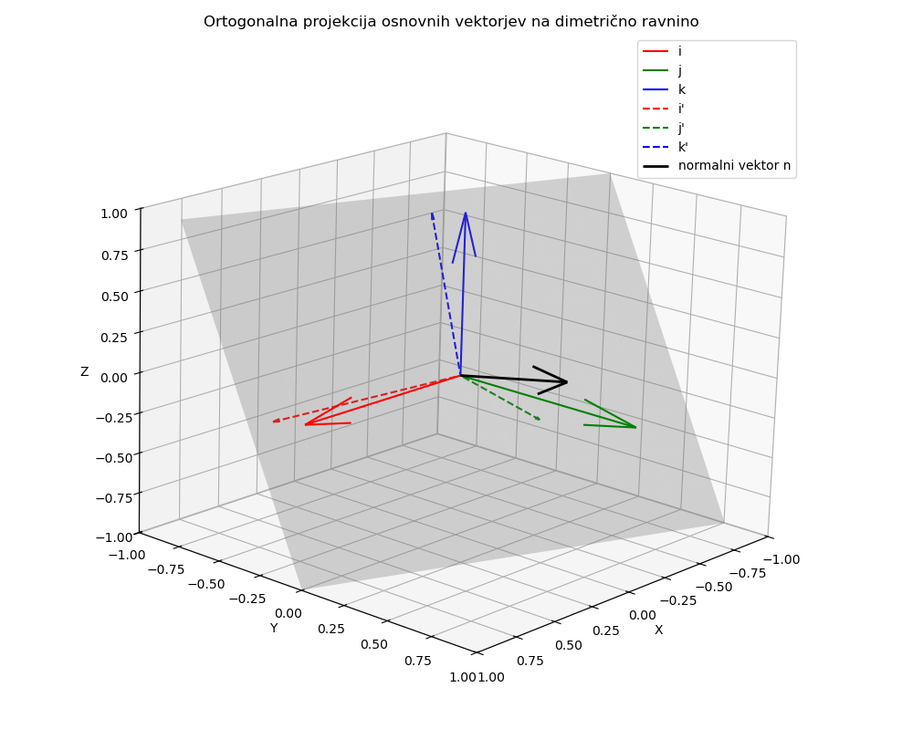

## IZRAČUN TOČKE POGLEDA ZA DIMETRIČNO PROJEKCIJO

V prostoru imamo:

* osnovne enotske vektorje $\mathbf{i} = [1, 0, 0]$, $\mathbf{j} = [0, 1, 0]$, $\mathbf{k} = [0, 0, 1]$,
* iščemo **eno samo ravnino** (določeno z njenim **normalnim vektorjem** $\mathbf{n}$, dolžine 1),
* takšno, da bodo **ortogonalne projekcije** vektorjev $\mathbf{i}, \mathbf{j}, \mathbf{k}$ v to ravnino dajale dolžine:

$$
|\mathbf{i}'| = |\mathbf{k}'| = 2|\mathbf{j}'| \quad \text{(dimetrična zahteva)}
$$

in

$$
|\mathbf{i}'|^2 + |\mathbf{j}'|^2 + |\mathbf{k}'|^2 = 2
\quad \text{(skupna energijska enakost)}
$$

---

Ortogonalna projekcija vektorja v ravnino

Projekcija vektorja $\mathbf{v}$ v ravnino z enotskim normalnim vektorjem $\mathbf{n}$ je:

$$
\mathbf{v}_{\text{proj}} = \mathbf{v} - (\mathbf{v} \cdot \mathbf{n}) \mathbf{n}
$$

Dolžina kvadrata te projekcije:

$$
|\mathbf{v}_{\text{proj}}|^2 = |\mathbf{v}|^2 - (\mathbf{v} \cdot \mathbf{n})^2
$$

Ker so $\mathbf{i}, \mathbf{j}, \mathbf{k}$ enotski, to postane:

$$
|\mathbf{i}'|^2 = 1 - (\mathbf{i} \cdot \mathbf{n})^2 = 1 - n_x^2 \\
|\mathbf{j}'|^2 = 1 - n_y^2 \\
|\mathbf{k}'|^2 = 1 - n_z^2
$$

---

Postavimo zdaj pogoje:

### a) $|\mathbf{i}'|^2 = |\mathbf{k}'|^2 \Rightarrow n_x^2 = n_z^2$

### b) $|\mathbf{i}'|^2 = 4 \cdot |\mathbf{j}'|^2 \Rightarrow 1 - n_x^2 = 4(1 - n_y^2)$

### c) $|\mathbf{i}'|^2 + |\mathbf{j}'|^2 + |\mathbf{k}'|^2 = 2$

---

## Reševanje sistema

Zapišimo:

* $n_x^2 = n_z^2 = a$
* $n_y^2 = b$

### Pogoj (b):

Zaradi $|\mathbf{i}'| = |\mathbf{k}'| = 2|\mathbf{j}'|$, mora veljati:

$$
1 - n_x^2 = 4(1 - n_y^2)
\Rightarrow
1 - a = 4(1 - b)
\Rightarrow
a = 1 - 4(1 - b) = 1 - 4 + 4b = -3 + 4b
\quad \text{(1) popravljeno}
$$

### Pogoj (c):

$$
(1 - a) + (1 - b) + (1 - a) = 2
\Rightarrow 3 - 2a - b = 2
\Rightarrow 2a + b = 1
\quad \text{(2)}
$$

## Popravek pogoja (b):

Vstavimo (1) v (2):

$$
2(-3 + 4b) + b = 1 \Rightarrow -6 + 8b + b = 1 \Rightarrow 9b = 7 \Rightarrow b = \frac{7}{9}
$$

Potem:

$$
a = -3 + 4b = -3 + \frac{28}{9} = \frac{1}{9}
$$

---

## Končni rezultati

$$
n_x^2 = n_z^2 = \frac{1}{9},\quad n_y^2 = \frac{7}{9}
$$

Ker gre za **enotski vektor**, to tudi preverimo:

$$
n_x^2 + n_y^2 + n_z^2 = \frac{1}{9} + \frac{7}{9} + \frac{1}{9} = \frac{9}{9} = 1 \quad \checkmark
$$

Izberemo pozitivne korene:

$$
n = \begin{bmatrix}
\sqrt{\frac{1}{9}} \\
\sqrt{\frac{7}{9}} \\
\sqrt{\frac{1}{9}}
\end{bmatrix}
=
\begin{bmatrix}
\frac{1}{3} \\
\sqrt{\frac{7}{9}} \\
\frac{1}{3}
\end{bmatrix}
$$

## Kaj to pomeni?

* Če **projiciraš osnovne vektorje $\mathbf{i}, \mathbf{j}, \mathbf{k}$** ortogonalno na **ravnino z normalo $\mathbf{n}$** (zgoraj),
* boš dobil **dimetrično projekcijo**, kjer je $|\mathbf{i}'| = |\mathbf{k}'| = 2 |\mathbf{j}'|$
* in $|\mathbf{i}'|^2 + |\mathbf{j}'|^2 + |\mathbf{k}'|^2 = 2$

---


{#fig:izracun_POV_dimetricna_projekcija}


```python
#! /bin/python3

import numpy as np
import matplotlib.pyplot as plt
from mpl_toolkits.mplot3d import Axes3D

# 1. Osnovni vektorji
i = np.array([1, 0, 0])
j = np.array([0, 1, 0])
k = np.array([0, 0, 1])

# 2. Normalni vektor dimetrične projekcijske ravnine
n = np.array([1/3, np.sqrt(7)/3, 1/3])
n = n / np.linalg.norm(n)  # normaliziramo

# 3. Funkcija za ortogonalno projekcijo vektorja na ravnino
def project_onto_plane(v, n):
    return v - np.dot(v, n) * n

# 4. Projekcije osnovnih vektorjev
i_proj = project_onto_plane(i, n)
j_proj = project_onto_plane(j, n)
k_proj = project_onto_plane(k, n)

# 5. Priprava 3D grafa
fig = plt.figure(figsize=(10, 8))
ax = fig.add_subplot(111, projection='3d')
ax.set_title("Ortogonalna projekcija osnovnih vektorjev na dimetrično ravnino")

# 6. Osnovni vektorji
ax.quiver(0, 0, 0, *i, color='r', label='i', linewidth=1.5)
ax.quiver(0, 0, 0, *j, color='g', label='j', linewidth=1.5)
ax.quiver(0, 0, 0, *k, color='b', label='k', linewidth=1.5)

# 7. Projekcije osnovnih vektorjev
ax.quiver(0, 0, 0, *i_proj, color='r', linestyle='dashed', label="i'", arrow_length_ratio=0.05)
ax.quiver(0, 0, 0, *j_proj, color='g', linestyle='dashed', label="j'", arrow_length_ratio=0.05)
ax.quiver(0, 0, 0, *k_proj, color='b', linestyle='dashed', label="k'", arrow_length_ratio=0.05)

# 8. Normalni vektor
ax.quiver(0, 0, 0, *n, color='k', label='normalni vektor n', linewidth=2)

# 9. Ravnina: zračunamo y iz enačbe ravnine: n · r = 0
xx, zz = np.meshgrid(np.linspace(-1, 1, 10), np.linspace(-1, 1, 10))
yy = (-n[0]*xx - n[2]*zz) / n[1]
ax.plot_surface(xx, yy, zz, alpha=0.3, color='gray')

# 10. Osi in pogled
ax.set_xlabel('X')
ax.set_ylabel('Y')
ax.set_zlabel('Z')
ax.set_xlim([-1, 1])
ax.set_ylim([-1, 1])
ax.set_zlim([-1, 1])
ax.view_init(elev=25, azim=45)
ax.legend()
plt.tight_layout()
plt.show()

```
: izracun POV dimetricne proj. {#lst:izracun_POV_dimetricne_proj}

