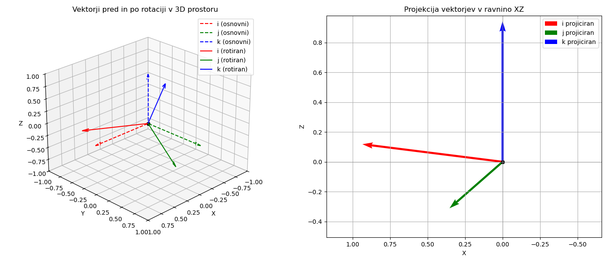

## IZRAČUN KOTOV ROTACIJE DIMETRIČNE PROJEKCIJE

Posebnost dimetrične projekcije je ta, da predmet (oz. prostor) nagnjemo tako, da dobimo dolžine projekcij osnovnih etonskih vektorjev $\mathbf{i} = [1, 0, 0]^T$, $\mathbf{j} = [0, 1, 0]^T$, $\mathbf{k} = [0, 0, 1]^T$, v posebnem razmerju:

$$|\mathbf{i}'| = |\mathbf{k}'| = 2 |\mathbf{j}'|$$

Reševanja tega problema se lotimo na enak način, kot smo to naredili za izometrično projekcijo, le da v tem primru uporabimo še eno posebno lastnost projekcije vektorjev in sicer, da je vsota kvadratov dolžin projekcij enaka 2:

$$|\mathbf{i}'|^2 + |\mathbf{j}'|^2 + |\mathbf{k}'|^2 = 2.$$

Uporabimo lahko isto transformacijsko matriko:

$$
\mathbf{T} = \mathbf{P}_{XZ} \cdot \mathbf{R}_X(\beta) \cdot \mathbf{R}_Z(\alpha)=
\begin{bmatrix}
\cos\alpha & -\sin\alpha & 0 \\
0 & 0 & 0 \\
\sin\beta \cdot \sin\alpha & \sin\beta \cdot \cos\alpha & \cos\beta
\end{bmatrix}
$$

in iste izraze za projekcije osnovnih enotskih vektorjev:

$$
\mathbf{i}' = \begin{bmatrix} \cos\alpha \\ 0 \\ \sin\beta \cdot \sin\alpha \end{bmatrix},\quad
\mathbf{j}' = \begin{bmatrix} -\sin\alpha \\ 0 \\ \sin\beta \cdot \cos\alpha \end{bmatrix},\quad
\mathbf{k}' = \begin{bmatrix} 0 \\ 0 \\ \cos\beta \end{bmatrix}.
$$

Ko upoštevamo prej omenjene pogoje: razmerje dolžin in vsoto dolžin projekcij, lahko izračunamo vrednost matrike:

$$
\mathbf{T} =
\begin{bmatrix}
\sqrt{\frac{7}{8}} & -\frac{1}{\sqrt{8}} & 0 \\
0 & 0 & 0 \\
\frac{1}{3\sqrt{8}} & \frac{1}{3} \cdot \sqrt{\frac{7}{8}} & \sqrt{\frac{8}{9}}
\end{bmatrix}
$$

in s tem poznamo rešitev za kota $\alpha$ in $\beta$:

$$
\cos\alpha = \sqrt\frac{7}{8} \Rightarrow \alpha = arccos\left(\sqrt{\frac{7}{8}}\right) \approx 20.74^\circ,
$$

$$
\cos\beta = \sqrt\frac{8}{9} \Rightarrow \beta = arccos\left(\sqrt{\frac{8}{9}}\right) \approx 19.47^\circ.
$$

Na enak način to transformacijo lahko prikažemo tudi grafično na [@fig:rotacija_prostora_dimetricna_projekcija]:

{#fig:rotacija_prostora_dimetricna_projekcija}

<!--
## Pogoji:

Za osnovne vektorje $\mathbf{i} = [1, 0, 0]^T$, $\mathbf{j} = [0, 1, 0]^T$, $\mathbf{k} = [0, 0, 1]^T$, po rotacijah in projekciji zahtevamo:

1. $|\mathbf{i}'| = |\mathbf{k}'| = 2 |\mathbf{j}'|$
2. $|\mathbf{i}'|^2 + |\mathbf{j}'|^2 + |\mathbf{k}'|^2 = 2$
3. Transformacija: najprej rotacija okoli osi **Z** za $\alpha$, nato okoli osi **X** za $\beta$, potem projekcija na **XZ-ravnino**
4. Rešitev naj ostane v **simbolni obliki** (ne zaokrožuj, ohrani `cos`, `sin` itd.)

---

##  Matrike rotacije in projekcije

### a) Rotacija okoli osi Z ($\alpha$):

$$
\mathbf{R}_Z(\alpha) =
\begin{bmatrix}
\cos\alpha & -\sin\alpha & 0 \\
\sin\alpha & \cos\alpha  & 0 \\
0          & 0           & 1
\end{bmatrix}
$$

### b) Rotacija okoli osi X ($\beta$):

$$
\mathbf{R}_X(\beta) =
\begin{bmatrix}
1 & 0 & 0 \\
0 & \cos\beta & -\sin\beta \\
0 & \sin\beta & \cos\beta
\end{bmatrix}
$$

### c) Projekcija na ravnino XZ:

$$
\mathbf{P}_{XZ} =
\begin{bmatrix}
1 & 0 & 0 \\
0 & 0 & 0 \\
0 & 0 & 1
\end{bmatrix}
$$

---

## Skupna transformacija

$$
\mathbf{T} = \mathbf{P}_{XZ} \cdot \mathbf{R}_X(\beta) \cdot \mathbf{R}_Z(\alpha)
$$

---

## Dolžine projekcij

Izračunajmo dolžine projekcij osnovnih vektorjev:

### a) Projekcija $\mathbf{i} \rightarrow \mathbf{i}'$

$$
\mathbf{i}' = \begin{bmatrix}
\cos\alpha \\
0 \\
\sin\beta \cdot \sin\alpha
\end{bmatrix}
\Rightarrow
|\mathbf{i}'|^2 = \cos^2\alpha + \sin^2\alpha \cdot \sin^2\beta
$$

---

### b) Projekcija $\mathbf{j} \rightarrow \mathbf{j}'$

$$
\mathbf{j}' = \begin{bmatrix}
-\sin\alpha \\
0 \\
\sin\beta \cdot \cos\alpha
\end{bmatrix}
\Rightarrow
|\mathbf{j}'|^2 = \sin^2\alpha + \cos^2\alpha \cdot \sin^2\beta
$$

---

### c) Projekcija $\mathbf{k} \rightarrow \mathbf{k}'$

$$
\mathbf{k}' = \begin{bmatrix}
0 \\
0 \\
\cos\beta
\end{bmatrix}
\Rightarrow
|\mathbf{k}'|^2 = \cos^2\beta
$$

---

## Postavimo enačbe iz pogojev

### **Pogoj 1**: $|\mathbf{i}'| = |\mathbf{k}'| = 2 |\mathbf{j}'|$

Kvadriramo:

$$
|\mathbf{i}'|^2 = |\mathbf{k}'|^2 = 4 \cdot |\mathbf{j}'|^2
$$

Torej dobimo **dve enačbi**:

#### (1) $\cos^2\alpha + \sin^2\alpha \cdot \sin^2\beta = \cos^2\beta$

#### (2) $\sin^2\alpha + \cos^2\alpha \cdot \sin^2\beta = \frac{1}{4} \cdot \cos^2\beta$

---

### **Pogoj 2**: vsota kvadratov dolžin je 2

#### (3)

$$
\left(\cos^2\alpha + \sin^2\alpha \cdot \sin^2\beta\right)
+ \left(\sin^2\alpha + \cos^2\alpha \cdot \sin^2\beta\right)
+ \cos^2\beta = 2
$$

Uredimo:

$$
\cos^2\alpha + \sin^2\alpha \cdot \sin^2\beta +
\sin^2\alpha + \cos^2\alpha \cdot \sin^2\beta +
\cos^2\beta = 2
$$

Združimo:

$$
\left( \cos^2\alpha + \sin^2\alpha \right)
+ \left( \cos^2\alpha + \sin^2\alpha \right) \cdot \sin^2\beta
+ \cos^2\beta = 2
$$

Opazimo: $\cos^2\alpha + \sin^2\alpha = 1$, torej:

$$
1 + \sin^2\beta + \cos^2\beta = 2
\Rightarrow \sin^2\beta + \cos^2\beta = 1 \quad \checkmark
$$

To potrjuje pravilnost – **ni nova enačba**, ampak posledica.

---

## Rešitev v simbolni obliki

Imamo sistem:

$$
(1)\quad \cos^2\alpha + \sin^2\alpha \cdot \sin^2\beta = \cos^2\beta
$$

$$
(2)\quad \sin^2\alpha + \cos^2\alpha \cdot \sin^2\beta = \frac{1}{4} \cdot \cos^2\beta
$$

Dodajmo obe enačbi:

$$
\cos^2\alpha + \sin^2\alpha \cdot \sin^2\beta +
\sin^2\alpha + \cos^2\alpha \cdot \sin^2\beta =
\cos^2\beta + \frac{1}{4} \cdot \cos^2\beta
$$

Leva stran:

$$
\cos^2\alpha + \sin^2\alpha + (\cos^2\alpha + \sin^2\alpha) \cdot \sin^2\beta =
1 + \sin^2\beta
$$

Desna stran:

$$
\frac{5}{4} \cdot \cos^2\beta
$$

Torej:

$$
1 + \sin^2\beta = \frac{5}{4} \cdot \cos^2\beta
\Rightarrow
\frac{1 + \sin^2\beta}{\cos^2\beta} = \frac{5}{4}
$$

Pomnožimo:

$$
4(1 + \sin^2\beta) = 5 \cos^2\beta
\Rightarrow
4 + 4 \sin^2\beta = 5 \cos^2\beta
$$

Z uporabo $\cos^2\beta = 1 - \sin^2\beta$:

$$
4 + 4 \sin^2\beta = 5(1 - \sin^2\beta)
\Rightarrow
4 + 4 \sin^2\beta = 5 - 5 \sin^2\beta
$$

Rešimo:

$$
4 \sin^2\beta + 5 \sin^2\beta = 5 - 4
\Rightarrow
9 \sin^2\beta = 1
\Rightarrow
\sin^2\beta = \frac{1}{9}
\Rightarrow
\cos^2\beta = 1 - \frac{1}{9} = \frac{8}{9}
$$

---

## Končna rešitev (v simbolni obliki)

$$
\boxed{
\sin^2\beta = \frac{1}{9},\quad
\cos^2\beta = \frac{8}{9}
}
$$

Vstavimo v enačbo (1) za $\cos^2\alpha$:

$$
\cos^2\alpha + \sin^2\alpha \cdot \frac{1}{9} = \frac{8}{9}
\Rightarrow
\cos^2\alpha = \frac{8}{9} - \frac{1}{9} \sin^2\alpha
$$

Z uporabo $\sin^2\alpha = 1 - \cos^2\alpha$:

$$
\cos^2\alpha = \frac{8}{9} - \frac{1}{9}(1 - \cos^2\alpha)
\Rightarrow
\cos^2\alpha = \frac{8}{9} - \frac{1}{9} + \frac{1}{9} \cos^2\alpha
\Rightarrow
\cos^2\alpha - \frac{1}{9} \cos^2\alpha = \frac{7}{9}
\Rightarrow
\frac{8}{9} \cos^2\alpha = \frac{7}{9}
\Rightarrow
\cos^2\alpha = \frac{7}{8}
\Rightarrow
\sin^2\alpha = \frac{1}{8}
$$

---

## Končni rezultati:

$$
\boxed{
\cos^2\alpha = \frac{7}{8},\quad \sin^2\alpha = \frac{1}{8},\quad
\cos^2\beta = \frac{8}{9},\quad \sin^2\beta = \frac{1}{9}
}
$$

Odlično! Uporabimo izračunane vrednosti kvadratov sinusov in kosinusov, da:

1. izračunamo kota $\alpha$ in $\beta$ v simbolni obliki,
2. zapišemo transformacijsko matriko $\mathbf{T}$ s **točnimi ulomki** in **koreninami** (ne decimalno).

---

## 1. Povzetek znanih kvadratov

Z našo simbolno rešitvijo smo dobili:

$$
\cos^2\alpha = \frac{7}{8},\quad \sin^2\alpha = \frac{1}{8} \\
\cos^2\beta = \frac{8}{9},\quad \sin^2\beta = \frac{1}{9}
$$

Ker delamo v 1. kvadrantu (vsi koti med 0° in 90°), lahko vzamemo **pozitivne korene**:

$$
\cos\alpha = \sqrt{\frac{7}{8}},\quad \sin\alpha = \sqrt{\frac{1}{8}} = \frac{1}{\sqrt{8}} \\
\cos\beta = \sqrt{\frac{8}{9}},\quad \sin\beta = \sqrt{\frac{1}{9}} = \frac{1}{3}
$$

---

## 2. Matrike

### Rotacija okoli Z:

$$
\mathbf{R}_Z(\alpha) =
\begin{bmatrix}
\sqrt{\frac{7}{8}} & -\frac{1}{\sqrt{8}} & 0 \\
\frac{1}{\sqrt{8}} & \sqrt{\frac{7}{8}} & 0 \\
0 & 0 & 1
\end{bmatrix}
$$

---

### Rotacija okoli X:

$$
\mathbf{R}_X(\beta) =
\begin{bmatrix}
1 & 0 & 0 \\
0 & \sqrt{\frac{8}{9}} & -\frac{1}{3} \\
0 & \frac{1}{3} & \sqrt{\frac{8}{9}}
\end{bmatrix}
$$

---

### Skupna rotacijska matrika $\mathbf{R}_{X,Z} = \mathbf{R}_X(\beta) \cdot \mathbf{R}_Z(\alpha)$

Pomnožimo ročno:

$$
\mathbf{R}_{XZ} =
\begin{bmatrix}
\sqrt{\frac{7}{8}} & -\frac{1}{\sqrt{8}} & 0 \\
\sqrt{\frac{8}{9}} \cdot \frac{1}{\sqrt{8}} & \sqrt{\frac{8}{9}} \cdot \sqrt{\frac{7}{8}} & -\frac{1}{3} \\
\frac{1}{3} \cdot \frac{1}{\sqrt{8}} & \frac{1}{3} \cdot \sqrt{\frac{7}{8}} & \sqrt{\frac{8}{9}}
\end{bmatrix}
$$

---

## 3. Projekcija v ravnino XZ

$$
\mathbf{P}_{XZ} =
\begin{bmatrix}
1 & 0 & 0 \\
0 & 0 & 0 \\
0 & 0 & 1
\end{bmatrix}
$$

---

## 4. Končna transformacijska matrika $\mathbf{T} = \mathbf{P}_{XZ} \cdot \mathbf{R}_{XZ}$

Torej:

$$
\mathbf{T} =
\begin{bmatrix}
\sqrt{\frac{7}{8}} & -\frac{1}{\sqrt{8}} & 0 \\
0 & 0 & 0 \\
\frac{1}{3\sqrt{8}} & \frac{1}{3} \cdot \sqrt{\frac{7}{8}} & \sqrt{\frac{8}{9}}
\end{bmatrix}
$$

Lahko tudi lepo zapišemo v simbolni obliki:

$$
\boxed{
\mathbf{T} =
\begin{bmatrix}
\sqrt{\frac{7}{8}} & -\dfrac{1}{\sqrt{8}} & 0 \\
0 & 0 & 0 \\
\dfrac{1}{3\sqrt{8}} & \dfrac{1}{3} \cdot \sqrt{\dfrac{7}{8}} & \sqrt{\dfrac{8}{9}}
\end{bmatrix}
}
$$

---

##  Izračun kotov $\alpha$ in $\beta$

### $\alpha = \arccos\left(\sqrt{\frac{7}{8}}\right)$

$$
\boxed{\alpha = \arccos\left(\sqrt{\frac{7}{8}}\right) \approx 20.74^\circ}
$$

### $\beta = \arcsin\left(\frac{1}{3}\right)$

$$
\boxed{\beta = \arcsin\left(\frac{1}{3}\right) \approx 19.47^\circ}
$$

---

## Povzetek

| Vrednost   | Simbolna oblika                          | Približno (°)         |
| ---------- | ---------------------------------------- | --------------------- |
| $\alpha$   | $arccos\left(\sqrt{\frac{7}{8}}\right)$  | $\approx 20.74^\circ$ |
| $\beta$    | $\arcsin\left(\frac{1}{3}\right)$        | $\approx 19.47^\circ$ |
| Projekcija | na ravnino XZ z odrezano Y komponento    |                       |

---

-->

